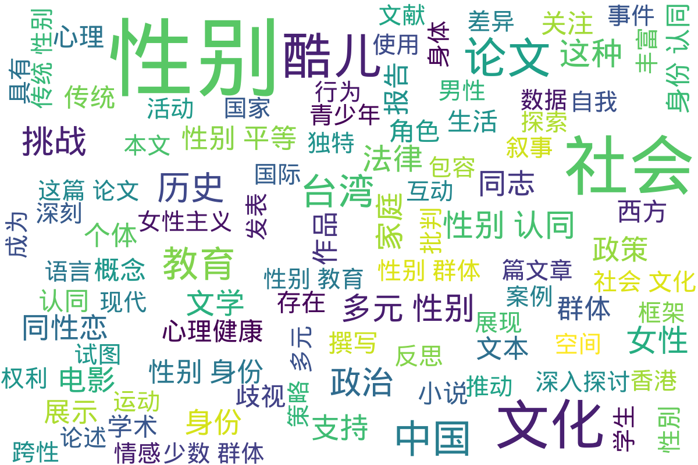

---
search:
  exclude: true
---

# 社科

该目录下收录了与跨性别相关的社会科学研究文献，包括对跨性别群体的社会分析、文化研究以及相关的理论探讨。这些文献旨在提升对跨性别群体生活现状的理解与关注。

标签: `跨性别`, `社会科学`, `研究文献`, `文化研究`, `社会分析`

总计 229 篇内容

### 📄 文档

#### 2024

[【书评】《谁在害怕性别？》当性别成为制造恐慌的鬼魂，巴特勒如何拆解](【书评】《谁在害怕性别？》当性别成为制造恐慌的鬼魂，巴特勒如何拆解_page.md)

查看摘要

该文件是一篇书评，评论了朱迪思·巴特勒（Judith Butler）所著的《谁在害怕性别？》。这本书探讨了性别研究的重要性，尤其是如何反对反性别运动的影响。书评中指出，性别研究的核心在于解放欲望，并强调了性别被视为一种展演过程，不同于传统意义上的二元性别区分。书评中提到，巴特勒的书包含了对反性别运动的分析，认为这种运动以恐慌为基础，试图掩盖复杂的性别现实，并对社会的性别表达施加限制。此外，文件详细讨论了相关的社会政治背景，包括性别与权力的关系，反性别运动在全球范围内的表现，以及如何影响跨性别者的生存现状。书评的最后指出，面对日益激烈的反性别运动，保持批判性思考和开放态度至关重要。

[PDF_國際多元性別統計與我國發展情形](PDF_國際多元性別統計與我國發展情形_page.md)

查看摘要

该文件为《国际多元性别统计与我国发展情形》的报告，由行政院主计处发布。文件内容主要围绕性别多元性的发展和统计，提出了全球多个国家（如澳大利亚、欧盟和加拿大）在多元性别分类和统计方面的进展与经验，同时对我国在这方面的现状进行了梳理和分析。报告中首先强调了性别的多元性，指出传统的男女二元性别无法涵盖所有个体的性别认同，还提到了交叉性别歧视的概念及其对社会政策的影响。各个章节对多元性别的统计方式、性别分析的三面向，以及性别与社会、心理方面的交互影响进行了详细论述。此外，文件还引用了各国对性别的分类方法和所获得的数据，强调了多元性别统计的重要性和当前面临的挑战，呼吁加强相关的法律与政策以支持多元性别群体的权益。

[酷儿未来与时间观的探讨_海德薇格_2024](酷儿未来与时间观的探讨_海德薇格_2024_page.md)

查看摘要

本文件是海德薇格撰写的一篇关于酷儿未来与时间观的评论文章，探讨了在充满不确定性和焦虑的世界中，人们如何理解快乐和幸福。文章引用了2018年诺贝尔文学奖得主奥尔加・托卡尔丘克的话，讨论了历史上暴力、残酷和仇恨的存在以及它们对现代生活的影响。海德薇格分析了幸福科学的假设，批判了以异性恋规范为基础的幸福标准，指出这种标准如何构建了对人生轨迹的期望，并如何造成了对未来的焦虑感。

文章进一步探讨了酷儿群体如何在这种主流幸福脚本之外找到存在的方式，并强调了拒绝遵循这些标准的可能性。作者引用了Lauren Berlant的“残酷乐观主义”理论，指出这种对承诺的依赖可能是不可持续的，并探讨了酷儿在反抗主流制度后的自主生存空间。海德薇格还提到控制与怀疑的双重性，提醒人们打破线性时间模型，结合过去与未来，创造出更具生命力的生存方式。最后，文章借助多位学者的观点，邀请读者思考酷儿如何在拒绝接受异性恋主流的同时，构建属于自己的时间观和未来，并强调幸与不幸之间的复杂对立。

[酷儿代词使用偏见研究_黄天毅_索马杉达_2024](酷儿代词使用偏见研究_黄天毅_索马杉达_2024_page.md)

查看摘要

该研究文献探讨了在大型语言模型（LLM）中减少对酷儿个体代词使用偏见的具体问题。作者们提出了一种合作代理管道，通过分析和优化代词使用来促进包容性，旨在改善AI生成内容中的公平性和对酷儿个体的表现。文中详细介绍了多代理框架的构建，包括助理代理、语言分析代理和优化代理，这些代理分别对语言的包容性进行评价和优化。

通过对Tango数据集的实验评估，研究展示了该方法在包容性代词分类中的显著效果，尤其在正确识别传统性别代词（“他”和“她”）及非二元性别代词（如“他们”、“xe”、“ey”、“fae”）方面的成功率。结果表明，代理工作流程的表现超过了基线模型GPT-4o和双代理流水线。研究还提及了长期性别偏见对酷儿个体的潜在影响，强调在AI系统中实现性别包容和多样性的重要性，旨在推动社会责任型人工智能的实践。

#### 2023

[PDF_淺談非二元認同及其教育意涵_面對性別刻板印象與性別二分的反思](PDF_淺談非二元認同及其教育意涵_面對性別刻板印象與性別二分的反思_page.md)

查看摘要

本文是一篇关于非二元认同及其教育意涵的研究，作者是桃园市潜龙国小的陈贞瑾。文章首先指出，跨性别概念在当今社会已演变为一个包罗万象的术语，包括变性人、双性人以及非二元、扮装者等多种性别认同。特别关注非二元认同者，作者分享了个人认识非二元友人的经历，解释了非二元认同的特征——这些认同者通常不认为自己属于传统的男性或女性角色，而是感到不适于性别二元框架。文章进一步探讨了性别刻板印象带来的社会压力，以及怎样通过教育来应对这些刻板印象，强调教育应鼓励尊重和包容多样性，并以科学根基引导学生理解不同性别气质的存在。总体而言，文中探讨了非二元认同在校园内的表现及其对性别平等教育的启示。

[PDF_行政院我國多元性別LGBTI者生活狀況調查研究案](PDF_行政院我國多元性別LGBTI者生活狀況調查研究案_page.md)

查看摘要

本文件为《我國多元性別（LGBTI）者生活狀況調查研究案》委托研究报告，由台灣彩虹平權大平台協會主办，主要旨在收集与分析台湾地区多元性别群体的生活状况与经验。报告综合调查2019年《司法院釋字第七四八號解釋施行法》通过施行后的变化，展示多元性别者在健康、福祉、社会支持、就业和家庭生活等多个方面的现状。研究通过问卷调查与数据收集，深入探讨了多元性别者的歧视与暴力经验、心理健康状态及社会接纳度等问题。报告尤其关注跨性别者的特定经历，分析其在生活中面临的挑战和需求。附录部分提供了问卷设计、研究方法、研究限制及未来研究建议的详细信息，包含问卷初步结果及收集的统计数据，期望为台湾相关政策的制定提供依据。

[跨性别者自杀意念的影响因素探析Analysis_of_Influencing_Factors_of](跨性别者自杀意念的影响因素探析Analysis_of_Influencing_Factors_of_page.md)

查看摘要

该文件是李记勇教授在2023年发表的一篇研究论文，题为《跨性别者自杀意念的影响因素探析》。论文主要探讨了跨性别者作为社会边缘群体面临的独特心理和行为问题，尤其是跨性别者自杀意念的高发率背后的主要影响因素。文中详细分析了多项研究数据和相关文献，得出结论：跨性别者常常经历来自环境的歧视、社会接纳不足、家庭支持缺失以及个体自身的应对策略等压力源，这些因素导致了跨性别者的高自杀意念和自杀尝试风险。作者强调，通过理解这些影响因素，可以为跨性别人群的心理干预提供重要依据。

[LGBTQI+抗争中的双语表达_2023_ANU_Press](LGBTQI+抗争中的双语表达_2023_ANU_Press_page.md)

查看摘要

该文件是由奥斯玛·贝尔诺特（Ausma Bernot）撰写的，标题为《LGBTQI+抗争中的双语表达》，发表于2023年，探讨了中国LGBTQI+社群在面临严格网络审查和社会压制下的抵抗和生存策略。文中描述了当代中国LGBTQI+活动者如何利用双语表达和秘密语言（如谐音词）来避开审查，例如使用“喝茶”这一隐晦的表达来表明与警方的接触。作者回顾了2014年至2017年间她在宁波诺丁汉大学的活动，强调了在相对宽松的政治环境下，如何构建群体意识和促进LGBTQI+问题的公共讨论。文章进一步讨论了在习近平领导下，LGBTQI+社群的数字空间的收缩和加强的监控，包括对WeChat和其他社交平台的严密审查。特别提到了在2021年之后，LGBTQI+相关的社交账户如何在没有预警的情况下被关闭，以及这一系列政策带来的影响。总体而言，该文为研究当代中国的LGBTQI+活动及其遭遇的政策挑战提供了重要的第一手资料和分析。

[2023_廖昱凱_酷兒跨性別生態學與河川正義書評](2023_廖昱凱_酷兒跨性別生態學與河川正義書評_page.md)

查看摘要

该文件为学术文献，书评内容主要讨论了Cleo Wölfle Hazard的著作《Underflows: Queer Trans Ecologies and River Justice》。书中探讨了跨性别与酷儿视角在生态学及河流治理中的应用，以反思传统的科学研究方法。作者廖昱凯通过对书中内容的批评与回顾，强调了原住民参与和生态学中的多样性问题，提出河流治理应挑战传统的殖民和种族主义观念。文本中还提到，Wölfle Hazard结合酷儿理论和环境科学，探讨如何通过关注情感和关系来改进科学研究，从而在不同的文化和生态背景中实现河流正义。具体章节分析了不同地区的水体治理情况，包括加州的社区参与和西雅图的后工业水岸等；同时，还讨论了河狸与伐木等动物在生态系统中，如何作为非人类的参与者促进环境变化，以及人类与自然之间的复杂关系。

[萨克森女性主义论坛_多元交叉视角_2023年9月.pdf](萨克森女性主义论坛_多元交叉视角_2023年9月.pdf_page.md)

查看摘要

本文件为关于萨克森地区女性主义论坛的通知和信息，会议将于2023年9月15日至16日在莱比锡的Tapetenwerk举行。论坛主题围绕多元交叉的视角，鼓励不同背景的女性，以及跨性别、双性别和非二元性别人群积极参与和分享经验。文件内容详细介绍了论坛的安排，包括签到时间、开场致辞、各类工作坊和座谈会的时间表，以及论坛的目标，即探索如何在政治、行政和社会构架中创造更为多元的视角。同时，文件中提到将提供多种语言的翻译服务，并考虑了参与者的无障碍需求，体现了对多元文化和身份的高度重视。参与者可以通过论坛讨论、交流经验，构建彼此的连接，推动更广泛的社会参与和能力的提升。

[2023_多元性别与媒体再现](2023_多元性别与媒体再现_page.md)

查看摘要

该文件《多元性别与媒体再现》探讨了媒体对多元性别群体的再现方式及其影响，分析了当前媒体环境中跨性别与酷儿的呈现现状。文本探讨了多样化的性别身份在影视、广告、新闻等多种媒体平台中的表现，指出了刻板印象、偏见和代表性不足的问题。此外，作者还提出了改进媒体内容的建议，以促进更为积极和准确的性别认同表达，旨在为社会公众提供更全面的多元性别视角。虽然我们无法准确提取文件内容，但从文件的标题和主题可推测它可能包含了一些研究数据及案例分析，以支持作者的观点。

[中华帝国晚期的性_法律与社会_文字版_苏成捷_Z_Library](中华帝国晚期的性_法律与社会_文字版_苏成捷_Z_Library_page.md)

查看摘要

本文件为苏成捷所著《中华帝国晚期的性、法律与社会》的文字版PDF文件，出版于2023年5月18日，由广西师范大学出版社出版。该书探讨了清代社会中的性、法律与社会结构之间的复杂关系，重点分析了性秩序的法律及其演变，尤其是性犯罪的法律规定如何反映和塑造社会对性别和性行为的认知。文件内容包含引言以及多个章节，如关于性秩序的愿景、强奸罪的法律演变等，尤其强调了鸡奸法和对贞节的崇拜如何影响清代法律。通过对历史文献和司法案例的详细分析，作者揭示了法律与社会性别角色之间的互动，以及社会心理对法律变迁的影响。书中还附有大量清代法律条文和司法案例，进一步揭示了法律与实践之间的矛盾。

#### 2022

[人工智能时代性别伦理的多维思考与前瞻性治理](人工智能时代性别伦理的多维思考与前瞻性治理_page.md)

查看摘要

本文探讨了人工智能时代的性别伦理问题，分析了传统性别问题在技术背景下的映射和放大。文章指出，人工智能的技术逻辑可能会吸收现有的性别偏见，并将这种偏见系统化，通过算法实现。此外，由于人工智能技术开发从业者的性别单一性，使得性别伦理的观念在技术应用中偏向单一，无法回应公平等社会公共价值。本文还关注了“第三性”即人工智能生命体的出现，提出人类和机器之间的交往新问题，强调这一现象如何打破两性二元对立的框架，并增加了性别交流和伦理的维度。文章呼吁应通过前瞻性治理行动来协调技术发展与性别伦理的建设，建议政府应更新理念、设计有效的治理工具，推动新的性别伦理观的形成。

[人类社会行为的双重属性及其双重判断](人类社会行为的双重属性及其双重判断_page.md)

查看摘要

该文献探讨了人类社会行为的双重属性，主要涉及生物学和文化两个方面的影响。作者吴家睿首先分析了人类社会行为的遗传基础，指出基因组与行为间的复杂互作。文章特别提及了人类大脑的独特基因变异如何影响社会行为的发展，以及文化因素如何在塑造个体性取向和性别认同方面发挥作用。吴家睿引用了对同性恋行为的遗传研究，认为基因在这一行为中起到的作用有限，更重要的是社会和环境因素的影响。此外，文章还讨论了跨性别群体的出现，以及社会如何接受和理解这一群体的多样性。文章最终呼吁在讨论人类社会行为时应基于理性分析，避免情感化的判断和误解。

[跨性別女性向父母現身之歷程研究_-_教育心理學報](跨性別女性向父母現身之歷程研究_-_教育心理學報_page.md)

查看摘要

该文件题为《跨性别女性向父母现身之历程研究》，收录于《教育心理学报》，由宋宥贤和陈思帆于2022年撰写。本研究通过质性访谈深入理解16位跨性别女性（年龄23至45岁）向父母现身的经历，探讨了她们在这一过程中所遇到的困境和应对策略，构建了向父母现身的历程模式。研究中指出，现身分为五个阶段：犹豫期、自我展现与反复试探期、现身期、关系震荡过渡期和接纳期。这一历程强调了跨性别女性在向父母现身时所面临的压力与挑战，以及父母对这一过程的各种反应。作者还指出，家庭支持在跨性别者的身心发展上至关重要，父母的接纳与支持对跨性别女性的心理健康具有深远影响。本文还提及了社会对跨性别者的偏见和压力，这些因素都对个人的性别认同与社会适应产生了影响。

[中国跨性别者非自杀倾向自残行为研究——流行率和风险因素的横断研究](中国跨性别者非自杀倾向自残行为研究——流行率和风险因素的横断研究_page.md)

查看摘要

本文件为一项关于中国跨性别者非自杀倾向自残行为(NSSI)的研究，探讨了其流行率和风险因素。研究由黄心蕊于2022年发表，样本包含703名年龄在18到51岁之间的跨性别者，旨在识别影响该群体心理健康的社会因素和心理因素。研究结果显示，63%的受访者曾有过自残行为，跨性别女性的发生率显著高于跨性别男性，且心理健康问题（如焦虑和抑郁）与自残行为之间存在相关性。此外，研究还指出，身体满意度低、自尊水平低、社会歧视感较高是自残行为的主要预测因素。本研究强调了改善跨性别者心理健康和身体接受度的重要性，并呼吁社会采取措施消除社会歧视，增加跨性别者的自尊。

[PDF_在荊棘中邁向真實自我跨性別女性向父母現身之歷程研究](PDF_在荊棘中邁向真實自我跨性別女性向父母現身之歷程研究_page.md)

查看摘要

该文件是国立台湾师范大学教育心理与辅导学系的一项研究论文，标题为《在荊棘中邁向真實自我：跨性别女性向父母現身之歷程研究》。研究旨在深入探索16位跨性别女性向父母现身的具体经历及其内在心理动态。文中通过质性访谈收集资料，采用扎根理论分析，揭示出参与者的现身历程可被分为五个阶段：猶豫期、自我展現与反覆试探期、现身期、关系震荡过渡期，接納期。研究还探讨了现身行为对跨性别女性心理发展的影响，以及父母的理解和支持对她们向家人展示真实自我的重要性。通过该研究，促进了对跨性别群体在家庭环境中面临的挑战与需求的理解，并为心理咨询人员提供了相关的参考建议。

[PDF_吳繼文酷兒小說中的性別飄浪_-_臺灣文學研究所-](PDF_吳繼文酷兒小說中的性別飄浪_-_臺灣文學研究所-_page.md)

查看摘要

本文着眼于1990年代台湾的酷儿小说，特别是吳繼文的两部重要作品《世紀末少年愛讀本》和《天河撩亂》，探讨其中的性别流动与家国想像。文章指出，吳继文的作品区别于当时其他以西方为背景的酷儿创作，提出了一种独特的‘回望’叙述策略，以中国古典男色传统为基础，展现了不同于线性时间及进步史观的复杂性。在《世紀末少年愛讀本》中，改写清代的《品花宝鉴》，展现了男性相公的悲惨处境与情感的复杂；而《天河撩亂》则交错叙述了男同志时澄与其跨性别姑姑成蹊的故事，揭露了家族历史与个人认同间深刻的联系。文本深入分析了主人公的心理挣扎、社会压力和性别认同，通过历史与现代交织的背景，呈现跨性别者的生存境况及其与社会的关系。整篇文章充分展现了台湾酷儿文学的丰富性及其在社会变迁中的位置，以期拓展对1990年代酷儿文学研究的视域与理解。

[创伤与修复：华语女性酷儿电影表现研究（李春裔，2022）](创伤与修复：华语女性酷儿电影表现研究（李春裔，2022）_page.md)

查看摘要

该文献是李春裔于2022年在马来西亚大学提交的博士论文，题为《创伤与修复：华语女性酷儿电影表现研究》。论文探讨了华语女性酷儿电影的创作与表现，从酷儿理论和女性主义的视角出发，分析电影文本中所展现的女性心理发展特点。作者指出，酷儿电影不仅是艺术探索，更是对女性身份焦虑和社会环境的深刻反思，尤其是随着台湾于2019年同性婚姻合法化，华语女性酷儿电影的研究具有了新的现实意义。论文分为四个维度探讨：创伤、身份认同、内在客体关系和隐喻心理意向的符号维度，通过文本分析，深度挖掘女性酷儿在电影中的内心冲突、根源以及疗愈过程。文中举例分析了多部具有代表性的华语女性酷儿电影，揭示了其中文化环境对女性身份认同和发展的影响，以及电影创作者如何运用符号和叙事结构来展现这些复杂的心理状态。同时，论文也总结了当前华语女性酷儿电影的共性特质以及存在的不足之处，为未来的相关研究提供了理论基础和实践方向。

[中學同志教育經驗探析_蔣琬斯_游美惠_2022](中學同志教育經驗探析_蔣琬斯_游美惠_2022_page.md)

查看摘要

本文件为一篇名为《朝向容納多元性別教育：中學教師推動同志教育之經驗探析》的主题论文，发表在2022年9月的《课程研究》期刊中。通过对19位中学教师的深度访谈，研究探讨了教师如何在校园中实施同志教育，所面临的挑战及其采用的策略。研究发现，许多教师最初是出于对同志学生出柜担忧的关注而投身同志教育，他们在通过持续的专业发展后，意识到了自身曾经的偏见，并对社会上存在的双重标准进行了深刻反思。在实施过程中，多个教师以潜移默化的方式推进同志教育，提出了应将“同志教育”这一术语改名为“容纳多元性别教育”，以涵盖更广泛的性别认同和性倾向。本研究强调了当前台湾校园中同志教育的实施现状以及所需的改进措施，强调教育中应注重性别多样性的包容性和接受度。

[酷儿理论视域下的电影研究_夜间飞行的身份认同_曾思繁_2022](酷儿理论视域下的电影研究_夜间飞行的身份认同_曾思繁_2022_page.md)

查看摘要

这篇文章由福建师范大学的曾思繁所撰写，探讨了酷儿理论在电影《夜间飞行》中的应用，分析了片中主人公的身份认同和社会文化背景。酷儿理论自20世纪90年代以来，挑战了主流性别观念，通过影像艺术反思同性恋者和广大跨性别、多元性别群体的生存状态。本文重点分析了两位男主人公的复杂情感关系及其社会身份的构建，揭示了社会对性别和性取向的规训以及对非异性恋身份的压迫。在影片中，导演李宋熙日通过描绘校园暴力、歧视以及少数群体的内心挣扎，呈现出同性恋者的真实生存环境，并强调酷儿身份在社会中的隐秘与暴露。文章还探讨了许多与社会认同相关的主题，如身份认同的内在冲突、个体与社会的博弈，以及主流文化的压迫，这些都为更深入理解酷儿身份认同提供了独特视角和理论支撑。

[2022-02-05_马骋Yura_酷儿女性看爱情与百合文化解构异性恋关系](2022-02-05_马骋Yura_酷儿女性看爱情与百合文化解构异性恋关系_page.md)

查看摘要

本文档为一篇深入探讨酷儿女性看待爱情的学术评论，标题为《酷儿女性看爱情：百合文化如何颠覆异性恋情感和关系》。作者马骋Yura于2022年2月5日出版。文章分析了百合文化（Yuri）的起源，以及它如何影响并重塑女性之间的情感关系。百合文化源自日本动漫次文化，主要探讨女性与女性之间的独特关系，该文指出女性读者对于以异性恋为前提的主流文化感到厌倦，从而转向百合文化以寻求情感的自由和表达。文中提到百合文化不仅是文本的创造，也依赖于读者的解读与想象，体现出一种“属于读者的文化”。研究深入探讨了角色的性别平等性以及对“性中心”话语的挑战，强调女权视角下女性之间的精神与情感连接的复杂性和重要性。文中还讨论了诸多案例，包括电影、小说以及网络文化中呈现的百合情感，并分析了百合文化如何为女性提供了一个与异性恋框架区隔的空间，建立起新的情感和文化表达方式。

[性别寻旅_跨性别者自述_梁詠恩_2022](性别寻旅_跨性别者自述_梁詠恩_2022_page.md)

查看摘要

本文件为梁詠恩于2022年在世新大学性别研究所完成的硕士学位论文，题为《性/别寻旅——一位跨性别者的自我民族志》。该论文通过作者的个人经历，探讨了跨性别者在当代社会中的身份认同及其社会文化背景。论文开篇回顾了现代社会中性别认同的变迁与挑战，并指出在西方性别理论影响下，许多跨性别者找到了一定的归属感和认可感。然而，尽管在法律和人权方面取得了一些进展，跨性别者的生存现状仍然令人担忧。该论文也对作者在香港、台湾及中国大陆的同志与跨性别运动中的参与与观察进行了深入分析，指出各地区在运动策略上的相似性与差异。通过自我民族志的研究方法，作者试图在自己的性别过渡过程中理解与他人的共同点与差异，以此为基础探讨跨性别者在社会中面临的各种挑战与机遇。

[成为安迪沃霍尔：性别与社会的对话_2022年2月19日](成为安迪沃霍尔：性别与社会的对话_2022年2月19日_page.md)

查看摘要

本文件为“成为安迪·沃霍尔”系列的对谈记录，活动于2022年2月19日在UCCAEdge报告厅举行，主要围绕性别与社会的对话进行深入探讨。会议的主持人为华东师范大学社会学教授魏伟与昆山杜克大学文学助理教授向在荣，双方通过对安迪·沃霍尔的艺术和个人背景进行分析，探讨如何从酷儿视角理解他的生平和作品。魏伟在发言中提到沃霍尔的艺术与同性恋身份之间的关系，强调沃霍尔在其创作中展现的酷儿气质及其对性别研究的影响。向在荣则补充了沃霍尔的自我表现及其在麦卡锡时代背景下的身份认同过程，讨论其作品如何影响同性恋社群的形成与发展。此次对谈不仅深入探究了沃霍尔的多重身份与创作中的性别表现，更质疑了传统的性别概念与艺术创作之间的关联，同时引发对当代性别多样性及社会可见性的思考。

[儿童文学研究新视野_彼得·亨特访谈_2022](儿童文学研究新视野_彼得·亨特访谈_2022_page.md)

查看摘要

该文件是一篇关于儿童文学的访谈文章，访谈对象为儿童文学研究领域的先锋学者彼得·亨特教授。文章深入探讨了儿童文学的重要性及其与文化规范的关系，亨特教授指出儿童文学不仅是教育学科的一部分，而是一个独立的文学研究领域，具有重要的文化意义和社会价值。访谈内容涵盖了儿童文学的历史、研究现状以及未来的发展方向，亨特教授分享了他对儿童文学定义的看法，认为儿童文学应当被视为一种独特的文学形态，包含多种文化背景下的文本。文章中亨特提到，儿童文学的研究涉及多个学科，如历史、心理学、艺术等，强调了儿童读者与成人作者之间的权力关系，探讨了儿童文学如何塑造社会行为及思想观念。他呼吁重视儿童文学在全球文化中的作用，并论述了儿童文学对塑造儿童成长过程的重要性。

[在社工教育納入多元性別社群議題：態度、知識、服務或行動策略](在社工教育納入多元性別社群議題：態度、知識、服務或行動策略_page.md)

查看摘要

本文探讨了在社会工作教育中纳入多元性别社群议题的重要性，特别是跨性别者和其他性少数群体的相关问题。作者讨论了多元性别的概念及其历史背景，强调尊重人们用不同名称描述自我的重要性。文章分为多个部分，梳理了美国和台湾的研究和文学，探讨了社工教育如何能更有效地回应多元性别社区的需求。内容包括对多元性别群体态度的澄清、实际在课程中融入这些议题的方式，以及促进社会工作者在服务中去辨识和消除对这些群体的性别歧视、刻板印象和偏见。作者提供了具体教案与讨论案例，力求使学生能够自主思考，并为多元性别者创造一个友好、包容的社会环境。

[從當代電影看亞洲跨性別人士的困局](從當代電影看亞洲跨性別人士的困局_page.md)

查看摘要

这篇论文由王雅雯撰写，题为《从当代电影看亚洲跨性别人士的困局》，发表于2022年。论文通过分析三部以跨性别为主题的电影，探讨了在不同亚洲地区跨性别人士所面临的困境与挑战。选取的电影包括台湾的《阿莉芙》(2017)，香港的《翠丝》(2018)，及马来西亚的《迷失安狄》(2020)。作者从电影中的叙事与电影语言出发，揭示了跨性别者在宗教、家庭与职场等方面所遭遇的不平等和误解。文章指出，尽管台湾的性别平权相对成熟，但仍有许多人面临着来自家庭和社会的压迫和偏见；而在香港与马来西亚，性别多元的接受程度远低于台湾，跨性别者更常遭遇法律与社会的歧视。该论文不仅为观众提供了对跨性别人士生活现状的深刻洞察，亦希望通过电影的力量提升社会对跨性别议题的理解与关注。

[An_Exploration_of_Transgender_Individuals_Identity_Experiences_in_the_Chinese_Context](An_Exploration_of_Transgender_Individuals_Identity_Experiences_in_the_Chinese_Context_page.md)

查看摘要

该文献摘自2022年5月出版的《国际社会科学与人文杂志》，主要探讨了中国跨性别个体的身份体验。研究显示，尽管中国社会对跨性别群体的关注逐渐增加，但他们的生活条件依然不乐观。研究的目的包括探索中国跨性别者在日常生活中面临的主要困难，提高对跨性别问题的社会意识，以及推动帮助跨性别者改善生活条件的措施。通过对四名成年跨性别个体的半结构化访谈，研究揭示了他们在心理健康、亲密关系、公共场所和跨性别手术相关药物方面的挑战。此外，研究还指出，中国跨性别者在新冠疫情期间面临着更大的困难，例如获取激素治疗和性别确认手术的障碍。尽管一些跨性别女性的研究已被关注，但对跨性别男性的关注仍显不足。作者希望通过该研究，增进公众对跨性别者的理解，提升社会对他们的支持，推动法律和社会环境的改善。

[The_Negative_Influence_of_Social_Media_on_Transgender_Group_Self-identity_in_The_East_Asian__Society](The_Negative_Influence_of_Social_Media_on_Transgender_Group_Self-identity_in_The_East_Asian__Society_page.md)

查看摘要

这篇文献探讨了社交媒体对东亚跨性别群体自我认同的负面影响。作者包含来自澳大利亚和中国的学者，通过系统文献回顾，收集了16篇相关的学术文章，分析了这些文章中描述的跨性别者在互联网环境下面临的挑战。文献指出，由于传统的性别二元观念，跨性别者在社会上受到了不公正的对待，社交媒体上的负面舆论对他们的自我认知造成了进一步的影响。文章分为两个主要方面，一方面是社交层面，探讨了跨性别者内心的双重意识和身份认同的挣扎；另一方面则涉及他们在网络上因性别身份所遭遇的偏见和网络欺凌。这不仅使跨性别者在表达自我性向时面临危险，也进一步限制了他们的生活空间。文献提供了关于当前跨性别群体在立法和个人层面上所面对的社会困境的深刻见解，期望促使社会更加关注和理解这一弱势群体的现状。

[Chinese_Trans_Women_in_Japan_and_Their_Embodied](Chinese_Trans_Women_in_Japan_and_Their_Embodied_page.md)

查看摘要

这篇文章探讨了生活在日本的中国跨性别女性在数字连接、国际流动性、性别和种族交叉性方面的经验。通过对居住在日本五个县的七位受访者的访谈，文章展示了她们如何以多种方式理解和表现性别身份的复杂现实。作者指出，这些跨性别女性的性别身份反映了她们对完整性和本体安全的个体追求，尤其是在处理在线和离线现实的紧张关系时。文章进一步分析了在线和离线生活经验是如何相互塑造的，强调了数字媒体在现代社会结构中所扮演的重要角色。文中还讨论了自1990年代以来，关于流动性与酷儿身份关系的研究变化，指出“迁出”并不一定意味着“出柜”，而此过程是复杂多变的，相互依存的。

#### 2021

[酷儿理论视角下档案与性别身份认同的冲突与和解](酷儿理论视角下档案与性别身份认同的冲突与和解_page.md)

查看摘要

本文探讨了酷儿理论视角下档案与性别身份认同之间的冲突与和解。酷儿理论代表着性与性别的文化和社会建构，挑战了传统的性别二元划分以及性多样性的忽视。本研究通过分析档案的固化特性和性别身份的流动性，指出档案的历史记录属性和信息固化特点可能导致性别身份认同的实现陷入困境。作者提到，虽然档案在某种程度上固化了性别身份，但同时也能为性别身份认同的积极重塑提供融合机制。文中还探讨了档案如何通过社群建档以及数字化实践为弱势群体发声，倡导包容与多样化的档案观，认为这一宏观努力在微观层面具有实际意义。

[竞技人文传播东京2020_奥运会系列事件的思考](竞技人文传播东京2020_奥运会系列事件的思考_page.md)

查看摘要

本文探讨了2020年东京奥运会的多个方面，重点从竞技、人文和传播的视角分析这一重大体育盛会。文章中提到，东京奥运会并不仅仅是一场体育赛事，而是现代文明社会中权力、话语和身份表征的综合体现。研究作者围绕中国体育代表团的表现以及与性别平等相关的文化传播进行深入分析，文章指出，东京奥运会是实现性别平等的重要时刻，尤其允许变性人参加比赛这一安排引起了广泛关注。同时，文章也探究了媒体在报道东京奥运会中如何表现中国体育形象，以及外国媒体对中国体育代表团优秀表现的淡化，这反映了西方文明对中国体育崛起的焦虑。文章进一步讨论了金牌的重要性与其背后的社会心理，以及东京奥运会如何折射出中国竞技体育的发展现状与未来方向，强调了人文关怀在这一切背后的重要性。

[体育运动中的性别平等公平及包容性表述](体育运动中的性别平等公平及包容性表述_page.md)

查看摘要

本文件为‘体育运动中的性别平等、公平及包容性表述展现方式指南’第二版，主要由国际奥林匹克委员会（IOC）发布。其内容围绕体育领域内，尤其是奥林匹克运动中性别平等的重要性展开，详细探讨了如何通过适当的展现方式促进性别的平等与包容。文中指出，体育是促进性别平等和赋能女性的重要平台，而媒体报道在形成社会的性别规范和刻板印象中起到了重要作用。指南强调了在体育传播中采用公正、均衡的语言、图像和表现方式的重要性，并提供了实用的核对清单及建议，以帮助各个体育组织、媒体和内容创作者实现性别平衡的展现方式。对两性运动员的展现方式的建议包括保持平衡曝光、避免性别刻板印象，并在报道中将体育成就置于更高的优先级。

[酷兒化檔案臺韓酷兒檔案庫與創作轉譯](酷兒化檔案臺韓酷兒檔案庫與創作轉譯_page.md)

查看摘要

本文件为《台湾文学研究》的论文，题目为《酷儿化“档案”：台韩酷儿档案库与创作转译》，由国立政治大学台湾文学研究所的陈佩甄教授撰写。文章首先讨论了2019年在台湾同性婚姻合法化及首尔举办第20届酷儿游行的历史性事件，凸显了这两项活动在LGBTQ历史和运动中的重要性。接着，文本分析了当年双方举办的两个重要文化事件：在首尔展出的「酷儿乐」和在台北举办的「一次重访台湾同志污名史的邀请：文献x创作计划展示」。这两个展览密切相关于酷儿/同志档案资料库的建立，反映了两地的同志史和文化演变。

陈教授特别提到，酷儿档案的构建不仅仅是性少数历史的复正工作，而是体现了对多元历史的重写和想象，强调了档案作为时间和地点的交汇表现出的不可能性以及知识生产的相对性。文章还涉及酷儿历史的边缘化，以及如何通过跨国界的资料库和创作展展示这些遗失的历史，并持续呼应酷儿文化的多样性。

[以愛之名擁抱多元性別_课件](以愛之名擁抱多元性別_课件_page.md)

查看摘要

本文件是由南玉芬教授于2021年6月22日在性别小课堂上发布的课件，内容主要探讨多元性别的概念及相关议题。课程涵盖性别认同、性倾向、出生性别、法定性别等重要概念，强调性别并非绝对二元，而是一个连续体。通过引用Korell与Lorah（2007）的观点，文件指出性别光谱说明性别在一个连绵不绝的范围内变化，并探讨跨性别、变性、性别酷儿等多个身份。文件中也提到最新的研究显示，跨性别身份不应被视为精神障碍，指责社会排斥和暴力才是造成心理痛苦的根源。此外，文件讲述了性别酷儿的定义，及其拒绝传统性别二分法的立场，探讨性别重置手术在跨性别者生活中的重要性。最后，文件涉及跨性别相关的统计数据与法制支持，如台湾的同性婚姻法律与跨性别者的社会认知。

[PDF_在美亚裔美国人和太平洋岛民的LGBT_成年人](PDF_在美亚裔美国人和太平洋岛民的LGBT_成年人_page.md)

查看摘要

这份报告探讨了在美国的亚裔美国人和太平洋岛民 (AAPI) 中，自我认同为LGBT的成年人的幸福感和相关特征。本文根据多个来源的数据，提供了关于这些群体人口特征的信息，特别关注心理健康、身体健康、经济状况及社会和文化经历。此外，报告对比了AAPI LGBT与非LGBT成年人的关键指标，以及AAPI中不同性别与族群的差异。主要发现包括：AAPI LGBT成年人中约685,000人自我识别为LGBT，其中4.5%的AAPI成年人自我认同；AAPI LGBT成年人更年轻、有更高的大学教育比例，同时在经济和健康状况上普遍较差，他们更易遭遇经济不安全、抑郁症的确诊率也显著较高。报告还提到，AAPI跨性别成年人经常遭遇歧视与困扰，有80%的人表示与财务和工作相关的压力很大。该报告的核心在于揭示AAPI LGBT群体的独特需求和挑战，为更有效的服务和支持提供数据支持。

[非西方酷兒理論與臺灣國族問題_劉文_2021.pdf](非西方酷兒理論與臺灣國族問題_劉文_2021.pdf_page.md)

查看摘要

该文件为《非西方酷儿理论与台湾国族问题》的一篇学术论文，作者刘文探讨了国族议题在台湾酷儿知识生产中的重要性。文中分析了洁净的文化框架是如何无法处理台湾酷儿身份的多样性，以及冷战时期的地缘政治对台湾酷儿身份认同的影响。作者指出，台湾的酷儿理论在面临欧美酷儿理论的挑战时，如何重新定义其地缘政治定位，并指出‘同性恋国族主义’在台湾性别地缘政治中的表现。该文讨论了后殖民分析的必要性，并对国族焦虑进行深入思考，认为台湾酷儿应采用‘时间转向’的研究方法，以更有效地应对国家主权相关的问题。此外，文中还探讨了酷儿理论与区域研究的结合，以及在当代政治和文化背景下酷儿台湾的存续与挑战。

[从本性到性：性化与重新构想_马正堂_2021](从本性到性：性化与重新构想_马正堂_2021_page.md)

查看摘要

本文件为马正堂（Yahia Zhengtang Ma）撰写的学术论文《从“本性”到“性”：性化与重新构想》。该论文探讨了中文中“性”的概念如何受到儒家思想和现代文化的双重影响而演变，并对性道德的内涵进行了深入分析。文章指出，尽管性的话语在现代化过程中发生了变化，传统的社会、文化和道德规范仍然在很大程度上影响了人们对性的理解和接受度。作者提到，早在中国古代文献中，“性”就与生命的活力和健康紧密相连，与西方对性的现代理解有着显著的区别。文章还强调了五四运动后，关于性的新词汇和新的性观念的引入，但同时指出，针对性的讨论依旧充满了社会的边缘化和道德评判。整体上，论文提供了对性与性别身份、中国社会及文化背景下的复杂关系的深刻见解，是对多元性别研究领域的一项重要贡献。

[多元文化性别与家庭的探讨_2021_性别平等教育季刊](多元文化性别与家庭的探讨_2021_性别平等教育季刊_page.md)

查看摘要

该文件为2021年《性别平等教育季刊》第95期，主题围绕“多元文化、性别与家庭”，其中探讨了在东京奥运会背景下，运动场上所涉及的性别议题，以及台湾同志家庭的社会认同与法律地位。文章引用多个实例，阐述在多元家庭形态日益显现的当下，如何在教育中实现性别平等的重要性。文中特别提到台湾在2019年同婚合法化后，同志家庭的法律保障，指出尽管有了法律变化，社会的普遍接受度及教育体制的调整仍显不足。同时，作者分享了一些关于同志家庭、单亲家庭等多样化家庭类型的生活与教育经验，强调无论家庭形式如何，“爱的存在”才是家庭的核心。同时，文件中包含多位专家对于教学中应如何引入性别平等议题的建议，以反映如今社会中多元化的家庭和性别关系。

[2021_卓芸萱_性別跨不跨_跨性別學生於友善校園成長的可能](2021_卓芸萱_性別跨不跨_跨性別學生於友善校園成長的可能_page.md)

查看摘要

本文由卓芸萱撰写，旨在探讨跨性别学生在友善校园环境中成长的可能性。文章指出，尽管《性别平等教育法》推行多年，鼓励学生超越传统的二元性别角色，但在现实中，许多跨性别学生在学校环境中仍遭遇歧视和不友好的对待。根据调查报告，近半数跨性别者表示他们在校园内遭遇了不友善的待遇，尤其是在青春期阶段。卓芸萱通过对不同跨性别个体在青春期的性别认同探索进行访谈和分析，从性别社会学的视角探讨教育系统如何应对和调整与性别相关的规范，为教育工作者提供思考，以创造更友好的校园氛围，使跨性别学生能够自由探索自己的身份。这不仅是跨性别者的故事，也是关于社会如何理解和支持多元性别认同的重要讨论。

[2021年卓芸萱_跨性別學生於友善校園成長的可能性](2021年卓芸萱_跨性別學生於友善校園成長的可能性_page.md)

查看摘要

该文件是关于跨性别学生在友善校园中成长的可能性的研究，主要由卓芸萱撰写，属于高雄医学大学性别研究所的研究成果。内容探讨了自《性别平等教育法》实施以来，虽然提倡打破二元性别角色的期待，鼓励学生探索不同性别身份，但跨性别学生在成长过程中仍面临许多挑战。根据2020年的调查报告，许多跨性别人员在国中时期便开始探索自己的性别认同，但近半数表示在校园内受到不友善对待，尤其是在国中阶段的比例最高。研究延伸自作者的硕士论文，分析了不同跨性别主体在青春期阶段的性别认同探索过程，并结合社会学的“做性别”观点，建议教育人员调整校内的性别规范，以支持跨性别学生的成长。文中提及多元性别教育的重要性以及如何在学校环境中营造友好的性别氛围，鼓励学生以真实自我面对他人，与传统的二元性别观念进行斗争。

[Castration_fever_On_trans_China_and_psychoanalysis](Castration_fever_On_trans_China_and_psychoanalysis_page.md)

查看摘要

本文探讨了昇华转型在中国历史与心理分析中的演变，重点关注了阉割这一历史问题的研究演变。作者Howard Chiang介绍了自己研究的重点从性别转换的科学转向跨文化心理分析的历史，分析了在中国历史上阉人的角色以及他们在政治系统中的影响。阉人，作为古代中国帝王的男性仆人，在许多朝代中曾经掌握着相当大的权力，同时也伴随着对他们的普遍指责。文章反映了在现代中国学术与社会讨论中，阉割及其文化意涵如何持续影响并塑造对性别与权力关系的理解。文章引用了多个历史案例，并探讨了阉割这一主题如何与中国的政治、性别和医学史交织在一起，迫使读者重新思考中国历史中的性别与文化身份构建。

[Excluded_lives_The_largest_scale_survey_on_the_social_and](Excluded_lives_The_largest_scale_survey_on_the_social_and_page.md)

查看摘要

该文件为一项关于香港跨性别者社会与法律边缘化现状的调查研究，名为《Excluded lives: The largest scale survey on the social and legal marginalisation of transgender people in Hong Kong so far》。该研究由香港中文大学的性别研究项目进行，调查时间为2019年至2020年，涉及234名跨性别参与者。研究结果显示，跨性别者在香港面临显著的社会和法律边缘化，许多人生活中遭遇拒绝、受害和歧视，尤其是在使用与自我认同性别相符的卫生间时，常常遭遇语言攻击、身体暴力甚至性侵犯。调查还表明，许多受访者因为多种原因未接受性别肯定医疗干预，导致他们在香港法律上无法进行性别标识的更改，严重影响了他们的公民、政治、经济、社会和文化权利。该研究强调，跨性别者的心理健康受到了极大的影响，42.8%的参与者呈现中度至重度抑郁症状，34.7%的参与者有中度至重度焦虑症状，76.9%的参与者曾考虑自杀。研究建议急需对公众进行教育和意识提升，以增强对跨性别者的理解，同时呼吁制定反歧视法律，改善公共空间的卫生间设施，并增加心理健康支持。

#### 2020

[小号中的叙事认同与爵士乐身份](小号中的叙事认同与爵士乐身份_page.md)

查看摘要

本文件是关于杰琪·凯（Jackie Kay）的小说《小号》（Trumpet）的学术论文，主要探讨了小说中主人公乔斯·穆迪（Joss Moody）的身份构建。从身份构建的视角出发，文章分析了穆迪作为一位多种族和跨性别爵士音乐家的生活经历，以及他女性的身体与男性身份之间的冲突。文章引用了传记作家斯通斯对穆迪的描写，指出其商业利益驱动可能导致对穆迪性别身份的错误解读和妖魔化。通过爵士乐这一本体的隐喻，穆迪不仅反抗传统的身份标签，还在音乐中探索流动的身份与家庭谱系。作者通过这些分析揭示了文化和社会规约如何影响个人身份的构建，并反映出当代跨性别个体所面临的复杂挑战。整体上，文章通过剖析穆迪的故事，探讨了身份的多重性和流动性，以及在异质文化背景下自我认同的探索。

[从后学到认同政治_当代美国人文思潮走向](从后学到认同政治_当代美国人文思潮走向_page.md)

查看摘要

该文献由刘康撰写，题目为《从后学到认同政治：当代美国人文思潮走向》。文中探讨了近半个世纪美国人文学术界的变迁，尤其关注后结构主义、后现代主义、后殖民主义等理论的兴起及其在社会与文化领域的影响。作者指出，后殖民主义理论是美国本土的学术成果，强调其与文化研究的交互影响，并分析了认同政治的核心概念，这一概念源自美国的种族、族裔和信仰多元的背景。此外，刘康认为，认同政治不仅在学术界，也在社会广泛传播，与当今的政治正确话语紧密相连。文中引用了众多理论家的观点，探讨了如何通过不同的理论视角理解人文学科、文化多样性与社会现状的关系。

[PDF_翻译受到规训得到学科化现在关于酷儿研究的跨性](PDF_翻译受到规训得到学科化现在关于酷儿研究的跨性_page.md)

查看摘要

此文件是凯尔·M·基根（Cáel M. Keegan）于2018年撰写的学术论文《受到规训/得到学科化：现在关于酷儿研究的跨儿*是什么？》，原文发表于《同性恋研究期刊》（Journal of Homosexuality）。该论文探讨了跨儿*研究在酷儿研究领域的地位以及其专业化进程所面对的挑战和机会。基根分析了在过去20年里酷儿研究和女性研究的快速发展如何影响跨儿*研究的接受度，指出跨儿*研究常常被视为一种附属或干扰，而并非学科的核心内容。基根认为，跨儿*研究并未得到充分的重视，其独特的物质和政治观点常常被排斥在外。

论文中，基根详细讨论了跨儿*与酷儿研究、女性主义的关系，以及这种关系中的权力动态。他指出，尽管跨儿*研究在学术界逐渐获得认可，但仍然面临着被用作研究附录的风险。他通过对多位学者的引用，分析了跨儿*研究在实际应用中的复杂性，包括其如何被引入和引用，以及在包括酷儿研究和女性主义研究中出现的纠葛与摩擦。他警示，跨儿*研究的标准化和专业化过程可能会削弱其政治效能，导致学术界对跨性别者的体验的错误解读和忽视。

[许通元同志小说研究_阮欣宁_2020](许通元同志小说研究_阮欣宁_2020_page.md)

查看摘要

本文件为阮欣宁所撰写的毕业论文，题为《论许通元及其同志小说》，发表于2020年，研究对象为马华作家许通元及其同志小说的创作。论文探讨了许通元在同志创作中的表现，分析了其对同志小说创作的影响和贡献，尤其是其作品中对同志情感与境遇的呈现。通过文化学研究方法，作者从多个角度分析了许通元作品所反映的同志主题，讨论了同性恋在社会中的排斥与认同，以及如何通过文学文本的细读揭示出深层的社会心理。同时，论文也考察了许通元在马华文学界对同志题材的推动作用，特别是在马华同志小说史的开创与发展中所扮演的角色。文中引用了许多文本实例，如许通元的《双镇记》和《埋葬山蛭》，讨论了各类人物的性别模糊性，以及作品中隐含的象征意义，特别是通过动物与昆虫的意象来映射同志的生存现状和社会环境。

[热风学术网刊2020年6月第17期](热风学术网刊2020年6月第17期_page.md)

查看摘要

《热风学术网刊》第17期于2020年6月发布，专注于青年与剧场行动的专题讨论。本期探讨了剧团草台班与定海桥互助社共同创作的剧作《草芥》，该作反映了当代年轻人在社会变迁中的生存状态和心理感受。多篇文章深入分析了青年、围观及当代艺术场所之间的关系，通过剧场的方法探讨青年如何在这个不确定的时代中重新定义自我与社会的联系。文章指出，‘青年’作为政治社会行动的群体，展现了勇敢、反抗的精神面貌，体现了他们在面对现实的束缚时所发出的呐喊与追求。同时，特稿中引用了大量参与者的言论，展示了青年对自身境遇的反思与探索，突显了年轻人在社区与剧团中的集体行动如何构建新的社会关系与文化表达。整期网刊不仅是对草台班与定海桥行动的记录，更是当代中国青年所面临的社会与文化课题的一次深刻反思。

[2020年迈克尔·尤因印度尼西亚LGBT应用影响研究](2020年迈克尔·尤因印度尼西亚LGBT应用影响研究_page.md)

查看摘要

本文件为迈克尔·尤因的研究，主要探讨了印度尼西亚社会中LGBT（同性恋、双性恋、跨性别）一词的使用及其影响。研究指出，尽管印尼历史上对非异性恋关系持有一定的接受度，但自2016年以来，社会对LGBT的态度发生显著转变，呈现出愈发负面和敌对的趋势。作者通过检索主流媒体中有关LGBT的报道，分析了政府官员、学者及非政府组织代表的言论和观点，反映出印尼媒体如何构塑关于LGBT的公共认知。

文中提到在印尼，LGBT在公共对话中的使用逐渐增多，但其内涵与国际上通行的定义存在差异。文件详细探讨了社会对LGBT的反对情绪以及与宗教、文化和社会意识形态的对立，认为LGBT被视为外来威胁，且其存在与传统社会价值观相悖。此外，LGBT一词在印度尼西亚的用法，也显示出该国对这一群体的偏见和误解，常常将其与疾病、叛逆和负面行为相联系。

[重读史丹_王天然_2020](重读史丹_王天然_2020_page.md)

查看摘要

本文件为王天然于2020年发表在《世界文学研究》上的学术论文，题为《重读史丹——酷儿理论视域下的《桑青与桃红》》。该文从酷儿理论出发，重新解读了聂华苓的小说《桑青与桃红》中史丹与桑青之间的关系，探讨了她们作为酷儿伴侣的身份与心理动态。论文中提到，史丹和桑青的关系起初是稳定的同性亲密关系，但随后因流亡学生的介入而面临破裂。文中通过对两位女性的家庭背景和成长经历进行分析，指出她们在精神上承担了对方的家庭角色，以及如何在对方的影响下探索自我身份。借助酷儿理论，文章揭示了她们的关系不仅仅是性别和性取向的表征，更是对传统家庭结构和社会规范的反叛与挑战。文章中深入探讨了桑青在寻找自我的过程中的挣扎，特别是她在与史丹的关系中如何构建和重新定义自己的身份。同时，作者还讨论了小说的社会历史背景及其对女性自我认同的影响。

[變性者電影評論_我就是我_趙庭輝_109年12月](變性者電影評論_我就是我_趙庭輝_109年12月_page.md)

查看摘要

本文为对电影《我就是我》的详细分析，探讨了电影中男变女变性者的性别认同与变性欲望。这部电影改编自英国小说，是电影史上第一部以男变女的变性者为主题的影片。文章首先描述主角Roy/Wendy的个人经历，揭示她在家庭与社会中面临的多重困难，包括对自我身份的探索和社会融入的挑战。文章详细分析了Roy如何努力通过服饰和化妆表达女性身份，并尽力隐藏原生男性身份所遭遇的困境。此外，文中探讨了变性者在法律和医疗体系中的困境，以及性别认同与社会期望之间的冲突。通过文本分析，本文归纳出男变女变性者在变性旅程中面临的22个主要难题，如经济困境、家庭支持缺失、社交场合中的性别认同和表演实时等。总体而言，该研究为理解变性者电影的叙事特性和社会文化背景提供了深刻的视角，也为日后的相关研究奠定了基础。

[Dialnet-How_a_Chinese_Male-_to-Female_Manages_Gender_Nonconformity-7639547](Dialnet-How_a_Chinese_Male-_to-Female_Manages_Gender_Nonconformity-7639547_page.md)

查看摘要

此文件为《多学科性别研究杂志》2020年10月出版的一篇学术论文，作者为香港的Fung Kei Cheng。文章题为《我应得身体的马拉松追寻：一名中国男性跨女性如何管理性别不符》。研究重点探讨了性别身份二元对话语的主导地位如何造成对性别不符的个体的偏见、污名化、歧视与排斥。虽然类似文献已相对丰富，但关于中国跨性别者的研究则相对稀缺。论文通过个案研究的方式，分析了一名中国跨女性如何通过性别重置手术应对其性别不一致和焦虑。研究采用了深入的半结构式访谈并使用解释性现象学分析方法处理数据，结果揭示了参与者从伪装男性状态逐步解放的过程，以及她为实现心中所愿的性别所做出的努力。此研究的结果强调了身体完整性和心理调整对缓解性别不符引发的 distress 影响的重要性，支持建立一个有益于个体与公共利益的性别认同社会。

[“伪娘”亚文化现象的美学解读_高妍](“伪娘”亚文化现象的美学解读_高妍_page.md)

查看摘要

本文件是高妍撰写的硕士学位论文，题目为《“伪娘”亚文化现象的美学解读》。论文旨在研究‘伪娘’这一亚文化现象的美学意义，探讨其在当代社会的存在背景及文化影响力。随着大众文化和网络媒介的发展，‘伪娘’已成为文化审美的热门话题，挑战了传统性别二元观念。论文结构包括绪论、四个章节和结论。第一章探讨‘伪娘’之‘伪’的意义及其存续的社会原因；第二章利用伯明翰学派的亚文化理论深入分析‘伪娘’亚文化的审美符号；第三章研究‘伪娘’与主流文化的关系，强调二者的对抗与协同；第四章解析‘伪娘’亚文化在大众媒介环境中的处境及内在思考。总结认为，‘伪娘’美学的崛起不仅仅是文化潮流的表现，还反映了社会对性别多元化认知逐渐扩展的趋势。同时，作者强调了伪娘审美对当代社会审美心理研究的重要性。

[性别互动论：基于“做性别”视角的探讨](性别互动论：基于“做性别”视角的探讨_page.md)

查看摘要

本文是王晴锋关于性别互动论的研究，探讨了基于“做性别”视角的性别研究新的范式，强调性别不再是固有属性，而是一个在社会互动中不断生成的过程。文章回顾了坎迪斯·韦斯特和唐·齐默尔曼在1987年首次提出的“做性别”理论，指出其意义在于将性别的构造看作是一种动态的社会互动产物。作者通过分析“做性别”“消解性别”和“再做性别”的不同理论，阐明了性别不平等的微观机制及其在日常互动中的表现。特别是对跨性别者的研究，呈现了他们如何在工作场所和日常生活中协商和管理性别化的互动，分析了在情境中性别规范的维持或挑战，以及如何在这一过程中形成一种新的性别身份认同。

[The__Slow__Depathologizing_of_Gender_Incongruence.11](The__Slow__Depathologizing_of_Gender_Incongruence.11_page.md)

查看摘要

该文献探讨了性别不一致的慢性去病理化过程，比较了针对同性恋的去病理化历史，以及对性别不一致的当代去病理化进程。文章指出，精神病学的病理分类常常反映了社会文化的道德规范与价值观，对性别和性取向的研究和分类在过去曾使得许多行为被标记为疾病，而这些分类实际上加深了被诊断个体在社会中的污名化和歧视。文中提到，性别不一致是指个体自我认知的性别与出生时分配的性别不一致的体验，这一术语包括那些自我认同为“相反性别”的个体以及那些不符合传统男女二元性别划分的个体。逐渐地，随着社会对性别及其构造的理解扩展，以及医学和社会观念的变迁，性别不一致的概念开始经历去病理化的进程。

[Workplace_Experiences_of_Transgender_Individuals](Workplace_Experiences_of_Transgender_Individuals_page.md)

查看摘要

该文献为一项针对跨性别个体在职场经历的系统性综述，搜集了已有的定量和定性研究，揭示了跨性别人士在职场中面临的各种挑战和障碍。文中探讨了职场支持、性别相关问题、结构和制度性障碍，以及跨性别个体的韧性等几个关键主题。作者强调了跨性别个体的适应性和灵活性，并提出了为安全和无歧视的职业发展实践、工作场所和政策提供建议的重要性。文献回顾指出，全球范围内，包括亚太地区的跨性别人士经常经历歧视，特别是在教育、住房和就业等领域，这一现象的严重性及其对职业发展和个人生活的影响不容忽视。为了深入理解跨性别个体在职场的生存现状，研究聚焦于跨性别个体所面临的挑战和社会支持的缺乏，强调了适应性及在逆境中的生存能力。文学的不足也在于，许多文献主要集中在性工作领域，而对跨性别人士职场经历的研究依然较少。因此，该文献为未来的研究提供了重要的基准和方向。

[A_Sisterhood_of_Hope_How_Chinas_Transgender_Sex_Workers](A_Sisterhood_of_Hope_How_Chinas_Transgender_Sex_Workers_page.md)

查看摘要

该文件为一篇学术论文，题为《希望的姐妹情：如何应对中国跨性别性工作者的亲密伴侣暴力》。研究者Eileen Yuk-ha Tsang从社会和行为科学的角度探讨了跨性别性工作者（TSWs）在面对伴侣暴力时所经历的挑战和应对策略。通过对25位跨性别性工作者的深入访谈，文章揭示了许多TSWs在生活中面临的各种暴力，包括来自客户、警察和伴侣的暴力，而其中特别高的比例来自亲密伴侣。文中指出，跨性别性工作者常常受到社会的边缘化，社会对他们的虐待与孤立使他们无从通过正式渠道如警方寻求帮助。为生存，TSWs依赖与姐妹们建立的非正式网络，进行情感支持和建议，而这种支持在应对亲密伴侣暴力的问题上比官方的法律机制更为有效。研究强调了姐妹情的重要性，指出这种支持如何帮助她们应对常态化的暴力行为，以及在心理和生理健康管理中所起的重要作用。

#### 2019

[从２０１９年纽约左翼论坛看西方左翼思想发展动态](从２０１９年纽约左翼论坛看西方左翼思想发展动态_page.md)

查看摘要

该文件是关于2019年纽约左翼论坛的学术文章，主要探讨西方左翼思想的发展动态。论坛的主题为"还有什么可以做呢？"，旨在面对不断加剧的经济政治危机、法西斯主义抬头及全球生态危机等问题。文章中提到论坛涉及特朗普主义、美国多方面的现实困境以及如何在21世纪对抗资本主义。它作为左派的交流平台，鼓励各种创造性的建议，涉及现代性、民族国家、种族制度、性别压迫等诸多议题。作者对特朗普主义进行了深刻分析，认为其对法治、公民自由、少数群体权利构成威胁，并且可能引发更严重的社会动荡。除此之外，文章还分析了美国激进主义的涌现如何与低薪工人罢工、反种族主义运动等联系在一起。

[PDF_硕士学位论文_我国跨性别群体歧视知觉对心理健康的影响研究](PDF_硕士学位论文_我国跨性别群体歧视知觉对心理健康的影响研究_page.md)

查看摘要

本文件为一篇硕士学位论文，题目为《我国跨性别群体歧视知觉对心理健康的影响研究》，由韩小琳于2019年5月20日提交给南方师范大学心理学院。研究旨在探索我国跨性别群体的歧视知觉如何影响其心理健康，并分析内化跨性别嫌恶和社会支持在该关系中的作用机制。研究通过网络抽样，共征集到467名跨性别者的有效问卷，调查内容包括对歧视的感知、社会支持程度、内化跨性别嫌恶和心理健康状况（如抑郁、焦虑及主观幸福感）。研究发现不同群体间对歧视的感知水平存在显著差异，尤其是跨性别女性的歧视感知水平较高。内化的跨性别嫌恶与心理健康指标（抑郁、焦虑）有显著关联，同时社会支持在歧视知觉和心理健康之间起到了部分中介作用。

[PDF_跨性別學生更容易受心理問題所苦](PDF_跨性別學生更容易受心理問題所苦_page.md)

查看摘要

本篇文件名为《跨性别学生更容易受心理问题所苦》，主要探讨了跨性别及其他性别少数族群在心理健康方面所面临的严重挑战。文件引用了一项由波士顿大学进行的最新研究，显示跨性别、非常规性别和非二元性别认同的大学生，其心理健康问题发生率是顺性别学生的二到四倍。文件中指出，心理健康问题包括忧郁、焦虑、饮食失调、自残和自杀倾向等。研究的主要作者莎拉·凱辰·利普森（Sarah Ketchen Lipson）强调，这一差异之大令人担忧，呼吁大学领导采取紧急措施，制定性别友好的政策，例如提供不分性别的厕所和住宿选项。

[PDF_跨性別學生受心理問題困擾的比例遠高於其他族群](PDF_跨性別學生受心理問題困擾的比例遠高於其他族群_page.md)

查看摘要

本文件是关于跨性别学生心理健康问题的研究报告，指出跨性别学生在心理健康方面遭遇的困扰明显高于顺性别学生。根据波士顿大学的一项大型研究，跨性别、非常规性别和非二元性别的大学生，心理健康问题的比例是顺性别学生的2至4倍。研究成果重申了跨性别学生所面临的困境，包括更高的抑郁、焦虑、自残和自杀倾向。其中，78%的性别少数学生符合一项以上心理健康问题的条件，58%曾出现抑郁症状，33%以上曾认真考虑过自杀。研究强调，校方需要采取跨性别友好的政策以改善这一现状，呼吁制定更人性化的校园环境，如设立性别中立的浴室和宿舍，以及允许学生灵活更改姓名等。

[PDF_軍隊助人者協助多元性別從軍者的輔導困境與挑戰性別觀點的分析](PDF_軍隊助人者協助多元性別從軍者的輔導困境與挑戰性別觀點的分析_page.md)

查看摘要

该文件是一个关于多元性别者在军队中面临的辅导困境与挑战的学术研究，主要分析了军队文化对多元性别者（即LGBTQ+群体，包括跨性别者、同性恋者等）的影响。作者崔艾湄在研究中指出，多元性别者长期受到社会偏见和压迫，并面对阴柔气质在军事文化中所造成的重大心理压力。研究提出虽然军队有完善的防护体系和转介机制，但往往无法及时有效提供多元性别者所需的资源和支持。文章详细探讨了军队助人工作者在协助多元性别者适应环境中的多重困境，强调了需要对专业辅导人员进行多元文化和性别意识的培训，以提升对多元性别者的支持质量。作者还提出了对军队教育体系及辅导机制的改进建议，包括强化军校中的多元性别相关课程以及增进部队中的性别平等意识。此研究揭示了军队对跨性别及LGBTQQ+成员的支持现状，并建议关注和改善军队中的多元性别氛围，以提升其心理健康和福祉。

[华人酷儿神学暑期工作坊2019_课程介绍](华人酷儿神学暑期工作坊2019_课程介绍_page.md)

查看摘要

《华人酷儿神学暑期工作坊2019课程介绍》是针对亚洲地区性小众基督徒群体而设计的工作坊，旨在提供一个整合性的酷儿神学教育平台。该工作坊特别面向有志于研究酷儿神学，并服务性小众群体的教牧和信徒领袖。文件中详细介绍了工作坊的对象、申请资格、特色课程、讲师阵容以及费用结构等信息。该工作坊将于2019年7月9日至14日在香港中文大学举行，为期六天五夜，课程主要以广东话和普通话进行，内容包括女性主义神学、酷儿神学、酷儿释经等多个议题。参与者将在安全的环境中塑造灵命，并通过小组讨论以创造包容意识的崇拜礼仪和教学材料。课程通过课程设计、师友计划等多元化方式，帮助参与者在各自的领域中推动性小众的共融事工。

[叶面纱曳叙事时空研究_唐玫_池州学院](叶面纱曳叙事时空研究_唐玫_池州学院_page.md)

查看摘要

这篇论文由唐玫和胡琴共同撰写，研究了威廉·萨默塞特·毛姆的中篇小说《叶面纱曳》以及其同名电影改编中的叙事时空呈现。文章运用了叙事学的理论，尤其是热奈特和查特曼的理论，从故事与话语的两个层面分析了小说和电影中时空的表现。研究表明，虽然小说与电影均展示了时空的二元性，但由于叙事手段和媒介的差异，两者在故事空间和话语空间的呈现上存在显著不同。该研究的核心在于探讨如何通过叙事学来揭示不同媒介对时空转换的影响，并分析历史和文化背景对叙事的塑造力。论文通过细致的文本对比，深入浅出地阐释了叙事媒介的变化如何影响了内容的呈现，强调了文学与电影叙事的相互关系和依赖性。

[酷兒同志-評價與政治-江河清-2019](酷兒同志-評價與政治-江河清-2019_page.md)

查看摘要

该文件是一篇书评，主要介绍了包宏伟的著作《酷儿同志：中國後社會主義時期的同性戀身分與同志政治》。书评由江河清撰写，发表于《女學學誌：婦女與性別研究》第45期。文章详细探讨了"queer"（酷儿）这一概念的转变及其在当代社会的意义，其中提到“酷儿”这一翻译方式强调了其批判面向和正面的进步含义，而非其起初的贬义。同时，文中讨论了“同志”这一角色和概念的历史变迁，指出它在不同历史和社会语境下多重的意义。文章还分析了98年代之后“同志”这一身份如何在华语社群中普及，以及其与“人民”概念的关联，从而揭示了性少数群体在社会政治中的话语权和公民权的追寻。书评在突出性别理论的同时，也提出了研究中存在的局限性，并吸引读者思考更广泛的社会和历史问题。

[跨性别教育与社会变迁观察报告_第二个十年](跨性别教育与社会变迁观察报告_第二个十年_page.md)

查看摘要

本文档名为《跨性别教育与社会变迁观察报告_第二个十年》，是关于跨性别与多元性别教育的观察与研究成果。文件涵盖了跨性别学生在教育环境中的成长经历，讨论了性别平等教育法实施近十年的进展和面临的挑战。报告中提到，尽管台湾社会在多元性别平权上取得了一些进展，但跨性别者依旧面临学校及社会中各种形式的歧视和不平等待遇。

文件主要分为几个部分，首先是对跨性别教育的整体介绍，接着回顾了台湾跨性别者在教育系统中成长的可能性，包括遇到的困难，例如校园霸凌和对性别认同的误解。报告中还引述了不同跨性别者的生命故事，以及他们在社会和家庭中的境遇。

此外，文中附上了一系列与跨性别和多元性别相关的重要法律政策与教育改革的时间线，指出尽管有一些政策的实施，但在实际的校内环境中，跨性别学生仍然面临着极大的挑战。例如，一个跨性别者在校内受到多次霸凌，甚至在使用卫生间时遭遇到不友好的举动。总的来说，该文件呼吁社会和教育系统中的每一个人都应对多元性别怀有更深刻的理解与尊重，以促进跨性别者的平等待遇。

此外，该报告也关注了性别友善的校园环境建设，例如性别友善浴室、宿舍等问题，以及如何为每个学生创造一个无歧视的学习空间。同时，文件还探讨了家长在陪伴跨性别子女成长过程中该如何发挥作用。这些内容都是为实现更为友好的社会环境贡献力量，旨在加强对跨性别者人权的理解和认可。

[Suicidal_ideation_and_attempted_suicide_amongst_Chinese_](Suicidal_ideation_and_attempted_suicide_amongst_Chinese__page.md)

查看摘要

此研究论文探讨了中国跨性别个体的自杀意念和自杀尝试的情况。研究基于全国性人口普查数据，选取了1309名参与者，以横断面调查的方式，运用结构化问卷收集了参与者的人口统计信息、感知的性别冲突、童年逆境和心理健康状况。研究结果表明，该跨性别群体中，自杀意念的终生患病率为56.4%，自杀尝试的终生患病率为16.1%，均显著高于一般人群。影响自杀意念和自杀尝试的风险因素包括对出生性别的不满、寻求性别重置手术、与父母的激烈冲突以及经历重度抑郁症等。此研究为中国跨性别群体的心理健康状况提供了重要的数据支持，并对自杀预防工作者和政策制定者具有临床意义。

#### 2018

[新探索与内卷化_2015-2017年西方跨文化传播研究述评](新探索与内卷化_2015-2017年西方跨文化传播研究述评_page.md)

查看摘要

本文主要评述2015至2017年间西方跨文化传播领域的研究进展。通过对546篇英文文献的分析，作者探讨了跨文化传播的理论框架、核心问题及其在全球化背景下的演变和复杂性。文中指出，跨文化传播研究在延续传统理论的过程中，也表现出内卷化现象，即在已有问题框架中反复循环，缺乏实质性创新。文章提到，身份认同研究朝向多重身份情境化发展，但对背后社会结构的揭示不足。文化适应理论的研究未能突破原有框架，而被动地细化和固化。此外，性别权利、移民与难民问题以及互联网时代的交往难题等都是近年来的重要研究领域。文末，作者呼吁在跨文化传播研究中应更加注重非西方元素的融入，推进理论的多元化与发展，同时反思西方化思维对研究的局限性。

[放映抵抗新加坡影片中的酷儿化战术_Screening_resistance](放映抵抗新加坡影片中的酷儿化战术_Screening_resistance_page.md)

查看摘要

该文件是刘思娴于2018年在新加坡南洋理工大学提交的硕士论文，题目为《放映抵抗：新加坡影片中的酷儿化战术》。论文探讨了酷儿文化与新加坡国家话语之间的互动关系，分析了官方对于酷儿的论述与管制及其文化发展的背景。通过对新加坡几位酷儿导演（如巫俊锋、陈敬音及罗子涵）作品的个案研究，论述了酷儿在文化产品中如何反抗官方话语，采用了“身体”、“空间”和“时间”三个主要符号进行酷儿化，时而挑战官方的霸权。这种文化产品的抵抗不仅展现了酷儿文化的丰富性，也暗示了新加坡特有的酷儿抵抗模式和策略。总结部分强调，新加坡的酷儿文化在社交和文化层面上展示了其能动性与独特性，尽管面临各种官方的限制与边缘化，但仍通过文化产品积极地进行自我表达与抗争。

[后人类时代的非自然叙事与边界消弭_思想战线_舒凌鸿_2018](后人类时代的非自然叙事与边界消弭_思想战线_舒凌鸿_2018_page.md)

查看摘要

本文件是关于"边界消弭的文本呈现：后人类时代的非自然叙事"的研究论文，作者是舒凌鸿。文章探讨后人类时代背景下的非自然叙事作品，强调了现实与虚构之间的界限逐渐模糊的现象。文章首先定义了后人类时代的概念，并指出随着科技的发展，人类与技术、自然界的界限愈发模糊，形成了复杂的关系网。非自然叙事文本通过采用非传统叙述者（如非人类叙述者），挑战了传统的文学二元观念，尤其是虚构与真实的分界。此外，文件讨论了叙述者身份的流动性以及文学作品如何通过打破常规叙述手法来探讨现代人存在的复杂性，引发读者对自身存在的思考。这些非自然叙事文本不仅表现在叙事结构上，更在内容上融合虚构与纪实，展现科技带来的影响与混沌。

[曹文轩与当代性别认同研究（1997-2008）](曹文轩与当代性别认同研究（1997-2008）_page.md)

查看摘要

该文献是针对中国当代性别认同的研究，集中分析了曹文轩、杨红婴和郭敬明的几部青少年文学作品，时间范围涵盖1997年至2008年。本文以性别为核心的视角对青春成长小说进行了深入探讨，涉及了性别身份、性别表现以及相关的社会文化环境。具体内容包括对成长小说的分类和分析，探讨了性别表现的模式，分析了作品中的角色构建、身体形象等。此外，文中还提到现代青少年文学如何反映并影响青年人的性别认同和社会环境。文献附有详细的研究背景、文学概述、参考文献及致谢部分，为学术研究提供了丰富的素材

[人性III_酷兒釋經_2018](人性III_酷兒釋經_2018_page.md)

查看摘要

《人性 III 酷兒「釋」經》是一本探索酷兒理论与神学的文献，于2018年4月出版。这本书是香港基督徒学会与性神学社联合出版的成果，由胡露茜和曾景恒共同编撰。书中集结了中、港、台十多位神学工作者与酷儿的文字，深入探讨圣经所启示的道，是否为酷儿带来了自由、释放与丰盛的福音。通过解放神学、女性主义神学、同志神学及后殖民神学等多种神学视角，作者们以自身多元、越界的性别身份以及丰富的经验，进行了一场深刻而富有挑战性的神学思考。这本书强调了酷儿对宗教文本的重新解读，质疑传统神学框架的局限，鼓励读者拥抱更为包容和广阔的信仰视野。书中包括了众多引领思考的主题，如从创世纪到早期教会的家庭观念、酷儿的以西结与历史编纂学、以及对酷儿身份的自我反思等，为基督徒后现代的神学探索提供了重要资料和视角。

[2018_酷兒釋經_香港基督徒學會.pdf](2018_酷兒釋經_香港基督徒學會.pdf_page.md)

查看摘要

本书《人．性III—酷儿「釋」經》由香港基督徒学会和性神学社联合出版，旨在重新审视基督教传统中的性别与性向议题。书中集合了来自中国大陆、香港、台湾等地的十多位学者和酷儿人士的学术研究与思考，讨论了聖經文本中关于酷儿的声音与经验，挑战传统释经学的权威模式。作者们认为，教会在以往对性别与性向问题的处理上往往存在片面与狭隘，未能充分包容多元性别的存在与表达。这本书不仅是一部学术著作，更是对那些长期被边缘化的酷儿群体的呼声，强调了聖經中的上主之道与酷儿身份之间的不冲突。本书分为两大部分，前半部以酷儿“釋放”圣经为主题，通过对各个经典故事的创新解读，发掘被消失的酷儿声音，后半部分则以酷儿“詮釋”圣经为主旨，探讨基督信仰如何与酷儿经验结合，以及如何在华人教会中建立包容性。

[The_de_politicization_of_pronouns_implications_of_the_No_Big_Deal_Campaign_for_gender_expansive_educational_policy_and_practice](The_de_politicization_of_pronouns_implications_of_the_No_Big_Deal_Campaign_for_gender_expansive_educational_policy_and_practice_page.md)

查看摘要

本文件为一份学术文章，探讨了性别中立代词（GNP）在加拿大教育政策和实践中的去政治化过程，以及校园内非二元跨性别者的包容问题。作者Lee Airton探讨了一个围绕性别中立代词的争议，尤其是在法律具有保护跨性别者权利的背景下，使用这些代词可能对‘自由言论’造成的威胁。文章通过将酷儿理论、情感理论和德勒兹-瓜塔里的集体理论结合在一起，建立了一个分析框架，用于理解在日常生活中，接纳社会差异所需的‘额外’与‘过度’努力之间的界限。文件进一步回顾了2016年加拿大社会媒体运动对性别代名词的态度，并指出，该运动试图将跨性别者的代词视为仅需‘额外’努力即可接纳的问题，而将其去政治化。最后，作者也讨论了这一议题对性别包容性教育政策及实践的重要意义。

[TG_transgender_GNC_gender_non-conforming](TG_transgender_GNC_gender_non-conforming_page.md)

查看摘要

该文件是2018年夏威夷州性别和性取向少数群体健康报告的一部分，重点关注跨性别青少年的健康问题。文件内容探讨了性别认同的定义、跨性别和性别不符合者在健康和社会方面所面临的不平等和偏见。文件指出，虽然夏威夷的性别和性取向少数群体经历了许多独特的健康挑战，但当地并没有足够的数据来全面了解这一人群的健康状况。通过对健康不平等现象的深入分析，报告强调了对这些社区的研究需求。例如，报告提及了青少年风险行为调查、健康服务获取、身体健康、心理健康、伤害和暴力、学业成就等多个方面，并且提供了相关的统计数据和表格，以支持这些论点。最后，文件还表达了对社区成员的感激之情，他们的反馈和建议使此次报告更加有意义。

[Trans-in-Asia_Asia-in-Trans](Trans-in-Asia_Asia-in-Trans_page.md)

查看摘要

《Trans-in-Asia, Asia-in-Trans》是一份专注于探索亚洲跨性别及多元性别文化的论文集导言。该文由Howard Chiang、Todd A. Henry和Helen Hok-Sze Leung等人撰写，旨在阐述跨性别研究和亚洲研究之间的交集与对话，呼吁学术界更加重视被边缘化的性别议题。文中提到，过去的二十年里，越来越多的学者和活动家开始检视亚洲社会中长期存在的跨性别文化，更希望通过跨学科的视角重新思考这些议题。文中特别提到，跨性别视角有助于学者们从新的视角理解在整体人类经验中被归类为少数的非规范身体。该文也对跨性别和酷儿的表现如何在亚洲不同社会中体现进行了探讨，强调了历史、语言和文化复杂性的重要性，同时呼吁重视非西方的视角。

#### 2017

[PDF_浅析蝴蝶君的跨文化戏剧意义](PDF_浅析蝴蝶君的跨文化戏剧意义_page.md)

查看摘要

本文摘录并分析了跨文化戏剧《蝴蝶君》的深层意义，探讨了其在中西文化交融过程中的重要性。作者袁佳颖着重阐释了《蝴蝶君》如何从历史文化及表演方面，对西方关于东方的定义进行了后殖民主义的解构和更新。该剧作为百老汇的跨文化代表作品，通过宋丽玲的角色反映了许多社会与心理层面的问题，包括西方人对于东方女性的刻板印象和文化误读。整部戏不仅在情节设计上展示了多样化的文化元素，且通过京剧与西方戏剧的结合，展现出一种全新的艺术表现手法，丰富了戏剧的审美性，同时引发观众对于东西方人际关系和身份认同的思考和讨论。文章对《蝴蝶君》中涉及的历史背景与戏剧风格的交织进行了详细分析，探讨了东西方文化在表演形式与内容上的融合，为跨文化戏剧的研究提供了重要视角。

[PDF_朱迪斯巴特勒与德国文学后结构主义性别批评](PDF_朱迪斯巴特勒与德国文学后结构主义性别批评_page.md)

查看摘要

本文分析了朱迪斯·巴特勒作为重要性别理论家的学说在德国文学界的影响及其发展过程。文章回顾了德国学者对巴特勒后结构主义性别理论的接受与演变，探讨了在引入巴特勒的理论后，德国文学评论如何逐步形成具有本国特色的性别批评理论。文中提到，巴特勒关于性别的‘操演’理论和‘做性别’的观点在德国的接受背景，与1968年欧洲民权运动相呼应，反映了性别研究的动态及其所面临的挑战。文章总结了当今德国文学性别批评的五种主要分析方法，包括后结构主义性别叙事学、解构女权主义视角、后结构主义男性分析、酷儿视角与性别话语分析，以及反后结构主义性别批评。这些方法的形成不仅与文学批评的实践密切相关，也反映了德国社会对性别与文化问题的认知与探讨。

[PDF_西方当代性别理论对传统理论的批判_-_CORE](PDF_西方当代性别理论对传统理论的批判_-_CORE_page.md)

查看摘要

该文献探讨了西方当代性别理论对传统性别差异理论的批判，深入剖析了性别关系的社会建构本质和权力关系。作者阿莱·木拉提首先提出了当代性别理论如何推翻传统理论假设的背景，分析了西方性别差异传统理论及其主要观点，并对当代性别理论的演变进行了系统梳理。这篇文章重点指出，传统理论往往以男性为核心，忽视了女性的实际地位和经历，淡化了权力与性别之间的关系。文中引用了多位学者的观点，强调性别和生物性别的区别，探讨了父权制对女性角色的定义和约束。同时，文章批判了以往的社会科学研究方法未能有效反映性别不平等和社会身份问题。

[2017王娟_多元性别身份的操演与戏仿](2017王娟_多元性别身份的操演与戏仿_page.md)

查看摘要

本文件为王娟撰写的学术论文，标题为《多元性别身份构建中的操演和戏仿》，发表在2017年《长安大学学报（社会科学版）》第19卷第2期，主要探讨朱迪斯·巴特勒的性别操演理论在多元性别身份构建中的应用。在文中，作者对巴特勒的理论进行了深入分析，认为性别身份是通过反复的社会文化操演构建而成，并提出性别操演具有语言、仪式和戏剧三个维度。文章还分析了性别操演如何突破传统的性别二元对立，推动性别身份朝向多元化和多样化发展。通过对性别身份的文化建构性探讨，作者力求开辟更广阔的视野，为身份认同提供新的路径和方法。

[我们内心的偏见展览脚本](我们内心的偏见展览脚本_page.md)

查看摘要

本文件为“我们内心的偏见”展览脚本，由史密森尼学会旅行展览服务组织，主要得到奥托·布雷默信托的支持。该展览旨在探讨人类内心深处的偏见及其影响，内容涵盖偏见的名称、心理学定义，及其普遍存在性和社会后果。文件详细探讨了偏见在各个层面的表现及其形成原因，强调每个人在社会中可能持有的隐性和显性偏见，尤其是在教育、法律、和日常生活中的影响。通过对偏见科学的深入分析以及各个案例的列举，展示了偏见的复杂性及克服偏见的重要性。此外，展览还提供了相关的媒体材料和互动元素，以提高观众对这一社会问题的认识和理解。

[2017年东方论坛_彩虹岛上的家国梦_台湾同志电影的系谱与政治](2017年东方论坛_彩虹岛上的家国梦_台湾同志电影的系谱与政治_page.md)

查看摘要

该文件收录了关于台湾同志电影的研究，发掘了自1990年代以来，同性恋/酷儿题材电影在台湾的兴起及其对社会的影响。文章探讨了台湾同志电影如何在保守的主流性政治中形成自己独特的文化，并逐渐主流化。作者指出，台湾的同志电影不仅以先锋性与商业性并存，还面临着异性恋中心主义的挑战和国族叙事的牵制。此文分析了同志电影的历史系谱、类型化发展及其背后的政治和文化意涵，揭示了同志电影如何在台湾民主化与文化多元化的浪潮中发展，成为社会中对同性恋权利表达的重要媒介。文中提到，台湾同志电影还在通过电影形式再现同志群体的生活现状，以此呼应了更广泛的文化运动与社会变革。

[差異與壓迫的界線_陳胤安_酷兒神學評析_2017](差異與壓迫的界線_陳胤安_酷兒神學評析_2017_page.md)

查看摘要

该文件为学术文献，作者陳胤安针对Patrick S. Cheng所著《激进的爱：酷儿神学导论》进行详细评析。文中探讨了酷儿神学的多元性、复杂性，特别是激进的爱的核心观念。文本指出，酷儿神学的本质在于消解界限，不论是人与人之间的界限，还是人与上帝之间的界限。鄭書祥在书中提出，酷儿神学首先需要面对传统教会对非异性恋群体的道德谴责，接着借助于拉丁美洲解放神学等影响，探讨酷儿如何在教会中获得自由。文中还讲述了酷儿神学的四个发展阶段，分析了从护教学式到关系神学的转变，以及不同性别、小众身份在神学讨论中的地位和重要性。最后，作者对激进的爱的概念提出质疑，讨论界限的消解与保护多元差异性的关系，并呼吁更深的对话与反思。该文在探讨神学与社会、文化和性别认同之间的相互作用方面，提供了新的视角和思考。

[性别治理_性／別研究丛書](性别治理_性／別研究丛書_page.md)

查看摘要

该文件为《性别治理: 性别研究丛书》中的一部分，探讨了台湾在性别研究以及性别治理方面的进展与挑战。作者何春蕤从多个维度阐述了性别平等在台湾的建立与实现如何与社会政治、文化背景及历史演变密切相关。书中讨论了性别治理在台湾民主化进程中所扮演的角色，包括性别平等如何被政治化，以及在不同权力关系下，性别平等与身份认同等议题的复杂交织。

[The_Bathroom_Case_Creating_a_Supportive_School__Environment_for_Transgender__and_Gender_Nonconforming__Students](The_Bathroom_Case_Creating_a_Supportive_School__Environment_for_Transgender__and_Gender_Nonconforming__Students_page.md)

查看摘要

该文档《浴室案例：为跨性别及性别不符合学生创造一个支持性学校环境》探讨了如何为跨性别学生提供适当的支持和设施。随着联邦指导方针和针对跨性别学生的诉讼增加，公众对跨性别学生法律权利的意识也在提高。文章分析了《第九条》法规对学校如何分隔男生和女生进行洗手间、淋浴和更衣室设施的要求，并关注跨性别学生如何访问与其性别认同相符的设施这一法律问题。这一案例虽然难以找到一致的学校标准，但强调了为跨性别学生使用他们的首选名字和代名词的重要性。此外，文章还结合了个人故事，例如引用了Jazz Jennings的话，她希望被称为Jazz，而不是仅仅一个标签。文中提到的主要参与者，鲍比·冈萨雷斯（Robert Gonzalez）是一名聪明的跨性别学生，他的经历突出了教育环境中对性别认同问题的关注。文献还引用了《家庭教育权利和隐私法案》（FERPA）来讨论在保护学生隐私的同时，如何分享有关跨性别学生的信息。总体上，该文章为学校管理者提供了如何合法和有效支持跨性别学生的指南。

[A_narrative_review_of_quantitative_research_s](A_narrative_review_of_quantitative_research_s_page.md)

查看摘要

这篇文献是对定量研究的叙述性综述，重点讨论了跨性别人士面临的歧视和韧性，以及他们的需求。作者McCann和Brown通过综合分析2006年至2016年间的研究，探讨了跨性别者在社会中遭遇的种种挑战。这些挑战主要体现在对性别认同的知识、理解和接受程度上。文献回顾的结果显示，跨性别人士的需求应该得到更明确的表达，并与改善他们的健康和生活质量的成果紧密相连。文章强调，如果不加以解决，这些歧视经历可能导致健康状况的恶化，而很多跨性别者则展现出韧性和积极的应对策略。文中还提出了护士和医疗工作者需要识别并适当响应跨性别群体的护理和治疗需求，以确保提供的医疗服务能够涵盖他们生活的各个方面。

#### 2016

[台湾酷儿小说中跨性别与父权的关系（一九九〇——一九九九_](台湾酷儿小说中跨性别与父权的关系（一九九〇——一九九九__page.md)

查看摘要

该论文由魏美慧撰写，题为《台湾酷儿小说中跨性别与父权的关系（一九九〇——一九九九）》，发表于2016年。这项研究旨在探讨在九十年代台湾酷儿小说背景下，跨性别者如何在父权体制的压迫中建构自己的性别身份。研究中指出，九十年代政治解严催生的同志运动背景，促使酷儿理论引入台湾，而跨性别在其中常常处于隐蔽的状态。论文详细分析了多部酷儿小说，如吴继文的《天河撩乱》和邱妙津的作品，探讨各个故事中跨性别角色面对父权压迫的生存状况，以及他们如何通过酷儿展演反抗和重构自身身份。文章强调了跨性别者在酷儿文学中较少被关注的现象以及他们在社会运动中的低能见度。关键字包括酷儿、跨性别、父权，体现了该研究的核心主题和讨论内容。

[PDF_性别表演新潮演剧中的男扮女装](PDF_性别表演新潮演剧中的男扮女装_page.md)

查看摘要

本论文探讨了新潮演剧中男扮女装的现象，主要从性别表演的角度出发，结合性别神话、性面具和性别表演理论等多个视角进行深入分析。作者胡志毅首先回顾了中国古代和日本新派剧中男扮女装的历史渊源，提及了李叔同、欧阳予倩和马绛士等人的重要角色以及他们在演出的过程中展现的性别表现形式。这种性别表演不仅仅局限于外部的装扮，还涉及演员内心的角色体验和心理模拟。结合巴特勒的性别表演理论，作者指出，性别并非简单的生理特征，而是一种文化建构，在戏剧舞台上，男扮女装是挑战和突破性别规范的一种表现。通过对历史案例的考察和理论分析，文章揭示了男扮女装在艺术表达中的复杂性和重要性，同时也探讨了这种现象背后的社会政治意义。

[关于现代汉语中‘族’与‘党’的演变研究_索非亚·巴雷托_2016](关于现代汉语中‘族’与‘党’的演变研究_索非亚·巴雷托_2016_page.md)

查看摘要

该文献为索非亚·巴雷托的硕士论文，题目为《现代汉语中‘族’与‘党’的演变研究》。文中探讨了汉语中两个关键形态素‘族’和‘党’的演变过程，提出这两个词素从传统的具体意义逐步演变为更为抽象的派生词缀。通过对1980年代至今的相关数据进行分析，研究发现这两个词素近年来在词汇中创造了大量新的词汇，如“上班族”、“打工族”以及“寂寞党”、“剁手党”等。这一变化反映了现代社会文化的演进，以及个体对群体认同的重新界定。论文分为三个主要章节：第一章介绍现代汉语的词法和词汇特点，第二章详细阐述了汉语的派生法，尤其是对‘族’和‘党’两者的对比分析，第三章则是对这两个词素在数据中的考察与讨论。

[多元性别教育分享与研究成果_东华大学_2016年](多元性别教育分享与研究成果_东华大学_2016年_page.md)

查看摘要

这份文档是来自国立东华大学教育与潜能开发学系的电子报，主题围绕多元性别教育的重要性与紧迫性。内容涉及八篇与多元性别相关的文章，各自分享了作者在国内外研讨会上的心得体会，着重探讨了性别平等教育、跨性别者在校园的困境、以及同志群体的生存现状等话题。其中提到某位资深男演员在金钟奖领奖时的言论，反映出社会对同志议题的偏见和挑战。此外，有关跨性别学生的态度调查以及不同论坛上的讨论，揭示了在台湾的多元性别教育仍需更多努力与改善。文中引用了实际案例和数据，展示了社会对多元性别的认知进展以及日常生活中的潜在歧视问题。通过这些分享，旨在提升社会对多元性别话题的关注，推动性别平等教育的发展和实践。

[现代中国文学中的酷儿中国课程大纲](现代中国文学中的酷儿中国课程大纲_page.md)

查看摘要

这份文件是来自Bryn Mawr College的课程大纲，标题为《现代中国文学中的酷儿中国》。课程主要探讨中国悠久而复杂的同性恋历史，尤其是在现代及当代中国大陆、台湾、香港和更广泛的华语圈中的酷儿（或称同志）身份与文化的发展。课程将通过广泛的文学、历史、电影和人类学文本进行批判性阅读与分析。大纲中详细列出了课程所需的读物，包括一些重要的文学作品和学术著作，重点讨论了传统中国对性别和性的理解、民国时期的同性恋观念、毛泽东时代的性别和性文化以及后社会主义时期的酷儿生活。此外，课程的要求和评估方式包括课堂参与、阅读反馈、短文和研究论文的写作，强调了学术诚信和对学习支持服务的利用。

[区域主义与酷儿亚洲研究_2016_黄煜星_江浩德](区域主义与酷儿亚洲研究_2016_黄煜星_江浩德_page.md)

查看摘要

本文探讨了酷儿研究中的跨国转向如何通过‘区域主义’的概念重新审视亚洲的酷儿现代性。通过分析新加坡的酷儿小说《亚洲男孩》和华语武术电影《剑雨》，作者们阐明了性别、种族和酷儿文化形式如何在不同的历史和地域背景下相互交织。文章反思了酷儿研究中存在的‘区域无意识’，认为这种无意识源于对西方殖民现代性的批判，而忽视了非西方国家和区域的多样性和复杂性。同时，作者倡导一种新的分析框架，旨在拓展酷儿理论与区域研究之间的对话，充分认识‘区域’这一概念的弹性，以及它在理解亚洲性别和性欲的多元性中的重要性。

[酷儿经验与博物馆解读_吴咨闵_2016](酷儿经验与博物馆解读_吴咨闵_2016_page.md)

查看摘要

本文探讨了位于美国旧金山卡斯楚街区的男同志、女同志、双性恋、跨性别历史博物馆（GLBT历史博物馆）如何通过展示来构建统一的酷儿身份，并处理不同性别类别之间的矛盾与多样性生命经验。文章详细分析了博物馆的开馆首年展览如何将观众的注意力引导向人类生活经验的多重性，而不仅仅是LGBT性别类别的多样性。本文还引用了酷儿学者Sara Ahmed关于‘倾向’的现象学概念，探讨如何从日常生活的脉络中辨识酷儿经验，并讨论了酷儿历史的隐蔽性和可见性的展示策略。本文意在揭示酷儿身份构建的复杂性和基进性，强调在对抗社会主流性别观念与对性少数群体历史的保存之间的张力。

[性別二十_性／別研究丛書](性別二十_性／別研究丛書_page.md)

查看摘要

《性／別20》是一本综合探讨性别与性别政治的学术文集，由何春蕤和宁应斌主编。该书包括来自不同领域学者的研究成果，讨论了台湾在性别解放运动过程中所面临的各种权力关系和社会差异。书中重点涉及对边缘性别群体的经历、性别主流化的影响以及性别研究在台湾特定语境中的发展。具体篇章包括对未成年人的法律与道德约束，对性别主流化造成的政治无意识、对性别骚扰的现代性问题以及对跨性别婚姻的法律讨论等。书中还反映了两场重要学术会议的成果，强调了在当代社会中对性别议题的进一步探讨与反思，特别是在全球化背景下的台湾。
该书旨在对台湾的性别解放运动进行历史的追溯和总结，同时审视这些运动在社会实践和学术研究中的重要性和迫切性。其主题强化了学术与社会运动之间的互动，强调研究者在面临社会变迁时的角色与责任。

[Synergies_in_health_and_human_rights_-_a_call_to_action_to_improve_transgender_health](Synergies_in_health_and_human_rights_-_a_call_to_action_to_improve_transgender_health_page.md)

查看摘要

此文件为关于跨性别健康与人权之间联系的重要学术文献，名为《健康与人权的协同：改善跨性别健康的行动呼吁》。文章探讨了全球跨性别群体面临的健康挑战，强调了政府和社会必须采取行动，以消除跨性别人士在获取适当医疗服务时面临的歧视和障碍。文件指出，跨性别者在寻求与性别确认相关的医疗时，常常遇到包括精神健康问题在内的广泛困扰，可能导致抑郁、自残和自杀行为。此外，文件中提到了跨性别者需要的医疗服务应与其他健康服务平等对待，包括提供雄性或雌性激素等性别肯定的治疗。最终，文件呼吁在公共健康政策中融入跨性别健康的考量，以提高对跨性别者医疗需求的响应，以及确保这些需求能够得到合法和社会的支持。

[Transgender_health_-_an_opportunity_for_global_health_equity](Transgender_health_-_an_opportunity_for_global_health_equity_page.md)

查看摘要

本文件探讨了跨性别健康在全球健康公平中的重要性，关注跨性别个体的健康需求和挑战。文章指出，跨性别者在各国均有存在，但他们的身份认同和接受程度因文化与社会的不同而存在差异。文件强调，许多初级医疗工作者对跨性别健康需求的认识不足，而跨性别者在获取健康服务的过程中常常遭遇耻辱和法律承认的缺乏。文件中提到的数据显示，关于跨性别者的整体健康状况，尚缺乏足够的人口统计数据以监测他们的健康需求。同时，文章呼吁对跨性别个体提供多元化的健康服务，以满足他们不同的健康需求，并指出，获得这些服务的普遍问题源于影响跨性别者生活的多种因素，包括社会地位、家庭支持、文化规范等。

[Transgender_people:_health_at_the_margins_of_society_-_Winter_et_al-2016](Transgender_people:_health_at_the_margins_of_society_-_Winter_et_al-2016_page.md)

查看摘要

该文件是一篇关于跨性别者健康的学术论文，标题为《跨性别者：处于社会边缘的健康状况》。文章由Sam Winter等人撰写，发表于《柳叶刀》期刊。论文探讨了许多跨性别者所面临的社会和法律条件，强调他们在社会中面临的污名、歧视、排斥和暴力，从而直接影响到他们的健康和福祉。作者指出，尽管国际上对跨性别者的研究显示出更高的人群数量和与性别不符相关的生物因素，但许多跨性别者依然面临获取适当医疗服务的困难，尤其是在与其性别需求相关的健康照护方面。文章还提到，虽然有些政府开始采取措施改善跨性别者的权利和法律保护，但这一进展并不普遍。同时，当前主导的对跨性别者的精神疾病看法受到质疑，WHO可能很快就会弃用将跨性别者分类为精神障碍的现行诊断体系。文中强调，跨性别者的需求应得到更广泛的理解与支持，特别是在医疗保健和社会政策方面。

[Public_Support_for_Transgender_Rights_A_Twenty-three](Public_Support_for_Transgender_Rights_A_Twenty-three_page.md)

查看摘要

该文件为一项关于跨性别权利的国际调查报告，标题为《公众对跨性别权利的支持：23国调查》。研究由Andrew R. Flores、Taylor N.T. Brown和Andrew S. Park于2016年12月发布，涉及23个国家的17,105名成年人对跨性别者及其权利的态度。报告中的关键发现指出，在所有受访的国家中，绝大多数人认为跨性别者应有权更改身份文件以与其性别认同一致，尽管有相当一部分人认为需有医疗或政府的某种形式的监管。同时，21个国家的居民支持禁止针对跨性别者的歧视政策，16个国家支持跨性别者的结婚权，14个国家支持其收养权，以及15个国家支持根据跨性别者的性别认同开放公共厕所。调查表明，社会对跨性别权利的支持程度因国而异，分数从41到74不等，其中俄罗斯得分最低，西班牙得分最高。调查发现，年轻人、女性、高学历和高收入人群对跨性别权利的支持力度较大。与跨性别朋友或家庭成员的接触被认为是支持跨性别权利的强劲预测因素。

#### 2015

[对同性恋和性取向异源性的跨学科观](对同性恋和性取向异源性的跨学科观_page.md)

查看摘要

该文献于2015年发表，探讨了针对同性恋和性取向的多学科视角，着重于对同性行为模式起源的分析。文章主要讨论了内源性和外源性因素在同性恋形成过程中的作用，并提出了跨学科研究的必要性，以更全面地理解性取向的异源性。文中详细阐述了生物学、心理学、社会学等学科如何交汇，影响个体的性取向。而且，作者讨论了历史上对同性恋的认知变化，以及在现代社会中仍存在的歧视与刻板印象。同时，文中还探讨了在不同文化和社会背景下，性取向研究的现状及未来研究方向，旨在推动对性少数群体的理解和政策的改进。文章最后总结了对此领域跨学科研究的重要性，强调方法学的完善以及对不同性取向个体特点的深入分析。

[个人化的婚姻和家庭](个人化的婚姻和家庭_page.md)

查看摘要

本文档是关于当代法国婚姻与家庭状况的学术论文，论文讨论了法国家庭的个人化特点。作者刘巍通过分析家庭结构变化、婚姻观念的演变以及同性婚姻的合法化，揭示了法国社会深刻的变迁。文章指出，法国家庭在规模和结构上经历了显著的变化，越来越多的人接受了未婚同居和同性婚姻，这些观念也反映在法国的立法中，例如民事同居协议和同性婚姻法。通过提供数据显示，文章描述了各种家庭形式的比例变化，强调了个人自由选择在当代婚姻中的重要性。此外，文章还探讨了社会对同性婚姻的接受程度及其法律和社会环境的影响。

[社会语言学视阈下的英语性别语言差异研究](社会语言学视阈下的英语性别语言差异研究_page.md)

查看摘要

该文件是关于英语性别语言差异的研究，探讨了男性和女性在语言使用上的显著差异，强调语言与性别之间的关系。文章从社会语言学的视角出发，分析了影响性别语言差异的多重社会因素，包括社会分工、社会心理和社会地位的差异，指出这些因素如何塑造了男女之间的语言特征。作者吴栋梁提出，随着社会的发展和女权主义的崛起，性别语言差异得到了更多的关注，但男性在语言中仍旧占据主导地位。在论文中，通过对语言特征（如语调、语义、句法、话语量等）的深度剖析，探讨了这些特征是如何在跨性别交流中影响沟通的能力和效果。同时，文章还引用了多项相关研究和调查，指出性别角色在特定社会环境中依然存在显著的不平等，强调提高对性别语言差异的认知对社会交际的重要性。最后，作者呼吁进一步的研究以帮助人们更好地理解性别语言的复杂性与社会背景的互动。

[性少数人群的心理健康理论模型与研究取向](性少数人群的心理健康理论模型与研究取向_page.md)

查看摘要

这篇文件名为《性少数人群的心理健康：理论模型与研究取向》，由张静、郑丽军和郑涌于2015年发表。文章探讨了性少数人群（主要包括男同性恋者、女同性恋者和双性恋者）面临的心理健康问题，重点分析了性少数压力模型及其在心理健康研究中的应用。文中提出，性少数个体因其身份而遭受的外部压力（如偏见、歧视）和内部压力（如身份认同障碍、身份隐藏）对心理健康产生显著影响。作者们概述了群体间研究取向和群体内研究取向，前者主要关注性少数与异性恋者的心理健康状况比较，后者则强调性少数内部压力对心理健康的影响。同时，文章指出国内外在性少数人群心理健康领域的研究进展与不足，并呼吁更多针对中国性少数群体的研究，以便妥善解决存在的问题。重要的关键词包括：性少数、心理健康、压力、性取向等。

[華人性權研究_總第七期](華人性權研究_總第七期_page.md)

查看摘要

《華人性權研究》第七期（2015年3月出版）全面涵盖了华人社会的性权问题，涉及多项重要议题与事件，包括年度性权报告、台湾十大性权事件分析、性权文学回应，以及性权对话与争论。该期刊由多位知名学者和活动家贡献，包括吳敏倫、阮芳賦、何春蕤等。内容中详细回顾了2014年华人社会在性与性别方面的重大事件，探讨了性别平权与跨性别权益的发展，以及社会对性别多元和性工作者的态度。期刊还记录了在推动性教育和反性侵意识形态中的矛盾，强调了全面性教育的重要性，反对单纯预防性侵犯的教育模式。此外，期刊中包含了对关键人士的悼念与成就的回顾，如对跨性别者张隆基先生的悼念，展现了个人故事与社会运动的交融。

[PDF_夺框而出论女房客的跨性别叙事](PDF_夺框而出论女房客的跨性别叙事_page.md)

查看摘要

本文为《上海理工大学学报（社会科学版）》第37卷第2期中的一篇学术论文，作者李方木，主要探讨安妮·勃朗特的小说《女房客》中的跨性别叙事。文章认为，该作品在维多利亚时期对性别认同的挑战中，展示了性别的可塑性与不确定性。通过分析小说中的男叙述者与女受述者之间的复杂关系，李方木指出，勃朗特通过跨性别叙事实现了突破传统意识形态的努力，推动了女性主体的构建。

文中提到，安妮以男性笔名发表作品，突出其作为女作家的身份悖论，并通过框套叙事的结构增强了小说的艺术表达。海伦这一角色的离家出走象征着女性意识的觉醒与反抗，完成了从“沉默到觉醒的成长历程”。这部作品不仅在性别研究领域内具有重要意义，同时也成为女性主义文学的经典文本。

[超长与微短_互联网时代的文学形态_王小英](超长与微短_互联网时代的文学形态_王小英_page.md)

查看摘要

本文探讨了互联网时代文学形态的变化，尤其是超长网络小说与微文学的并存现象。文章首先总结了超长和微短文学的背景，提出这两种文学形式都是在注意力经济背景下产生的，存在着与现代生活节奏和时间碎片化相适应的特点。超长网络小说依赖于无限的网络存储空间与商业驱动，其发展导致了阅读习惯的变化。而微文学则是为了适应手机等便携设备限制下的短时间阅读需求，强调短小精悍、快速传播的特点，反映出人们在信息过载时代的阅读焦虑。文中通过对中国网络文学的分析，指出其在内容与形式上的创新、对传统文学定义的挑战，以及新媒介时代人们的文化消费方式。最后，作者呼吁关注新文学形态的背后所带来的更广泛的社会文化影响。

[2015_性少数学生心理健康与校园欺凌关系研究_魏重政_刘文利](2015_性少数学生心理健康与校园欺凌关系研究_魏重政_刘文利_page.md)

查看摘要

本文件为2015年发表的研究论文，研究了性少数学生的心理健康状况以及遭受校园欺凌的关系。文章指出，众多性少数学生因其性倾向和性别认同在校园中遭受不同形式的欺凌，包括使用难听的绰号、语言攻击和身体威胁等。研究通过在线问卷对751名学生进行了调查，结果显示，遭受校园欺凌的学生更可能出现自杀意念、抑郁情绪，并且其主观幸福感较低。研究强调教育机构需特别关注性少数学生的心理健康，根据结果采取有效的干预措施以减少和预防校园欺凌。

[洪凌_反常肉身奇觀_跨性酷異戰役_科奇幻文學.pdf](洪凌_反常肉身奇觀_跨性酷異戰役_科奇幻文學.pdf_page.md)

查看摘要

本论文《反常肉身奇观，跨性酷异战役：再阅读科奇幻文学的酷儿阳刚与负面力量》由洪凌撰写，刊登于《文化研究》杂志2015年第21期。文章探讨了当代科幻与奇幻文学中酷儿阳刚的再现，特别关注那些被视为边缘或负面的跨性别表现。洪凌运用‘罔两’理论，分析了这些非典型酷儿形象如何在当前的性别政治背景中反映并挑战主流的性别规范。论文从多个文本入手，展示了霍尔等作家如何在奇幻世界中构建复杂的酷儿身份，并探讨了这些身份在历史遗迹与文化表现中是如何被边缘化与污名化的。通过对角色生存现状的深入剖析，洪凌指出，这些跨性别表现不仅是对传统性别规范的挑战，更是对此类身份及其历史的重新评价与政治发声。

[2015_刘家妠_范一亭_文化种族与性别混杂性研究](2015_刘家妠_范一亭_文化种族与性别混杂性研究_page.md)

查看摘要

该文件为《北京第二外国语学院学报》2015年第10期中一篇学术论文，标题为《文化、种族与性别——论《中性》的多重混杂性》，由刘家妠和范一亭共同撰写。这篇文章探析了美国作家杰弗里·尤金尼德斯的小说《中性》中所体现的文化、种族和性别的混杂性概念。文章指出，《中性》作为一部探讨跨文化、跨种族以及跨性别身份的作品，展示了中性人的角色卡尔在男女性别之间的模糊地带，并通过他丰富的身份经历和家庭背景，阐释了全球化与移民带来的文化混杂及其对个人身份的影响。文章强调，尤金尼德斯通过打破二元对立的方式，创造出一个供边缘群体生存与发展的“第三空间”，反映了现代社会中性别、种族与文化交融的复杂性。本研究为理解跨性别、多元性别在文学中的表征提供了重要意义。

[许建平_明清小说叙事的意味形式_社会科学2015年第1期](许建平_明清小说叙事的意味形式_社会科学2015年第1期_page.md)

查看摘要

本文件是许建平在《社会科学》2015年第1期上发表的论文，题为《明清小说叙事的意味形式》。论文探讨了英国美学家克莱夫·贝尔提出的“有意味的形式”观点，并将其应用于明清时期小说的叙事分析。作者首先分析了“意味形式”的三层内涵，指出形式源于意义，形式能够引发情感，并且好的艺术作品能够引起深刻的心灵共鸣。接着，文中细致探讨了明清小说中叙述的结构与效果，提出了诱人、动人与移人与三种层次的叙事效果，并归纳出对抗、人格、幻想、巧合、怪奇、神秘及诗思等七种叙事生成类型。论文通过具体的小说实例，深入分析了这些叙事形式如何影响读者的情感体验与审美感受，强调了明清小说的叙事策略与艺术特征。

[翻译的公共_爱滋_同志_酷儿_纪大伟_台湾文学学报](翻译的公共_爱滋_同志_酷儿_纪大伟_台湾文学学报_page.md)

查看摘要

这篇文章来自《台湾文学学报》第二十六期（2015年6月），由国立政治大学的助理教授纪大伟撰写。文章探讨了爱滋病（AIDS）、同志（tongzhi）和酷儿（ku’er）这些概念在台湾文学及社会文化中的翻译与公共性。作者认为，同志文学的崛起不仅与1987年解严有关，更深受早在1980年代早期爱滋病的翻译与公共讨论的影响。文章提出“翻译的公共”这一概念，强调翻译如何影响公共话语，并在讨论过程中分析了“爱滋”、“同志”、“酷儿”三个词汇是如何被公共化、重新定义，并与台湾当地的文化语境相结合。文章追溯了台湾文坛、文化及社会对于爱滋、同志、酷儿的反响与认知，详细探讨了翻译在这其中起到的推动作用和其对文学创作的影响。作者还讨论了公共性与同志文艺的关系，分析了不同年代、不同语境下，同志这一身份的演变。

[2015年同性双性恋及跨性别中学生校园骚扰与歧视经历研究](2015年同性双性恋及跨性别中学生校园骚扰与歧视经历研究_page.md)

查看摘要

本研究于2015年针对香港校园中同性、双性恋及跨性别中学生的骚扰与歧视经历进行了调查，调查结果显示，超过84.3%的受访职前教师未曾接受过关于跨性别或性倾向的性教育课程，近一半（49%）的受访者承认对性小众有中等程度的偏见。研究通过问卷和深度访谈的方式，调查了332位职前教师，以及42位同性/双性恋/跨性别青少年，13位同性/双性恋及跨性别学生的家长，和7位相关经验的社区工作者，收集了他们在校内遭遇的骚扰与歧视的具体情况。这些骚扰与歧视可以分为个人层面和政策层面两种，前者包括言语、肢体、关系及网络欺凌等，而后者则体现在校园的氛围、设施、校规以及狭窄的性教育课程等方面。研究也强调了这些经历对中学生的精神健康和学习机会的负面影响，提出应制订性倾向和性别认同的反歧视法例，以改善校园环境，保障性别小众学生的平等学习权利。

[沈政_关于外源性同性性行为和性少数群体的发展观_2015](沈政_关于外源性同性性行为和性少数群体的发展观_2015_page.md)

查看摘要

本文探讨了外源性同性性行为及性少数群体的发展观，尤其是基于对美国性少数群体历史及生态现实的回顾，提出了自然、社会和文化综合发展的视角。文章详细分析了外源性同性性行为的社会影响，尤其是在性少数群体形成中的关键角色。作者沈政引用了生态学的自然选择原则，说明除了生物因素，社会文化和经济发展过程中的重大事件也显著影响性少数群体的形成与现状。文中内容涉及同性性行为模式的多样性和异源性，提出了针对女性同性行为的理解与包容，对男性与女性的同性行为应采取不同的社会策略。沈政建议加强性教育，以应对性少数群体所面临的社会挑战和心理健康问题。整篇文章通过丰富的数据和案例，强调社会对性少数群体的理解和包容的重要性，同时呼吁国家在政策和教育方面采取积极措施以改善性少数群体的生存现状。

[Transgender_Inmates_in_Prisons](Transgender_Inmates_in_Prisons_page.md)

查看摘要

该文件为一篇学术研究文章，探讨了跨性别囚犯在监狱系统中的处境和相关法律政策。文章通过对美国各州监狱管理局与跨性别囚犯相关政策的分析，强调了这些囚犯在分类、医疗和健康问题上的困境。研究显示，虽然越来越多的州开始为跨性别囚犯提供法律或政策指导，但仍有许多州滞后，缺乏足够的医疗指导和支持。文章提到的案例包括俄勒冈州的跨性别囚犯因未能获得必要的激素治疗而提起诉讼，显示了跨性别者在监禁环境中面临的特殊挑战。整体而言，文章呼吁改进监狱对跨性别囚犯的管理和照护，以提升其人权和医疗待遇。

[性少数人群的心理健康_理论模型与研究取向_张静](性少数人群的心理健康_理论模型与研究取向_张静_page.md)

查看摘要

这篇论文来自《心理科学进展》，介绍了性少数人群（包括同性恋者和双性恋者）的心理健康问题及其研究模型。文中指出，性少数个体常常面临来自社会环境的压力，包括外部的偏见、歧视和污名，以及内部的身份认同与隐藏身份所带来的压力。这些压力显著影响着性少数个体的心理健康状况，导致焦虑、抑郁等心理问题的发生。研究还表明，性少数人群的心理健康状况普遍较差，尤其是在男同性恋者中。通过群体间和群体内的比较研究，探讨了性少数压力模型及其对心理健康的影响。此外，文中详细分析了压力的来源和性少数人群所面临的特定心理健康挑战，强调了社会支持和自我认同对心理健康的重要性。

[Reading_Transgender_Narratives_in_Late_Imperial_China_by](Reading_Transgender_Narratives_in_Late_Imperial_China_by_page.md)

查看摘要

该文件为一篇名为《(Trans)Culturally Transgendered: Reading Transgender Narratives in (Late) Imperial China》的学位论文，作者为谢文娟。论文探讨了清末民初的跨性别叙事及其文化历史意义，旨在填补现有中国跨性别研究中有关早期跨性别现象的空白。作者在文中提出了“帝国中国的跨性别”这一分析术语，描述了性别身份、性别表现被视为模糊或可变的个人群体。这篇论文系统地重新审视了在前现代中国的文学文本中存活的跨性别个体及其在形成前现代中国跨性别历史中的重要性。论文特别聚焦于三种主要类型的跨性别存在：二形(erxing)、女化男(nü hua nan)和男化女(nan hua nü)，并分别从文本的角度剖析了它们的多种叙事及表现方式，揭示了这些个体在道德行为中的客体化过程。通过分析清末和民国时期的跨性别现象，作者还探讨了跨性别叙事中性别的变化性、建构性和历史性。

#### 2014

[西方大学生身份研究及其启示](西方大学生身份研究及其启示_page.md)

查看摘要

本文为高等教育领域中的一项重要研究，涉及西方大学生的身份认同，探讨了过去60年来对大学生身份的多维度研究成果。作者粟进英及龚双萍从心理学、社会学、社会心理学及个体与环境理论等多个学科视角出发，对身份理论进行了深入探讨。文章指出，大学生身份是一个复杂的概念，不同学科对其有不同的理解与解释，这些研究成果不仅对大学生本身，也对大学管理者及教育工作者有重要的指导意义。文中提到，身份认同的发展过程包含探索与选择，是建立积极的自我认同的重要基础。文章还分析了影响大学生身份形成的多种因素，包括社会文化环境和教育机构的作用。

[郭建树_2014_论许通元数梦同志的心理语言及身份认同](郭建树_2014_论许通元数梦同志的心理语言及身份认同_page.md)

查看摘要

本论文由郭建树撰写，探讨了许通元的同志小说《数梦》中关于心理语言及身份认同的主题。论文详细分析了《数梦》中的心理语言特点，比如魔幻写实式心理语言和梦的解析式心理语言，阐述同志在社会环境中的生存现状以及身份认同的困境。根据文本分析，作者认为许通元通过对老鼠在梦境中的反复描绘，隐喻了同志群体所面临的隐秘和排斥，同时也表达了对自我认同的渴望和对社会接受的追求。论文本身使用多种学术视角，例如结合心理学和社会学的理论框架，深入探讨了同志小说如何在文化作品中反映个体的心理状态和社会关系。

[陳煒仁_以酷兒觀點探討利未記研究_2014](陳煒仁_以酷兒觀點探討利未記研究_2014_page.md)

查看摘要

本文是由陳煒仁撰寫的碩士論文，题目为《以酷兒觀點探討利未記研究》。此研究透過酷兒理論，深入分析《利未記》18:22和20:13中对同性性行为的禁令及其文化背景，探讨该文本对当代 LGBTQ+ 社群的影响。文中详细论述了基督教对于性别与性倾向的解读，指出传统教义中的诸多权力结构与社会文化因素如何塑造对性与身份的理解。研究中利用了大量先前学者的研究成果，总结出两种对同性性行为的观点：一种认为其绝对是罪恶，另一种则对其持怀疑态度。最后，作者探讨了对这两段经文理解的必要性与社会背景如何影响了其解释。

[上海拉拉：中國都市女同志社群與政治](上海拉拉：中國都市女同志社群與政治_page.md)

查看摘要

该文件为《上海拉拉：中国都市女同志社群与政治》的学术研究报告，旨在探讨中国大陆，特别是上海的拉拉（女同性恋者）社群的形成与发展。作者金曄路在2005年第一次以研究者的身份回到上海，通过田野调查，分析上海女同志群体如何在异性恋社会文化中寻找身份认同与生活的空间。研究中详尽记录了参与者的生命故事，探讨了异性婚姻压力对拉拉的影响以及她们在日常生活中所采取的应对策略。该文本对当前中国同志（LGBTQ）政治与社会变迁下的拉拉群体巨大的价值及其挑战进行了深入的反思与分析。

#### 2013

[流行歌曲中意象符号的性别使用差异](流行歌曲中意象符号的性别使用差异_page.md)

查看摘要

本文件为《流行歌曲中意象符号的性别使用差异》，由陆正兰教授撰写。文章讨论了流行歌曲作为一种大众文化艺术形式，其在歌词意象上的性别特征表达，揭示了性别意识对性别文化建构的深刻影响。文中通过分析不同性别的歌曲文本，探讨了男歌和女歌在意象选择和使用方面的差异。例如，男歌通常着重歌颂女性的外貌，而女歌则更多关注男性的精神特质、忠诚与承诺等。同时，文章指出流行歌曲在传播过程中，性别特征常常被忽视或遮蔽，导致性别文化程式的强化。本研究依托对多首流行歌曲的歌词分析，揭示了当代文化中对性别和性别差异的再评价，强调这些差异并非固定不变，而是可被识别和改造。还提到教育部和文化部相关研究项目的支持，增强了研究的权威性和学术价值。

[PDF_女同运动的分歧与联合](PDF_女同运动的分歧与联合_page.md)

查看摘要

这篇名为《女同运动的分歧与联合》的文件探讨了全球范围内女同性恋者在反对性别歧视方面的重要角色以及她们在社会运动中所面临的挑战。文中讨论了女权主义的不同浪潮，以及这些浪潮如何影响女同性恋者的权利与活动。通过分析女同性恋运动在各种社会背景中的影响力，文件指出女同性恋者在不同文化中如何为自己和他人争取平等。它还涵盖了国际、地方组织如何联合，强调跨性别者、双性恋者及女同性恋者之间的联结，以及她们在国际人权法中逐步获得的认可。同时，文件中提到了一些组织和活动，如ILGA（国际女、男同性恋、双性恋，跨性别、间性人联盟），并探讨了与女权主义者之间的合作与摩擦。

[PDF_女性主义心理学的逻辑演进及其对心理治疗的意义_-_CORE](PDF_女性主义心理学的逻辑演进及其对心理治疗的意义_-_CORE_page.md)

查看摘要

本文件名为《女性主义心理学的逻辑演进及其对心理治疗的意义》，由厦门大学马克思主义学院的宋建丽教授撰写，发布于2013年1月的《妇女研究论丛》。该文探讨了女性主义心理学的发展历程，特别是其对心理治疗的影响。文中指出，女性主义心理学经历了从实证主义到现象学，再到后现代主义的转变，强调将女性作为心理学知识的主体，并关注女性群体内部的多样性。这种转变使得女性主义心理治疗强调社会文化情境及其对女性心理健康的影响，从而挑战了传统心理学的男性中心主义偏见。作者强调，女性主义心理学的研究不仅仅关心女性的个体经历，更关注两性平等及社会变革，并提倡通过社会角色分析等技术来帮助女性认识和应对性别角色对心理健康的影响。

[PDF_惟性别政治_反思Gender_在中国的知识再生产](PDF_惟性别政治_反思Gender_在中国的知识再生产_page.md)

查看摘要

本文标题为《惟性别政治：反思Gender在中国的知识再生产》，由黄盈盈撰写，发表于2013年10月的《社会学评论》中。文章批判性地分析了“中国社会中的社会性别”作为一个范畴在知识生产中的现状，指出其理论积累的不足以及与社会运动背景的脱节。黄盈盈指出，相较于西方女权主义理论的丰富内涵，我国的“社会性别”知识生产虽然取得了一些成果，但仍存在对于男女二元观念的强化、对身体和性欲等内容的忽视、以及分析策略的单一化等局限。这些问题影响了性别理论的发展和对中国社会愈加复杂的性别局面的理解。

文中提出，社会性别理论的应用往往受到社会历史背景的限制，尤其是在面对激进的（新）女权运动时。“惟性别政治”这一概念在中国的应用往往简化为男女对立，未能涵盖多元性别的存在。此外，研究者们对“性”的讨论表现出“无性之性别”的态度，忽略了跨性别和其他性别认同的多元化，导致研究领域的局限性。同时，黄盈盈也提到，现代中国社会由于缺乏对多元性别的理解和草根社会运动的支持，使得社会性别研究常常回归到只聚焦于生理女性的压迫，忽略了其他性别群体的需求与权利。文章旨在呼吁关注中国社会性别知识生产中的多元视角，以促进性别理论的全面发展。

[纪大伟_感官世界情欲书写与酷儿化_李心洁_2013](纪大伟_感官世界情欲书写与酷儿化_李心洁_2013_page.md)

查看摘要

这篇论文由李心洁撰写，旨在探讨纪大伟的作品《感官世界》中情欲书写与酷儿化的主题。文章首先回顾了90年代台湾社会的多元化发展背景，指出在开放的文学环境中，边缘题材如同志文学开始受到关注和书写。纪大伟的作品将传统的性别和情欲观念颠覆，挑战了异性恋霸权和社会规范，体现了酷儿文学的反叛精神。论文详细分析了纪大伟的文风，以及如何通过对禁忌情欲的书写，揭示社会对酷儿群体的压迫与偏见。李心洁通过对纪大伟作品的文本分析，展示了情欲与性别身份的流动性，以及这种流动性在文学创作中的重要性。文中涉及的主题包括：如何用情欲书写抵抗异性恋霸权、酷儿文学的颠覆性、以及性与欲望之间深刻的社会和文化意义。

[Transgender_Representation_by_the_People’s_Daily_Since_1949](Transgender_Representation_by_the_People’s_Daily_Since_1949_page.md)

查看摘要

该文档名为《自1949年以来《人民日报》上的跨性别表现》，主要探讨了中国自1949年社做复兴以来跨性别者在《人民日报》中的表现及其社会、政治和文化背景。作者张青飞通过对《人民日报》的分析，揭示了性“偏差”是如何在经历了数十年的政治变迁后得以规范的，同时讨论性别意识如何随着时间的推移而变化，特别是在社会主义意识形态的影响下。文中指出，儒家思想对中国人特别是跨性别者的影响，强调了家庭观念与社会对跨性别者的压制之间的矛盾。此外，文中还回顾了历史上与跨性别相关的人物和文化现象，如太监和现代戏曲中的旦角角色，为理解当代中国跨性别现象提供了重要背景。文献综述部分对以往跨性别及其表现主题的相关研究进行了评析，对于理解跨性别在中国社会中的脉络及挑战具有重要价值。

[transgender_performance_in_contemporary_Chinese_films](transgender_performance_in_contemporary_Chinese_films_page.md)

查看摘要

本文探讨了当代中国电影中的跨性别表演及其所反映的性别政治。主要分析了两种性别变迁或伪装的不同类型：一是男性演员模仿女性角色，文中以《霸王别姬》（1993）和《梅兰芳》（2009）为例，探讨了基于京剧中的‘旦’的历史实践；二是女性为了挑战传统禁止她们进入公共领域的性别角色而男扮女装，代表性作品为2009年的真人电影《花木兰》，讲述了这位女性战士假装成男性以代替父亲参军的故事。作者通过对这三部电影的深度分析，结合西方性别理论（如Garber、Butler和Halberstam的研究），讨论了当代中国文化与政治中的性别和性取向的话语及政治，指出性别的表演并不一定是颠覆性的，而是表明异性恋规范的任意性和不自然性，揭示了当前性别等级制度的维持与强化。同时，文章挑战了西方性别理论的普遍性，提供了跨文化背景下的反思。

#### 2012

[PDF_杰克哈伯斯坦酷儿面孔摄影与亚文化生活Queer_Faces](PDF_杰克哈伯斯坦酷儿面孔摄影与亚文化生活Queer_Faces_page.md)

查看摘要

该文件为杰克·哈伯斯坦（Jack Halberstam）撰写的论文《酷儿面孔：摄影与亚文化生活》，收录于《视觉文化读本》第三版。本文探讨了如何通过摄影视觉化酷儿性（queerness），分析了与酷儿性视觉化相关的多个主题。作者首先提出了将酷儿身份视觉化与怪诞性（freakishness）以及奇观（spectacle）之间的关系。此外，文中讨论了历史与当代对酷儿身份、社群、文化和历史的理解关系，以及与视觉化酷儿性相关的真实性（authenticity）问题。哈伯斯坦指出，摄影不仅可视化酷儿历史与文化，还能在特定环境下赋予某种“真实”之感，尽管这些图像呈现的情景常常带有误解和歪曲的可能。文中的案例如妮基·李（Nikki Lee）和布拉塞（Brassaï）的摄影作品，被用来示范如何在摄影中捕捉跨性别和酷儿主体的复杂性。哈伯斯坦还分析了德尔·拉格雷斯·沃肯诺（Del LaGrace Volcano）和凯瑟琳·奥佩（Catherine Opie）等当代艺术家的作品，探讨这些艺术家如何通过身体的性别不稳定性，在现代摄影中丰富了酷儿与跨性别的表征形式。文件涵盖了20世纪至今的酷儿摄影历史，强调了在酷儿文化中视觉呈现的重要性及其影响。

[郁达夫文学性爱叙事研究_福建论坛2012](郁达夫文学性爱叙事研究_福建论坛2012_page.md)

查看摘要

该文献名为《郁达夫小说性爱叙事的文化背景》，收录于2012年第11期《福建论坛·人文社会科学版》。文章探讨了郁达夫的小说中性爱叙事的文化背景及其文学史上的重要性。作者指出郁达夫的创作受到了多位西方文学家的影响，包括卢梭、王尔德和尼采等，并特别提到日本私小说对他的情感描写的影响。文中分析了郁达夫作品中存在的性压抑、非性化倾向，以及他在情爱书写中的矛盾表现。作者认为，尽管郁达夫的作品描绘了特定社会背景下的性压抑和个人苦闷，但其文中爱国主义情怀和对西方价值观的接受表现出一种复杂的文化碰撞。文末总结认为，郁达夫在推动个性解放和描绘男性情欲的同时，却也在一定程度上重申了男权意识。

[2012年上海心理与社会和谐会议论文集](2012年上海心理与社会和谐会议论文集_page.md)

查看摘要

该文献为2012年在中国上海召开的心理与社会和谐会议的论文集，会议于5月20日至22日举行。文集内容涵盖了诸如心理学、社会学等多学科领域的研究，特别是关注于促进心理健康和社会和谐的各类主题。文章包括对青少年犯罪心理因素的分析、大学生注意力集中与思维操作的实验关系研究、女性在工作与家庭之间的冲突等讨论。这些研究成果为社会和谐与心理健康之间的关系提供了深入的见解以及实践指导。此外，部分论文讨论了心理健康教育、群体辅导对学生自尊心和人际关系的影响等，显示了心理健康在教育环境中的重要性。文集中的研究旨在为政策制定者和教育工作者提供数据和研究参考，以更好地理解群体心理与社会和谐之间的相互作用。

[Supporting_Transgender_Children_New_Legal_Social_and_Medical_Approaches](Supporting_Transgender_Children_New_Legal_Social_and_Medical_Approaches_page.md)

查看摘要

本文摘自《同性恋期刊》，作者Shannon Price Minter，JD，是一位倡导跨性别儿童和青少年的律师。文章探讨了支持跨性别儿童的新法律、社会和医疗方法。Minter强调，随着社会和法律环境的变化，临床方法应与之相适应。有研究表明，家庭和社会对跨性别儿童的拒绝以及试图改变他们的性别身份或性别表达会对他们造成伤害。因此，作者呼吁医疗提供者和法律倡导者应与政策制定者及跨性别儿童的家庭合作，创造一个让这些年轻人能够充分发挥潜能，并被全社会平等、尊重和接纳的未来。文中还提到近年来公众对跨性别儿童的关注和接受度大幅提高，并举例说明了电影和社会事件如何影响这一议题，以及越来越多的家庭开始认识到性别变异儿童可能是跨性别者，并寻求信息和支持。

[Transgender_Marriage_and_the_Legal_Obligation_to_Disclose_Gender_History](Transgender_Marriage_and_the_Legal_Obligation_to_Disclose_Gender_History_page.md)

查看摘要

这篇论文由亚历克斯·夏普（Alex Sharpe）撰写，出版于《现代法律评论》（The Modern Law Review）上，主要探讨了英国跨性别者在结婚或进入民事伴侣关系时所面临的法律义务。根据2004年性别承认法（Gender Recognition Act 2004），合法认可的跨性别人士有权要求其“获得”的性别地位在法律上得到承认，但同时根据1973年婚姻原因法修正案的规定，跨性别者在婚礼前必须披露其“性别历史”。未能遵循这一规定，可能导致婚姻被宣告无效。论文认为这一规定存在歧视，侵犯隐私权，违反欧洲人权公约第14条与第8条的规定。此外，文章挑战了隐性的看法，即不披露性别历史是不道德的或欺骗性的。作者还反对那种认为与跨性别者发生性关系的潜在风险可以正当化歧视的观点，并进一步探讨了知情同意的权利如何被公正和法律一致性等理念所超越。整体而言，本文深入分析了跨性别者在结婚时面临的法律障碍及其影响。

#### 2011

[青少年性教育是什么_中国性科学](青少年性教育是什么_中国性科学_page.md)

查看摘要

该文件是关于中国性科学的期刊文章，讨论了青少年性教育的重要性以及其在中国的历史发展。文中引用了中国性教育工作者徐震雷的观点，他强调了性教育应根据青少年不同的发展阶段来进行调整。文件详细描述了性教育的多种形式，包括性知识教育、青春期教育、艾滋病预防教育等多种内容。此外，文章还指出，全面的性教育应涵盖生理学、心理学、社会学等方面的知识，使青少年能够在生理、心理和社会三个层面上健康成长。此文体现了对中国青少年性教育的深入研究，并对未来的性教育政策提出了见解。

[酷儿视角下的城市性和空间政治](酷儿视角下的城市性和空间政治_page.md)

查看摘要

本文探讨了城市与同性恋之间的关系，从‘酷儿’的视角对城市性和空间政治进行了深入分析。作者魏伟回顾了历史上同性恋作为一个社会群体在城市中的出现和发展，强调了现代性对同性恋身份认同的形成所起的关键作用。通过对城市空间的组织与控制与同性恋欲望和权利表达之间的张力进行探讨，本文着重分析了当代中国城市中同性恋社群争取公共空间的努力，以及这些努力如何挑战‘异性恋正统性’。此外，文章结合2009年在北京、上海和广州发生的三个重要事件，通过媒体报道和案例分析，论述了同性恋社群在中国城市中逐渐增强的社会可见度和对公共空间的要求。这项研究不仅反映了中国城市社会环境的变化，也对同性恋研究在城市地理学中的价值提出了新的视角。

[PDF_認識多元性別_分享人處王振圍_好性會秘書長_](PDF_認識多元性別_分享人處王振圍_好性會秘書長__page.md)

查看摘要

这份文件《认识多元性别》由王振围（好性会秘书长）创作，主要探讨了包括跨性别在内的多元性别的概念与现状。文本详细介绍了直同性恋、双性恋与跨性别等多元性别的定义、身份认同、社会环境与法律政策等方面的内容，并分享了各种性别身份与性别气质的多样性。文中通过多个小故事和实例，突显了不同性别认同及其社群的生活体验，如男同性恋、女同性恋等，同时也涉及了与异性恋的对比，强调社会上对多元性别的偏见与歧视。特别地，文件中提及了台湾的相关支持团体和服务，呼吁社会大众当成为同志的盟友，打破性别歧视和社会压迫，努力创造一个更友善的环境。

[中国性研究_性别起点论](中国性研究_性别起点论_page.md)

查看摘要

本文件为一篇学术文献，标题为《性别起点论:非传统本质论的性别观》，探讨了性别的构成与变性主义的关系，重点分析了女性主义与变性主义之间的冲突与对立。文中指出，变性主义者常以本质论来说明自身的性别认同，而女性主义则主张性别是社会建构的。本文通过采用“性别起点论”这一框架，认为性别潜能是历史与社会环境的产物，并提出每个人的性别本质并非固定，而是在个体生活经历中逐渐形成。文章还涉及了性别认同的多样性，以及如何在社会条件下实现个人的性别潜能，探讨了性别身份的流动性和变化性，重点强调人类的差异性。此外，文中提及了变性者在争取权利与社会认同过程中的挑战与机遇，指出社会运动对个人性别认同的影响。本文件适合人文学科、性别研究等领域的研究人员与学生深入阅读。

[2011年罗显勇_论20世纪90年代台湾小说中的酷儿书写现代性](2011年罗显勇_论20世纪90年代台湾小说中的酷儿书写现代性_page.md)

查看摘要

本文件为罗显勇于2011年发表的学术论文，题为《论20世纪90年代台湾小说中的酷儿书写现代性》。文章探讨了台湾小说中酷儿书写的发展及其现代性特征。酷儿书写自20世纪60年代的白先勇开始，至90年代，经过邱妙津与朱天文等新生代作家的创新与挑战，形成了独特的文学风潮。这些作家摒弃了传统酷儿书写的悲情与自恨，转而采用自信与昂扬的笔调，深刻探索酷儿的情欲与性别流动，挑战社会的主流价值与权威。文章分析了新世代居于边缘位置的酷儿们如何通过文学作品反映自身的生存状况以及对抗父权制的反抗，强调了其在文本中所体现的多重现代性特质，以及对性别界限的颠覆。文中提到的台湾作家如邱妙津的《鳄鱼手记》和朱天文的《荒人手记》等，均代表了这股反叛与对话传统的文学力量。

[2011年_郭思慧_男扮女装的操弄策略](2011年_郭思慧_男扮女装的操弄策略_page.md)

查看摘要

本文件是公关报告和研究论文的汇聚，探讨了新加坡文化现象中的男扮女装现象，通过对角色“Auntie Lucy”的分析，提供了对新加坡社会及文化的批判视角。研究的核心在于“Auntie Lucy”这一角色如何被构建并展现了新加坡人对性别和社会接受度的思考。文件首先介绍了“Auntie Lucy”这一角色的背景及其在新加坡华文电视频道《女王本色》中所承担的社会评论功能，体现了对中年女性形象的刻板印象，以及通过幽默手法对社会陋习的讽刺。同时，从文化产业的角度分析了该角色的流行亮点和社会意义，探讨了男扮女装如何转化为对性别角色固有观念的挑战与讨论。主要提及了对新加坡社会的诸多文化反思，包括性别刻板印象、社会接受度和公众对草根阶层女性角色的解读。

[多元性别主题书展书单_陈洛葳_2011](多元性别主题书展书单_陈洛葳_2011_page.md)

查看摘要

该文件《多元性别主题书展书单》是由陈洛葳于2011年编制的 PDF 文档，主要列出了与多元性别相关的书籍和文学作品，涵盖了不同作者及其作品所探讨的主题。书单中包括了有关双性恋、跨性别者的生命故事、心理成长、家族结构、法律政策等内容。陈洛葳是台湾首个双性恋团体「Bi The Way」的发起人之一，在该文献中，她通过仔细梳理相关研究，探索双性恋者在异性恋和同性恋社群中的双重歧视及其面临的社会刻板印象。书单中的作品展示了多元性别者丰富而多样的生活体验，强调了多元性别主题的重要性与影响力，并意在激发大众对性别多样性和相关问题的反思与关注。

[彭晓辉_追寻理想性教育环境探讨](彭晓辉_追寻理想性教育环境探讨_page.md)

查看摘要

本文件是由彭晓辉撰写的研究论文，探讨了理想的性教育环境在中国大陆的建立。文件中提到，早在2000年，阮芳赋先生在一场全国性学术会议上，讨论了性学专业的可行性，并呼吁成立性学院系。他认为，中国大陆的性教育环境应具备七个基本条件，包括独立的性学专业设置、相关行政法规的执行力、性学研究和师资人才的培养、免费公共服务机构的建立、性学学术团体的创建等，这些都意在提升性教育的质量与覆盖面。此外，文件也提及了社会各界力量对性教育普及的必要性，以及让性健康教育走入日常生活的重要性。总的来看，这篇论文对中国大陆的性教育环境和未来发展提出了深入的见解和建议。

[朱惠慈_多元性別教育教案分析_2011](朱惠慈_多元性別教育教案分析_2011_page.md)

查看摘要

这份文件是朱惠慈撰写的关于多元性别教育教案分析的学术刊物，主要探讨了台湾教育部在国小和国中推广性别平等教育课程的情况。文章切入点在于如何将同志议题纳入教学中，同时指出在实施过程中可能出现的二元对立问题。朱惠慈提出，尽管教育部希望通过教材消除性别对立，但实际上却可能加深了同志与非同志、男与女之间的对立。她引用教育部的教材内容，阐述了多元性别的概念，并列举了包括女同性恋、男同性恋、双性恋、跨性别等七种性别身份。此外，作者还提到了相关教材在教学中的应用，通过各个学科的学习来引导学生对性别及其多元性的理解。文件中也包含许多关于如何教育小学生和国中生识别和理解性别认同的重要观点，以及这一教育过程中家长与学校之间的紧张关系。

[2011性别意识与社会变革论文_符文玲](2011性别意识与社会变革论文_符文玲_page.md)

查看摘要

本文件为符文玲所撰写的论文，题为《消失的性别界限》，探讨了性别意识与社会变革之间的关系。论文回顾了西方性别教育的发展、台湾性别平等政策的进展，以及性别作为一个概念在社会中的演变。作者强调“性别”一词不再仅限于男性和女性，而是扩展到各类性倾向者，包括跨性别者和同性恋者等。文件中提到，由于社会对性别的理解不断发生变化，传统的性别界限正在模糊，并且对父权观念的挑战催生了一场思想革命。论文里引用了西蒙·波娃和朱迪思·巴特勒的理论，强调了文化、社会与性别间的复杂关系，并论述了认同与身份的建立对于个体的重要性。最后，符文玲指出，认识“两性”与“性别”的区别是我们迈向性别平等和理解多元家庭的第一步。

#### 2010

[The_Case_Against_Autogynephilia_驳AG_论](The_Case_Against_Autogynephilia_驳AG_论_page.md)

查看摘要

该文件为Julia M. Serano撰写的学术论文，标题为《驳AG论》，发表于2010年。文章主要对自我女性恋（Autogynephilia，简称AG）这一性欲倒错模型进行了深入的批判。AG理论声称，跨性别女性的性认同与对自身作为女性的幻想密切相关，然而Serano指出，这种理论不仅是错误的，还误导了跨性别女性的性别认同和性取向。她总结了对AG理论的反驳，认为这一分类将跨性别者性别化，并加剧了他们所面临的社会歧视。文中还提到，许多跨性别者在经历性别过渡过程中并非如AG理论所描述的那样，更多的是与其性别认同有关，而非性欲的驱动。该研究在跨性别研究领域引起了较为广泛的讨论，尤其是关于不同跨性别群体的性取向和性别认同之间的复杂关系。

[刘丽凤_后现代女权主义与酷儿理论_2010](刘丽凤_后现代女权主义与酷儿理论_2010_page.md)

查看摘要

该文件是刘丽凤在2010年撰写的学术论文，标题为《后现代女权主义与酷儿理论》，发表于《长春工业大学学报（社会科学版）》。文章探讨了后现代主义思潮影响下的性别与性问题，介绍了后现代女权主义与酷儿理论这两种重要理论的起源、发展及其内涵。对于后现代女权主义，文本指出其对传统性别理论的否定及对多样性和差异性的强调，主张在争取妇女解放的同时关注男性与女性之间的相互依存。酷儿理论则挑战了传统的两分性别结构和异性恋规范，强调性别身份的流动性与表演性。文章对这两种理论的理论贡献与现实意义进行了深入分析，认为它们在解构性别与性霸权、推动社会变革方面具有理论与实践上的双重重要性。此外，文件还讨论了这两者在现代社会中如何协同工作以加深对性别压迫的理解并提供新的行动策略。

[酷儿视角下的西游记解读_张丛丛_2010](酷儿视角下的西游记解读_张丛丛_2010_page.md)

查看摘要

该文件为2010年发表于《湖南医科大学学报(社会科学版)》上的一篇学术论文，作者为张丛丛，研究了中国古典文学名著《西游记》中性别角色及性关系的酷儿理论解读。全文从酷儿理论的视角出发，对《西游记》中的“酷儿性”进行深入分析，探讨小说中展现的多样性关系，尤其是唐僧与其三个徒弟之间以及与妖怪的复杂情感纽带。张丛丛指出，《西游记》不仅描绘了异性恋的传统关系，还有隐含的同性恋特征。文本中提到，唐僧明显具备“女性化”的特征，其性格和行动显示了他的柔弱和对男性徒弟的依赖，而三个徒弟之间也存在着深厚的情感和支持，形成了“同性恋群体氛围”。文章总的来看，提供了酷儿理论在古典文学中的应用，突显了文学作品中的性别与性向的多样化和复杂性，成为酷儿研究的重要案例。

[多元性别与后殖民叙事_高利马与宋的身份反转_周妍君_2010](多元性别与后殖民叙事_高利马与宋的身份反转_周妍君_2010_page.md)

查看摘要

本论文题为《以语言构建的性别认同与后殖民叙事：比较《蝴蝶君》与《九重天》》，主要探讨后殖民戏剧中性别与种族的相互关系。论文重点从语言角度分析了两部戏剧中如何通过模仿、假扮和性别表演来反映殖民权力的动态，以及在特定历史与文化背景下，性别如何被语言所建构和定义。通过对《蝴蝶君》和《九重天》的细致比较，作者分析了如何在植根于传统性别观念的同时，通过语言的创造性使用来反抗和颠覆既定的性别角色。论文提出，性别并非固定的本质，而是通过一系列复杂的社会表演而形成的，这一点在戏剧中得到了充分体现。特别是在《蝴蝶君》中，主角宋采用男性身体扮演“完美女人”的角色，通过这种扮装，揭露了殖民者对女性身份的刻板印象，而在《九重天》中，角色们的性别扮演则展现了性别认同的多样性与流动性，反映了复杂的性别政治。

论文还回顾了相关的后殖民理论，包括巴赫汀的“众声喧哗”理论和巴特勒的性别表演理论，探讨了语言在性别与后殖民身份构建中的关键作用。这一研究不仅为后殖民戏剧提供了新的视角，也激发读者对性别复杂性的深入思考。

#### 2009

[榎本奈理子_2009_科学怪人视角下的腐女视觉修辞](榎本奈理子_2009_科学怪人视角下的腐女视觉修辞_page.md)

查看摘要

本文探讨了榎本奈理子（榎本ナリコ）以BL漫画的视角重新演绎夏目漱石的经典小说《心》，分析了在这一改编中呈现的同性社交欲、群体意识和视觉阐释的问题。文章指出，榎本版的《心》不仅在叙事中突显了男性之间的复杂情感，还挑战了日本主流文化对同性情欲的遮掩与表现。这一版本深刻探讨了恋爱与罪责之间的关系，同时分析了男性角色在面对女性角色时的情感动态，尤其是对女性角色的排斥和妖魔化。通过对视觉文体的细致描绘与传递，榎本的作品成功地将自我剖析与当代性别角色重新定义结合起来，从而再现出复杂的同性欲望与社会结构之间的相互作用。特别是在讨论“仲间意识”之时，强调了个体与集体之间的暴露与归属感的紧张关系，这种关系并非建立在自然的社群认同之上，而是通过短暂而丰富的情感链接构建的漂浮社群。

[科技社會與跨性別研究報告_林文靈_2009](科技社會與跨性別研究報告_林文靈_2009_page.md)

查看摘要

该文件是一个关于跨性别研究的成果报告，由林文灵主办，涉及科技、社会与跨性别的多个方面。研究背景强调了跨性别在社会上逐渐获得可见度，此现象尤其在媒体宣传与学术讨论中越来越普遍。该报告深入探讨了跨性别者的身份认同、社会适应和医療相关的议题，包括跨性别者面临的社会排斥与歧视。文件提供了相关的政策讨论以及跨性别者在医疗、法律和文化方面的需求与挑战。通过对台湾跨性别者的研究，该文献展现了他们的个体经历与身体改造过程，讨论了如何在既定的社会制度与文化框架中寻求身份认同与社会集成。

[酷儿新声_性／別研究丛書](酷儿新声_性／別研究丛書_page.md)

查看摘要

《酷儿新声》是一本收录与性别研究相关的学术文集，由台湾的多位学者共同编辑并参与撰写。该书详细探讨了性别与性取向的多样性，尤其是男同性恋群体中“哥哥／弟弟”角色的构建及其社会与文化背景。文中提及了在台湾男性同性恋者中，关于“哥弟”身份的划分、阳刚与阴柔的特质、以及这些身份如何影响情感关系和社会互动。此外，书中还探讨了男同志对传统性别角色的挑战，分析了男性气质与阳刚角色的相互作用，特别是在现代文化背景下的显现。通过对个人经历的分析与案例研究，该文集尝试重新定义和理解跨性别与性别流动性，并探讨社会对这些个体身份的接受度。

[Supportive_Families,_Healthy_Children__-_FAP_English_Booklet_pst](Supportive_Families,_Healthy_Children__-_FAP_English_Booklet_pst_page.md)

查看摘要

本文件是由加州州立大学提供的一本针对有同性恋、双性恋及跨性别孩子的家庭的指导手册，名为《支持性家庭，健康的孩子》。该手册旨在提升家庭对LGBT（女同性恋、男同性恋、双性恋及跨性别）儿童的支持，减少他们面临的风险，从而促进他们的幸福感。手册中通过多个案例强调，家庭对于孩子的认可和支持至关重要，特别是在孩子成长过程中可能会面临的社会歧视和心理健康问题。文中提到，根据研究，许多LGBT儿童在年轻时意识到自己的性别认同和性倾向，但因为来自家庭和社会的压力，他们往往选择隐瞒自己的感受。因此，父母和监护人的理解与爱是支持孩子接受自己身份的关键。文件还提供了对家庭、看护者及专业人士的建议，帮助他们更好地理解和支持LGBT孩子。

[Transgender_Legal_Advocacy_-_What_Do_Feminist_Legal_Theories_Have_to_Offer?](Transgender_Legal_Advocacy_-_What_Do_Feminist_Legal_Theories_Have_to_Offer?_page.md)

查看摘要

该文档探讨了跨性别法律倡导的主题，尤其是女性主义法律理论对跨性别者的影响与贡献。作者Demoya R. Gordon在《加利福尼亚法律评论》（California Law Review）上发表了这篇文章，深入分析了跨性别者在就业、信用、公共服务及法律执行等公共领域，以及婚姻、养育、医疗和继承等私人领域中所面临的严重偏见与歧视。文中讨论了女性主义法律理论在帮助女性满足法律需求方面的成就，并质疑其是否同样能够为寻求法律救济的性别与性别不符者提供支持。作者的重点在于针对《1964年民权法》第七条所涉及的跨性别者工作场所歧视，说明就业歧视是跨性别者所面临的重大挑战，影响到生活的其他多个方面，包括住房和医疗的获取。

#### 2007

[我国心理健康研究现状的文献计量学分析](我国心理健康研究现状的文献计量学分析_page.md)

查看摘要

本文来源于《医学与哲学(人文社会医学版)》，对摘录于中国期刊网上的488条心理健康研究论文进行了文献计量学分析。分析发现，心理健康研究论文数量相对较少，主要集中在心理健康相关因素及现状调查两个领域。研究的内部合作成为心理健康研究的主要形式，研究力量集中在高等师范院校、医科院校及医院，且大部分研究集中在经济发达的地区。此外，作者对近年来心理健康研究论文的分布、研究对象、合作形式及领域分布进行了深入探讨，并对研究的质量与数量问题提出了建议。该研究表明，心理健康研究在中国尚处于发展阶段，需要更多关注特殊人群及心理健康教育相关研究，以提升研究水平和实用性。

#### 2005

[酷兒政治與同志研究_游靜_2005](酷兒政治與同志研究_游靜_2005_page.md)

查看摘要

本文件为游静于2005年发表的论文，探讨了酷儿政治与同志研究的发展历程及其在社会中的影响力。文中指出，自1990年左右‘酷儿’这一概念进入公众视野以来，它就成为挑战性别和性取向二元范畴的重要力量。游静分析了从‘石墙暴动’开始的伯克利同性恋运动的历史转变，并探讨了酷儿研究在90年代初北美的兴起及其与同性恋运动之间的紧张关系。她提到，随着同性恋身份的主流化，酷儿的概念逐渐被边缘化，并且在华文社会中，香港和台湾对酷儿研究的引入是与社会环境息息相关的。她还讨论了香港在性别议题上的特殊背景及其对酷儿政治的制约，强调了对性小众的社会舆论压力和文化消极影响。这一文献为理解多元性别的社会政治背景、历史脉络及其面临的挑战提供了丰富的资料和深刻的分析。

#### 2004

[儿童性别恒常性发展](儿童性别恒常性发展_page.md)

查看摘要

该文献由范珍桃和方富熹撰写，讨论了儿童性别恒常性的发展，尤其是心理科学领域的最新研究进展。性别恒常性是儿童性别认知发展的关键问题，通常在6或7岁时完全获得。文中提到，儿童在获得性别恒常性过程中受到认知发展水平、文化背景、社会经济状态和教育等多种因素的影响。作者回顾了不同的理论和实证研究，分析了性别恒常性与性别类型活动之间的复杂关系，指出这种关系不再简单地被定义为性别恒常性是性别类型活动的必要条件。文中还探讨了性别恒常性的发展和影响因素、多项研究方法的改进，以及未来研究的潜在方向。

[霓虹流光下的性別逾越_周美玲導演](霓虹流光下的性別逾越_周美玲導演_page.md)

查看摘要

该文件为《霓虹流光下的性别逾越》一文，作者纪孟均，发表在议艺份子第十期中。文章探讨了影片《艳光四射歌舞团》中跨性别扮装美学与性别政治的表现。故事的主角阿威在白天是为亡魂超度的道士，夜晚则化名为薔薇，成为扮装皇后。影片的情节围绕薔薇在其爱人阿阳遇难后的悲痛与超度仪式展开，展现了跨性别者在传统文化和性别规范中的挣扎与确认。随着同志与酷儿叙述在台湾逐渐得到关注，影片成为性别研究的重要案例。文章从同性情欲、camp感性、雌雄同体、性别操演等多角度深入分析了影片中蕴含的性别政治与美学意涵，特别着重对传统性别观念的质疑与超越。影片在2003年完成并于2004年展出，这一时期台湾的跨性别运动开始受到重视，成为探索和讨论边缘族群处境的重要文化产物。

[厦门大学论文_西方歌剧中的东方女性形象研究](厦门大学论文_西方歌剧中的东方女性形象研究_page.md)

查看摘要

该文件是对西方歌剧中东方女性形象的研究，主要集中在普契尼的《蝴蝶夫人》和《图兰朵》这两部歌剧上。文章首先探讨了“东方主义”理论，引用爱德华·赛义德的名言，强调了在西方文化中，东方女性被彻底剥夺了发声权，往往只是作为他人想象的代表而存在。文件中详细分析了《蝴蝶夫人》的情节与角色，指出其主人公的悲惨命运反映了西方对东方女人的刻板印象和文化偏见。相较于《图兰朵》中充满幻想的角色，《蝴蝶夫人》似乎更接近于真实生活中的女性，尽管她同样被塑造成了一个受害者的形象。此外，文章还对剧作《蝴蝶君》进行了探讨，该剧通过男性化的东方形象批判了西方对东方的刻板印象，展现了男性对东方女性的压迫关系，并借此传达了深刻的社会政治意义。整体而言，文件深刻地反映了19世纪以来，东西方文化交流中关于性别、种族和身份的复杂关系。

[探討台灣兒童與青少年的性別觀念-陳瓊花-2004](探討台灣兒童與青少年的性別觀念-陳瓊花-2004_page.md)

查看摘要

本文是陳瓊花教授於2004年發表的研究，名為《探討台灣兒童與青少年的性別觀念》。該研究深入分析了當時台灣的兒童和青少年如何以圖畫和言語表達其對性別特徵和行為的理解，涵蓋了性別刻板印象的形成背景，以及性別教育的必要性。研究結果顯示，學生通過圖像主要使用「衣服」、「髮型」、「動作或活動」和「配件」來區分男性與女性的差異，尤其是在表現女性時，大多數男孩和女孩都傾向於固定的刻板概念，如「女孩穿著裙子」。此外，文中也提到隨著年級的增長，性別刻板印象逐漸減少，然而大多數學生仍然維持著傳統社會對性別的期待。在語言用法方面，學生對於性別的描述也呈現出顯著的差異，對於女孩的正面陳述高於男孩。這些觀察為推動性別平權教育提供了重要的實證依據。

#### 2003

[PDF_跨性別_-_中央大學性別研究室](PDF_跨性別_-_中央大學性別研究室_page.md)

查看摘要

本文件是《跨性别》一书的首次出版版本，由何春蕤主编，收录了多篇关于跨性别现象及其研究的学术论文。文件探讨了跨性别群体的历史轨迹、文化表达及其在社会中遭遇的困难与挑战。书中包含了诸如性别认同、性别表达、变装者与变性者的区别、以及跨性别者在家庭和社会生活中所经历的问题，尤其是对性别二元分化社会的批判。通过多位学者如徐淑婷、方荣煌等的研究与文章，体现了跨性别者的实际生活经验和所面临的社会压迫。内容涉及性别身份的构成、跨性别美学、性别政治、以及法律政策对性别自由的影响等主题，是台湾性别研究领域的重要学术成果。

[跨性别_【性／別研究】丛書](跨性别_【性／別研究】丛書_page.md)

查看摘要

本文件为《跨性别》一书，主编为何春蕤，收录于【性／别研究】丛书中，首次出版于2003年。这本书涉及了对跨性别现象的多维度解读，包括跨性别者的生命故事、过渡经历、医疗资源与经验、法律政策及社会环境记录，同时也探讨了性别研究在台湾特有的社会与历史脉络下的发展。

书中包含多个章节，探讨了跨性别的主体性、认同问题、及跨性别者在社会中面临的挑战和努力。整本书呈现了跨性别者在面对性别二分体系时的困惑与斗争，强调了跨性别运动的历史脉络及未来的可能性，文中提到 "當認同意識已然成為牢籠" 表达了对受限认同的反思。同时，书中收录了多位专家学者的研究成果与见解，涉及酷儿理论、性别政治、性工作及台湾相关的跨性别事件等多个议题，提供了丰富的学术讨论和案例分析。此外，书中还附有相关历史文宣和事件记录，以记录台湾跨性别运动的演变历程。

#### 2002

[性别形成和差异的社会认知理论述评](性别形成和差异的社会认知理论述评_page.md)

查看摘要

该文件为《关于性别形成和差异的社会认知理论述评》的学术文献，由邢强于2002年发表在《南京师大学报（社会科学版）》第2期。文中综述了关于性别形成的多种传统理论，包括心理分析、认知发展、性别图式及社会认知理论，针对性别形成的现有研究提出了批判性思考。尤其指出，社会认知理论整合了心理因素与社会文化决定因素，认为性别概念和性别角色是广泛社会网络相互作用的产品，而非固定性别差异模式。文章详细探讨了儿童如何通过媒介、模仿和角色扮演等途径，逐步形成性别认同，并通过自我效能感和社会评价等机制调控性别行为和角色期望。此外，文中讨论了模仿和社会化在性别形成中的重要性，并总结性别角色在社会文化变迁下的变化。

[“灵魂”对“肉体”的背叛——变性人现象综述_祁冬涛](“灵魂”对“肉体”的背叛——变性人现象综述_祁冬涛_page.md)

查看摘要

本文件《灵魂对肉体的背叛——变性人现象综述》由祁冬涛撰写，探讨了变性人现象的历史与文化背景。文章通过引用古代文献和现代研究，讨论了变性人如何在历史上频繁出现并表现出不同的性别认同。作者阐述了变性人在求医过程中所经历的痛苦，以及变性手术对他们生活的潜在影响，同时指出，变性人在接受变性手术之前常常面临灵魂与肉体的分裂。文中提到，变性人虽然数量微少，却在许多文化和社会中都有存在。

#### 2001

[中国同性恋走向正常](中国同性恋走向正常_page.md)

查看摘要

本文件为《CCMD-3》和美国精神病学会对于同性恋的精神病理化与非病理化的相关讨论与研究结果的整理。文件总结了中国精神医学界在同性恋问题上的变迁，尤其侧重于2001年CCMD-3发布的内容，该标准正式将同性恋从精神疾病分类中移除，并趋向国际标准的一项重要举措。文件详细探讨了CCMD-2与CCMD-3中关于同性恋的定义变化，指出CCMD-3对于“性指向障碍”的定义，承认同性恋在正常生活条件下的存在，而非单纯将之视同疾病；同时也提到了相关的国际背景，包括美国精神病学会1973年决定将同性恋从精神疾病中删除的历史。结合各种专家对研究结果的解释与分析，该文件进一步讨论了在中国社会中，对于同性恋的理解与接受的逐步演变以及还面临的挑战。

#### 2000

[从酷儿空间到教育空间](从酷儿空间到教育空间_page.md)

查看摘要

该文件题为《从酷儿空间到教育空间》，是台湾性别解放运动中重要的学术文献之一。本文讨论了自1994年以来，台湾的性别解放运动如何在多个方面表现出显著的开拓性，尤其是在学术研究界对性与别的理解不断深化的过程中。文件中指出，性与别的研究不仅应该被视为个人或生理的问题，更是涉及法律、教育、家庭、科学与媒体等各个制度的政治与社会问题。作者探讨了性别与身份的构建，及其如何在不同的社会、文化和历史背景中展现出独特的权力关系。此外，文件也回顾了1997年第二届四性研讨会的论文，致力于展现本土的性别和性研究如何通过批判和反省的方法逐渐走向跨学科融合。通过对相关文献进行讨论，作者表达了对未来性别研究的期待与信心，并强调必须重新思考身体与性、以及其他社会范畴如阶级、族群等的关系。

#### 1997

[酷儿理论与政治概论_卡维波_1997](酷儿理论与政治概论_卡维波_1997_page.md)

查看摘要

该文献为卡维波在1997年发表的关于酷儿理论与政治的文章，主要探讨台湾的酷儿思维及其政治背景。文中指出，酷儿不是传统意义上的同性恋，而是对主流性别标准及性道德的抗拒与超越。文章回顾了台湾的性别解放运动，并讨论了酷儿在台湾的根源和意义，特别是与西方酷儿政治的关系。卡维波还分析了「酷儿」这一术语翻译的多重性，认为不同的翻译可能基于不同的社会文化脉络。文中提到台湾的酷儿政治如何形成，以及其对公共性和私密空间的影响，强调了酷儿对抗莫名的性压迫和文化规范所重视的反抗力量。文章最后提出了酷儿如何开发多元情欲、反对单一性别规范及促进性权利的重要论点，认为这种政治运动需要融合台湾本土的社会语境与外来酷儿理论的影响。

[酷儿理论与政治_卡维波_1997](酷儿理论与政治_卡维波_1997_page.md)

查看摘要

该文档为卡维波主编的《酷兒：理论与政治》专号的一部分，深入探讨了酷儿政治的基本概念及其历史脉络。文中首先对“酷儿”进行了定义，指出它不仅涵盖同性恋、双性恋及变性人，还包括所有不符合主流性别和性欲规范的表现。文中论及1990年代的酷儿运动如何超越了传统的同性恋身份，挑战异性恋中心主义，并分析了在台湾的语境下，酷儿如何与本地文化和社会运动相结合。作者探讨了多元情欲的概念，强调在追求性别和情欲解放的过程中，酷儿作为反抗力量的重要性，特别是在面对性压迫和社会歧视的复杂网络时。文中还提到，酷儿的兴起并非仅源自西方，而是与台湾历史、社会背景密切相关，指出台湾社会中的酷儿思维和实践的独特性和发展潜力。此外，卡维波在文中也对当前的性别政治进行了批判，认为现行的性识别框架需要被重构，以展现更为广泛和多样的情欲形式。

#### 1993

[1993年_李菀瑄_霸王别姬与酷儿身份分析](1993年_李菀瑄_霸王别姬与酷儿身份分析_page.md)

查看摘要

本文由李菀瑄撰写，研究了电影《霸王别姬》中的酷儿身份与政治创伤之间的关系。作为1993年陈凯歌执导的经典影片，《霸王别姬》不仅在电影圈内享有盛誉，还引发了关于性别与历史的深刻反思。文中分析了影片通过京剧花旦程蝶衣的命运，映射出20世纪20年代至70年代中国历史的剧变，以及其中的同性情感与政治背景的复杂交织。文章着重探讨了创作者陈凯歌的艺术意图与观众的接受误读之间的巨大鸿沟，论及了影片中对同性恋元素的压制与否认，以及其在当代观众解读中如何渐渐被理解和接受。关键在于，这个故事不仅是关于个人的悲剧，也是一段民族历史的沉痛反思。

#### 时间未知，按收录顺序排列

[跨性别运动员参加高水平体育比赛的科学思考](跨性别运动员参加高水平体育比赛的科学思考_page.md)

查看摘要

这份PDF文档由田野教授撰写，题为《跨性别运动员参加高水平体育比赛的科学思考》，发表在《体育科学》2021年（第41卷）第10期中，探讨了跨性别运动员特别是变性运动员参加女子体育比赛的各项问题。文中以新西兰变性举重运动员劳拉·哈伯德为例，分析了自1936年以来，跨性别运动员参与女子比赛引发的社会、伦理和科学争议。文章重点讨论了跨性别运动员在生理结构、激素水平及其对运动能力的影响，回顾了国际体育组织在该领域的若干规定和转变。此外，文中还讨论了跨性别运动员是否会损害其他女运动员的权益，及社会对这一现象的反应与看法。文章内容详细，涵盖了人体形态生理学、伦理学和社会学等多个学科，促进了对跨性别运动员参与体育竞技的深思。

[人工智能与性别伦理一个新时代](人工智能与性别伦理一个新时代_page.md)

查看摘要

本文探讨了人工智能时代对传统性别伦理的影响，特别是围绕男性和女性二元对立的性别关系的挑战。作者马中红指出，随着数字青年文化的崛起和人工智能的快速发展，传统的性别伦理面临前所未有的冲击。文中讨论了各种人工智能产品如何强化或重塑性别角色，尤其是在语音助手和情感伴侣等技术中，女性形象常常被设计为听从和温和的角色，从而加深了性别刻板印象。文章还探讨了女性主义理论如何要求重新审视性别的构建，强调性别的流动性与多元性，挑战长期以来的二元对立观点。通过不同的文化现象，如耽美文化和青年数字文化，作者展现了新一代人是如何重新定义性别观念和关系的。

[跳出性别之网_读朱迪斯·巴特勒《消解性别》_兼论“性别规范”概念](跳出性别之网_读朱迪斯·巴特勒《消解性别》_兼论“性别规范”概念_page.md)

查看摘要

该文件为对朱迪斯·巴特勒的《消解性别》一书的学术分析和评论。作者阐述了巴特勒在性别理论中的重要地位及其引入的概念，如‘性别规范’、‘强制异性恋基型’、‘性别戏仿’及‘展演性’等。文章探讨了性别规范的内涵及其与主体、人的资格、自由等概念的关系，并对巴特勒如何将‘性别规范’与社会理论、规范、法律等联系起来进行了深入分析。通过引述巴特勒的多个论点，文章批评了传统性别观念，并提出了对性别及其表现形式的重新思考。尤其是在讨论性别过渡和变性手术时，巴特勒对性别自由的质疑，为理解跨性别群体的经历提供了理论基础。同时，文章强调了规范如何在社会中通过排斥不合规范者来维持其本身的有效性，讨论了如何通过身体实践与性别规范对抗，并探索性别表达的多元可能性。

[酷儿理论等于同性恋研究吗](酷儿理论等于同性恋研究吗_page.md)

查看摘要

本文件题为《酷儿理论等于同性恋研究吗?》，由都岚岚教授所撰写，旨在探讨酷儿理论与传统同性恋研究之间的关系。文件中详细分析了酷儿理论的渊源、内涵及其与同性恋研究的差异。酷儿理论是在20世纪90年代兴起的后结构主义批判理论，尽管它与同性恋研究有一定的关联，但两者并不能完全等同。作者指出，在国内学界存在将两者混淆的现象，本文试图通过评述两者的理论基础和应用来厘清这种误解。文件中引用了许多相关理论家的观点，如朱迪斯·巴特勒和伊芙·塞吉维克，讨论了他们在性别、身份及社会规范上的影响。此外，文件还探讨了后结构主义对酷儿理论的影响，强调酷儿理论在多样性与人类社会中所起的重要作用。总的来说，该文对于理解酷儿理论以及其在当代性别和社会研究中的地位具有重要意义。

[话语竞争与性别平等理念的传播](话语竞争与性别平等理念的传播_page.md)

查看摘要

该文档探讨了性别平等理念在中国社会中的传播与话语竞争，重点分析了传统媒体和新型媒体中性别形象的对比与刻板印象的挑战。作者佟新通过对2015年春节联欢晚会节目中‘女汉子’和‘女神’形象的讨论，指出媒体在反映性别平等和女性形象方面所面临的困难与挑战。文章提到，随着社会消费时代的来临，性别平等的理念需要通过新的话语形式重新定义与传播。同时，作者呼吁需要引入专家来监督媒体内容，推动性别平等的政策，并强调媒体的社会责任。文中还涉及对‘暖男’、‘直男癌’等新词汇的使用，展现了当代青年对性别平等观念的反思与创新。

[论社会性别理论视域下的女性研究及其争论](论社会性别理论视域下的女性研究及其争论_page.md)

查看摘要

该文件是关于社会性别理论在女性研究中的应用和争论的学术论文，由张成华撰写。文中详细探讨了社会性别理论的起源及其对女性身份、角色和社会地位认同的影响。文章开头提到社会性别理论在20世纪70年代的兴起，主要受美国心理学家罗伯特·斯托勒的研究影响。根据社会性别理论，女性研究者关注的是社会影响如何塑造男女身份认同以及相应的气质差异，从而形成两性之间的等级结构。研究展示了女性在研究中获得的多项成果，并对权力关系进行了深入探讨，包括如何忽视具体上下文而导致的理论狭隘和僵化。此外，文章还批评了现有的女性研究未能充分考虑生理和社会因素的交互作用。

[性行为和性规范多样性研讨会的内容探讨](性行为和性规范多样性研讨会的内容探讨_page.md)

查看摘要

这篇文件名为《性行为和性规范多样性研讨会的内容探讨》，旨在探讨性行为和性规范的多样性，可能涵盖跨性别群体在性行为和性表达上的经验与挑战。由于无法从PDF中提取具体文本，具体内容未知。不过，从标题来看，该文献或许包含了与跨性别相关的学术讨论、生命故事和社会现象的反映，学者们可能通过会议分享了相关的研究成果、数据统计以及社会环境分析，从而为理解跨性别个体的生命体验提供了理论支持和实践指导。

[何谓跨文化_自我与他者的吊诡共生](何谓跨文化_自我与他者的吊诡共生_page.md)

查看摘要

本文件为彭小妍撰写的跨文化研究专题论文，主要探讨了跨文化研究的定义、重要性及其在全球化时代中如何呈现自我与他者的复杂关系。文中指出，跨文化研究是继比较研究、文化研究、后殖民研究与翻译研究之后，最具发展潜力的研究范式，强调文化的转化与新生。作者挑战了二元化的思考模式，试图提出‘跨文化的吊诡’概念，探讨身份认同与文化交融的多重性，尤其是在全球化背景下，个体的身份认同会在面对多元文化时展现出复杂性，体现出强势文化与弱势文化之间的变迁与互动。文章在分析跨文化资料与历史背景的基础上，深入讨论了中国与世界其他文化的联系，并在研究方法论上表达了跨文化研究的未来发展方向。

[性与性别少数群体心理健康与亲密关系报告](性与性别少数群体心理健康与亲密关系报告_page.md)

查看摘要

该文献探讨了性与性别少数群体，尤其是跨性别者的心理健康与亲密关系的现状与挑战。研究涵盖了多方面的问题，包括跨性别个体在求医过程中面临的障碍、社会支持的缺失以及亲密关系中遭遇的困扰。文中提到，心理健康不仅仅是生理健康的延续，更是和谐的人际关系与社会接纳的结果。报告引用了大量的数据，指出在特定的文化和社会环境中，跨性别者的心理状态与其社会环境、法律政策及公众态度息息相关。除此之外，报告还建议了一些改善心理健康与促进亲密关系的策略，如增强社会支持，改善医务人员对跨性别者的理解与接纳等。

[酷儿电影中的跨性别身份认同](酷儿电影中的跨性别身份认同_page.md)

查看摘要

本文以电影《男孩别哭》为主线，深入探讨了酷儿电影中跨性别身份认同的重要性和文化建构意义。跨性别身份认同作为酷儿电影的核心主题，往往与身体塑造和社会实践密切相关。通过分析电影中布兰登这一跨性别角色的情感表达、身体重塑以及与社会互动的复杂关系，文章揭示了跨性别者是如何在社会性别刻板印象下努力追求身份认同的。影片的上映在1999年引发了广泛的社会讨论，使跨性别身份的问题逐渐进入公共视野。此外，影片中展现的跨性别者在寻求自我认同过程中的困惑与挣扎，也反映了社会对跨性别群体的偏见与压迫。通过理论与实践的结合，本文希望促进对跨性别身份认同问题的进一步理解和研究。

[很高興認識你跨性別者_XX的房間導讀](很高興認識你跨性別者_XX的房間導讀_page.md)

查看摘要

《很高興認識你跨性別者_XX的房間導讀》是一部由國立高雄師範大學性別教育研究所教授游美惠所指導的短片，透過探索個人房間的社會實驗來引導觀眾深入了解跨性別和雙性人的議題。影片中介紹了三位跨性別者及一位雙性人的生命故事，從而開啟對跨性別者生活經驗的同理與理解。本片反映了跨性別者在社會框架下的多元身份認同，強調跨性別者不應被病理化，而是應被視為多元性別的一部分。片中提到跨性別和雙性人的處境，是探討身份認同、社會接受度以及生存挑戰的重要依據，同時也描繪了他們面臨的各種困難，從日常生活的挑戰到職場的歧視，以及舊有標籤造成的困擾。結尾部分呼籲社會接納多元性別，倡導一個尊重與包容的環境。

[促进变革音乐行业中的性别平等](促进变革音乐行业中的性别平等_page.md)

查看摘要

该文件深入探讨了音乐行业中的性别平等问题，研究了行业内存在的性别歧视、工资差距和性骚扰现象。研究发现，接近60%的行业专业人士认为性别歧视是音乐行业中一个主要问题，尤其是女性和非二元性别个体在薪酬和职业发展上的不平等待遇。具体而言，男性的收入普遍高于女性，尤其是跨性别者和非二元性别人士面临更大挑战。此外，行业内的性骚扰和性虐待发生率令人担忧，女性和跨性别者的受害者比例显著高于男性。文件中还建议采取一系列行动呼吁，以促进音乐行业的变革，包括为性别多元化提供支持，确保薪酬透明和反性骚扰培训，并在领导层中实现性别多元化。最后，文件呼吁所有相关人士行动起来，共同改善行业环境，为多元性别个体创造一个安全、包容的工作空间。

[研究报告_同性雙性戀及跨性別中學生在校園遇到的骚扰和歧视](研究报告_同性雙性戀及跨性別中學生在校園遇到的骚扰和歧视_page.md)

查看摘要

本研究报告专注于探讨香港的同性、双性恋及跨性别学生在校园中遇到的骚扰和歧视现象，旨在揭示其面对的困境与挑战。研究通过质性访谈和量化问卷调查的方式，收集了42位青少年及其家长的经验和观点。研究中指出，校园内存在对不同性倾向及性别认同的学生的歧视性行为，包括言语和肢体上的骚扰，以及不友好的校园环境，这些因素严重影响了受访者的心理健康和学习体验。例如，许多受访者表示，由于缺乏法律保护及报告机制，他们在学校并未能获得应有的支持与帮助。同时，报告也提到教育工作者及学校制度对这一情况的影响，许多教师因缺乏专业知识而无法有效支持学生，使得对此类问题的认识仍然不足。报告建议制定更完善的性别认同与性倾向反歧视法律，并对教师及校方进行相关的培训，以提升对于性别多样性议题的认知和处理能力。通过这些措施，期望打造一个更安全、包容的校园环境，让所有学生都能平等接受教育。

[住錯性別身體的靈魂-跨性別與人權保護](住錯性別身體的靈魂-跨性別與人權保護_page.md)

查看摘要

本文件是由中原大学财经法律系副教授林春元撰写的论文，探讨了跨性别者的生存状况与人权保护。文章通过引用电影《丹麦女孩》中的主角Einar的故事，引入跨性别者在追寻性别自我认同过程中的挑战。尽管台灣在女权与同志运动的推动下在性别意识与保护方面有了进步，但文章指出跨性别者的处境依然被社会忽略。文中详细阐述了社会对跨性别者的偏见，指出性别判定主要是基于生殖器官，导致跨性别者的痛苦。历史上，心理学界曾将跨性别视为精神疾病，但随着观念的变化，现今的医学界已将其重新定义，更加贴合跨性别者的真实状态。然而，社会的歧视与排斥依旧存在，加剧了跨性别者的困境。文中还讨论到在台湾，法律上对于跨性别者的性别变更有着严格的条件，这使得不少跨性别者即使经历了身体的改变，也难以得到合法的性别认同。

[PDF_台灣也有丹麥女孩認識異裝症](PDF_台灣也有丹麥女孩認識異裝症_page.md)

查看摘要

本文件探讨了异装症的定义、特征及其治疗方法，结合了一个案例分析，讨论了台湾的相关情况。文件中提到，异装症患者通常在儿童或青少年时期开始表现出异性装扮的倾向，且这种行为可能与他们的性别认同有关系。文件通过分享一个名为郑某的案例，描述了其从小就有扮女装的倾向，并最终因为涉嫌犯罪而被警方逮捕的事件。医界对异装症的描述涉及心理因素、性功能障碍以及伴随的法律问题。本文同样探讨了异装症如何在个案中表现，强调了患者可能追求变性手术的动机，并讨论了疾病的治疗方法，包括心里治疗和行为治疗等。最后，作者认为通过治疗，很多患者可以改善其异装行为，同时也指出了异装症与变性症的区别，以及如何判别二者。

[虛實之間Cosplay_中的反串行為與性別認同](虛實之間Cosplay_中的反串行為與性別認同_page.md)

查看摘要

该文件《虛實之間Cosplay_中的反串行為與性別認同》探讨了在Cosplay文化中表现出来的反串行为与性别认同之间的关系。虽然PDF文档未能提取文本内容，但可以合理推测内容涉及：Cosplay这一亚文化如何通过角色扮演的方式反映不同的性别认同和性别表达。同时，文件可能探讨了参与者在 cosplay 中的个人经历，包括他们如何在这一过程中探索自身的性别身份。文中可能包含对个体故事、研究案例或相关理论的讨论，以及在这一文化现象中与跨性别相关的社会与心理维度。

[PDF_歌曲文本的性别符号传播](PDF_歌曲文本的性别符号传播_page.md)

查看摘要

《歌曲文本的性别符号传播》一文由陆正兰撰写，探讨了歌曲作为一种特殊的符号文本在性别身份构建与传播中的复杂性。文章指出，歌曲的文本性别身份不仅在历史上经历了多重变化，还受到作者性别、演唱者性别以及社会文化的深刻影响。在中国的诗词和歌词发展历程中，男性作家与女性代言的现象普遍存在，从而引发了性别角色的模糊和翻转。尤其是在当代，歌手的性别对歌曲文本的性别身份赋形起到了决定性作用，形成了“女歌”与“男歌”的社会文化认知与理解。更深入地，文章还探讨了性别赋形在流传过程中的角色，指出歌众在演唱实践中常常让渡了主体性别身份，依赖于歌手的性别标记与符号身份。因此，性别文化在歌曲的理解与传播中无处不在，潜移默化地影响着人们的性别体验和社会认知。

[PDF_流行歌曲_性别符号学研究的一个特殊领域](PDF_流行歌曲_性别符号学研究的一个特殊领域_page.md)

查看摘要

该文档是对流行歌曲中性别符号学的研究，探讨了音乐如何反映与塑造性别认同和性别表达的问题。虽然无法提取文本内容，但可以预想，该研究可能涉及不同文化背景下流行音乐的歌词分析，通过对歌手形象、歌词内容以及公众反应的分析，揭示其如何促进或挑战传统性别观念。同时，这项研究可能还会涉及历史背景、音乐风格的演变以及相关的社会科学理论。该文档的目的是为学术界和普通读者提供一个关于流行文化中性别表现的深入理解，使人们意识到音乐与性别的复杂关系。

[PDF_从身份到身体_跨媒介视域中女扮男装叙事的身体政治_-_符号学论坛](PDF_从身份到身体_跨媒介视域中女扮男装叙事的身体政治_-_符号学论坛_page.md)

查看摘要

本文为一篇学术论文，探讨了跨媒介语境中女扮男装叙事的身体政治。作者苗田指出，叙事中的身体政治与性别身份问题紧密相连，构成了叙事的基本要素。文章分析了从古代到现代的女扮男装故事，特别是花木兰和梁祝的故事，如何通过叙事展现性别身份的变迁与复杂性。论文深入考察了不同文化背景下女性在历史叙事中的表现，以及身份与身体在叙事中是如何相互作用的。作者强调，性别叙事不仅仅是身份的隐蔽与暴露，更是身体在身份认同中所扮演的关键角色。此外，论文也探讨了现代影视作品中女扮男装故事的转变，如何将身体的展示置于叙事的核心，并通过具体的案例分析，揭示了文化消费如何影响性别表现的方式。

[PDF_蝴蝶君对性别和种族的解构](PDF_蝴蝶君对性别和种族的解构_page.md)

查看摘要

该文件《蝴蝶君对性别和种族的解构》涉及跨性别议题与种族身份之间的相互影响。虽然从PDF中无法提取具体文本，但文献标题和主题提示其可能探讨了性别构造与种族构造的交叉性。蝴蝶君可能作为一个重要的文化符号，反映出在当代社会中如何将性别与种族双重身份进行解读与解构。此外，该文献可能结合理论分析与实例研究，揭示跨性别者在社会文化背景中的生存状态以及挑战，尤其是在多元文化环境下的独特经历和声音。

[第五章_华语同性恋电影的美学特征（下）](第五章_华语同性恋电影的美学特征（下）_page.md)

查看摘要

该文件为边静撰写的学术文献，探讨了华语同性恋电影的美学特征，尤其关注英俊少年美和男性肉体美的表现。在文中，边静回顾了同性恋的众多美学现象，指出无论是在古代中国还是在现代华语电影中，英俊少年美始终是文化和审美的重要主题。文中列举了许多90年代以来的华语同性恋影片，如《美少年之恋》、《春光乍泄》等，并分析了男同性恋者选择伴侣时对美和年轻的偏好，以及古代文学中对少年美的描述。他强调，现代华语同性恋电影虽然频繁展示男性肉体之美，但更多是追求一种超越生理感官的精神纯粹之美。边静还探讨了易装现象在华语电影中的表现，指出易装行为不仅仅是性别角色的转换，更是文化与艺术表现的延续。通过这些分析，文件着重体现了华语同性恋文化美学的独特性和复杂性。

[PDF_與我同在____多元性別探索與認同_-_學生輔導中心](PDF_與我同在____多元性別探索與認同_-_學生輔導中心_page.md)

查看摘要

该文档标题为《與我“同”在──多元性別探索與認同》，内容主要探讨了多元性别及其自我认同的复杂性。文中首先引用金赛博士1940年代的研究，指出同志群体的比例，以及对性别认同的广阔定义，包括L（女同性恋）、G（男同性恋）、B（双性恋）、T（跨性别）、Q（酷儿）、I（双性人）和A（无性别）。文章详细介绍了心理学家Cass在1979年提出的性别认同形成模式，分为六个阶段：认同混淆、认同比较、认同容忍、认同接纳、认同骄傲、认同整合。这些阶段展示了个体在性别认同过程中的心理历程，从最初的困惑到最终的自我接纳与社会关系的重建。文章强调，自我认同的探索与社会文化的交互作用，以及大学期间在身份发展中的重要性，呼吁读者通过阅读、参与活动和咨询等方式加强对自身身份的探索。文末提供了一些延伸阅读和实用资源的链接，旨在帮助那些在性别认同旅程中的个体。

[PDF_为基于性别的暴力绘制人道干预新途径](PDF_为基于性别的暴力绘制人道干预新途径_page.md)

查看摘要

该文件为克里斯·多兰撰写并由廖凡翻译的研究文献，题为《放弃性别二元论：为基于性别的暴力绘制人道干预新途径》。文章探讨了性别暴力的复杂性及其在冲突和人道环境中的不同表现，强调性别包容性的重要性。作者指出，当前关于性别暴力的政策和实践主要关注妇女和女童，忽视了男性、男童及LGBTI群体作为受害者的情况，批评了人道主义领域在处理性别暴力问题上存在的局限和缺陷。文中探讨了现有《2005年指南》对性别暴力的定义与应对措施的不足，提出在应对政策中应纳入男性受害者及其他性别身份群体的需求。同时，文章表明，只有超越性别二元论的视角，采取更加包容和参与的态度，才能有效改善人道环境中所有性别群体的生存状况和权利。

[PDF_專題說明_-_女學學誌](PDF_專題說明_-_女學學誌_page.md)

查看摘要

本文件为《女学学志》的一篇专题说明，重点探讨性别与台湾文学之间的关系。文章邀请来自不同学科的学者参与性别研究，尤其是台湾文艺界的性别表现。作者指出，性别研究与台湾文学的互动关系并非简单的包容，而是充满了复杂的矛盾与冲突。文中讨论了台湾文学在不同历史时期（如日本时期、白色恐怖时期等）的发展，以及性别在文学中的表达如何受到时代背景的影响。特别提到性别研究在台湾文学领域仍然处于边缘化的状态，且如何在学术研究中不断质疑这种边缘化现象。讨论还包括不同性别主体（如女性、同性恋、跨性别者）在文学和社会中的位置，以及社会结构和文化政治对这些身份的影响。文件承诺促进跨学科、跨国界的对话，并通过匿名审稿机制确保学术质量。

[PDF_指导简报-_性别简介_-_FHI_360](PDF_指导简报-_性别简介_-_FHI_360_page.md)

查看摘要

该文件为FHI 360为WiSTEM2D计划编制的性别简介指导简报，旨在向志愿者提供与性别相关的关键概念和问题的基本概述。文中深入探讨了性别与性之间的区别，解释了性别的社会构建与文化背景对性别表达和性别认同的影响。此外，文件还讨论了跨性别者的定义及其面临的挑战，包括性别焦虑症和性别暴力等。通过多样化的生存现状和相关概念，强调了性别平等和女性赋权的重要性，倡导社会对于性别话题的包容和理解。文中提到不同文化中的性别表达和对性别的认定不同，建议读者在处理相关话题时应保持敏感和尊重。

[PDF_解讀台灣綜藝節目反串模仿秀_的性別文化_-_中央大學性別研究室](PDF_解讀台灣綜藝節目反串模仿秀_的性別文化_-_中央大學性別研究室_page.md)

查看摘要

该文件是由林宇玲撰写的学术论文，标题为《解讀台灣綜藝節目“反串模仿秀”的性別文化》。论文针对1998年台湾台视的综艺节目《台湾红不让》中反串模仿秀的性别文化进行了深度分析。文中提到，自1998年10月，有关该节目反串秀的内容因其潜在的社会影响而遭到新闻局的处罚，引发了对节目性别表现的广泛讨论。林宇玲运用符号学分析的方法，探讨反串者在表演中所采用的策略，以及该节目如何在异性恋文化的背景下构建和呈现性别意识。论文也从历史及文化的视角讨论反串秀的起源及发展，并反思其对性别身份认同的影响。林宇玲深入探讨了反串表演如何挑战传统的性别规范以及该节目对观众性别认知的潜在影响。

[PDF_香港跨性別社群發展與歧視個案研究](PDF_香港跨性別社群發展與歧視個案研究_page.md)

查看摘要

本文为一项关于香港跨性别社群发展的个案研究，主要探讨了香港跨性别人士在社会中面临的歧视以及他们的生活经历。文件开头提到，香港自1985年进行首宗性别重塑手术以来，跨性别社群在香港逐渐发展，尽管如此，社群仍然面临许多制度化的歧视和社会排斥。研究采用质性方法，通过访谈跨性别活动组织者，分析他们在策划社群活动过程中的经验、遇到的困难和所需的支持网络。

文章详细介绍了跨性别的各种定义和身份，包括变性人、易服者及性别非二元者等，并探讨了互联网对跨性别社群发展的重要作用，强调互联网为这一群体提供了一个隐蔽安全的交流空间。在讨论中，作者指出跨性别社群的多样性和复杂性，认为个人经历与社群发展的方向之间存在互相影响的关系。此外，文中也涉及到社会资本、社会排斥的概念和影响，以及跨性别人士在社会中的被边缘化现象，如在就业、家庭和社交圈中所遭遇的歧视。最后，作者呼吁社会应对此提供更多的认识与支持，以促进跨性别人士的权利与认同。

[PDF_全球女权主义口述史访谈艾晓明](PDF_全球女权主义口述史访谈艾晓明_page.md)

查看摘要

该文档是关于全球女权主义和性别教育的重要访谈记录，主要围绕艾晓明在教学、社会行动及性别教育领域的经历与观点。在访谈中，艾晓明提到她推动性别教育论坛的建立，旨在通过争议性和激进的女权主义观点，引入对性问题的深度讨论，特别是女性、跨性别者和其他性别少数群体的权利和生存现状。艾晓明强调了教育的颠覆性，认为教学不仅是知识的传递，更是社会变革的工具。此外，文中也涉及到对社会事件如“黄静案”的反思，提及其对性别暴力的看法，以及如何在教育和行动中结合妇女权利的主张，推动社会进步。

[PDF_关键词酷儿影像_中国大陆独立影像中“酷儿影像”的脉络](PDF_关键词酷儿影像_中国大陆独立影像中“酷儿影像”的脉络_page.md)

查看摘要

本文由赵锡彦撰写，探讨了中国大陆独立影像中的酷儿影像脉络。通过对虚构和非虚构影像创作的深入分析，文章指出新数字技术的引入促进了虚构类和非虚构类酷儿影像的实验性转变。文章提出，虽然酷儿数字纪录片逐渐成为社会行动的工具，增强了当地同志/酷儿社区的凝聚力，但对女性的边缘化问题依然存在。赵锡彦总结了在二十一世纪初，独立影像创作不仅引入了以同性恋和性别认同为主题的作品，且反映了经济和社会环境的变迁，并指出了需进一步研究的两个方向：虚构与非虚构影像的区别，以及中国新兴媒体环境对独立影像的影响。

[PDF_研究摘要_本港中學實施全面性教育研究](PDF_研究摘要_本港中學實施全面性教育研究_page.md)

查看摘要

该文件是关于香港中学实施全面性教育的研究摘要，旨在收集香港中学性教育现状的实质数据，以提出对政府、学校及非政府组织的相关建议。文件详细阐述了研究的背景与目标，强调全面和适当的性教育对青少年建立正面价值观和促进两性关系健康选择的重要性。研究通过混合研究的方法进行，调查了473间本地中学性教育的实施情况，包括课程内容、教师安排以及在教育实施中遇到的各种困难。主要结果显示，有13.8%的学校在2018/19学年完全未教授性教育，大部分学校缺乏足够的课时和适当的性教育资源。此外，许多学校的性教育课程过于侧重生理知识，缺少心理和社会方面的教育内容。研究还指出，教师缺乏专业培训，学校与外界的合作有限，以及泛滥的社会偏见等问题。最后，文件提供了一系列针对性教育实施的改善建议，强调需要更新性教育指引，同时为小众学生提供更多支援资源。

[PDF_認識多元性別打開性別的眼睛第183期](PDF_認識多元性別打開性別的眼睛第183期_page.md)

查看摘要

本文件《认识多元性别，打开性别的眼睛》第183期，旨在探讨多元性别和跨性别的相关议题。尽管无法提取文本内容，但根据文件的标题和主题可推测，此期刊很可能包含关于性别认同、性别表达多样性、以及社会对于多元性别的理解与接受等方面的讨论和研究。期刊可能包括个人案例分析、相关法律政策解读、跨性别者在社会中面临的挑战与支持资源等内容。此文献对于推动社会对跨性别者理解、尊重及平等对待具有重要意义，是学术研究和社会实践的重要参考。

[PDF_被消費的跨性別表達國內Bilibili_平臺上的變裝皇后](PDF_被消費的跨性別表達國內Bilibili_平臺上的變裝皇后_page.md)

查看摘要

本文探讨了中国大陆网络平台Bilibili上变装皇后的现象，分析了其背后的文化意义及对跨性别群体的影响。文件首先指出，变装皇后自称其为酷儿身份，并依附于这种身份获得了广泛关注，尤其是受到社会上异性恋顺性别女性的喜爱。然而，文中强调变装皇后并不完全等同于跨性别者，而是大多数为性别表达为女性气质的男同性恋者。随着社会环境的变化，这些变装皇后的曝光使得跨性别群体的真实身份被更大程度地掩盖，导致对跨性别者的误解和偏见进一步加深。文中也提到，尽管变装皇后表现出强烈的性别流动性，其行为往往仍然迎合了传统性别规范，同时强化了对女性的刻板印象。本文通过分析具体的网络案例，探讨了跨性别群体在该语境下的处境以及未来的发展方向，呼吁社会对性别表达进行更多的理解与包容。

[PDF_晚清至民国时期异装现象及其性别意识研究_-_浙江理工大学学报](PDF_晚清至民国时期异装现象及其性别意识研究_-_浙江理工大学学报_page.md)

查看摘要

本文件探讨了晚清至民国时期的异装现象及其背后的性别意识。作者分析了当时社会文化背景对异装行为的接受与否，并通过相关文献、历史记录及个案研究，揭示了当时人们对于性别角色的观念以及这些观念如何影响个体的生活与身份认同。文件中提到，异装现象不仅仅是个人的穿着选择，更是社会对性别的理解和界限的反映。此外，研究也涉及了相关法律政策的演变和社会风貌的变化。通过对比不同地域及文化背景下的异装表现，文件尝试描绘出一幅更为全面的性别意识变迁图景，探讨这些变迁如何影响现代社会的跨性别群体。

[男旦艺术文化心理研究_福建师范大学_徐蔚](男旦艺术文化心理研究_福建师范大学_徐蔚_page.md)

查看摘要

本论文来源于福建师范大学学报（哲学社会科学版），由徐蔚撰写，标题为《男旦艺术文化心理管窥》。文中探讨了男旦艺术作为一种独特的艺术形态如何体现远古“雌雄同体”神话原型的文化心理，分析了男旦在中国戏曲中的文化背景和发展历程。论文指出，男旦艺术的形成与发展与中国传统的民族审美心理密切相关，特别是梅兰芳等艺人在京剧男旦艺术上的突破与成就。当代男旦艺术面临困境，但仍具备存在与发展的合理性和可能性。文中提及相关的心理机制，以及对于文化的影响，以及如何在当代中国文化背景下重新审视这一艺术形式。

[好性会青少年性别教育报告_酷儿理论](好性会青少年性别教育报告_酷儿理论_page.md)

查看摘要

该报告《好性会青少年性别教育报告_酷儿理论》旨在探讨和分析青少年性别教育中的多元性别与酷儿理论。报告中包含对现有青少年性别教育的评价，并结合酷儿理论的相关观点，提出在教学中应该如何更有效地包容多元性别与性取向。文件可能探讨了青少年对性别与性身份的理解，强调在教育中引入酷儿视角的重要性。此外，报告还可能提供了关于如何支持青少年探索其性别认同的实用建议与最佳实践，以帮助教育工作者与家长更好地指导和理解青少年的性别发展。

[英汉文化词汇探讨_徐东林](英汉文化词汇探讨_徐东林_page.md)

查看摘要

本文件由徐东林撰写，主要探讨了英汉词汇在社会文化中的内涵及其对跨文化交流的影响。文章指出，语言词汇承载着丰富的文化信息，反映了人类社会生活的各种侧面。作者分析了由于文化和语言差异所导致的词汇空缺现象，例如英文中的 American Dream 和汉语中的一些特有词汇。此外，文中还讨论了词义联想和文化意象差异导致在语义表达上不等的情况，比如对 lion 和 dragon 这两个词的文化象征的不同理解。文章针对英汉词汇的搭配意义和语义内涵进行了深入分析，指出了概念意义和内涵意义的不等值性。本研究提供了关于语言与文化之间关系的深刻见解，并强调了在跨文化交流中理解这些差异的重要性。

[北欧文学中的家庭主题与性别议题](北欧文学中的家庭主题与性别议题_page.md)

查看摘要

该文件探讨了北欧文学中的家庭主题和性别议题，详细分析了多个北欧作家的作品及其如何展现家庭生活的复杂性和多样性。文章中提到的作品包括邬瑟·阿娃·奥拉斯多蒂尔的《疤》和希尔铎·可努茨多蒂尔的《冬霜》，重点关注这些文学作品如何通过家庭故事反映了作家对社会、性别和个人成长的思考。文中引用了多个获奖作品，展示了北欧文学对家庭和性别问题的深刻关注，包括性暴力、成长故事以及独居现象等议题。此外，该文也提到了一些统计数据，探讨了北欧国家在幸福指数和自杀率等方面的对比，反映出北欧社会复杂的心理健康状况，并详细论述了这些因素如何塑造家庭关系和个体认同。这些讨论不仅丰富了对北欧文学的理解，也为我们提供了有关当代家庭结构和个人身份认同的深刻见解。

[青少年网络流行文化现象研究报告](青少年网络流行文化现象研究报告_page.md)

查看摘要

本文件为关于青少年网络流行文化现象的研究报告，涵盖了青少年网络文化的形成、特征、发展趋势及其与主流文化的关系。研究设定的青少年年龄跨度为12至28岁，探讨了他们在网络和新媒体环境下的文化表达及社会认同。报告分为多个章节，首先介绍了青少年文化的基本概念，强调青少年群体对网络文化的主动参与，随后分析了青少年网络流行文化的社交化、二次元化等特征，并用实际调研数据来支持观点，如92.5%的青少年使用微博分享信息。此外，报告指出，青少年利用新媒介技术创造和传播文化产品，形成独特的文化意识，且女性青少年在网络文化中的参与度逐渐增高，成为文化创造的重要力量。最后，报告提到，青少年网络流行文化的快速演变及其与商家和社会的互动，显示出未来文化发展的可能方向。

[性与经济正义_新女权主义解决方案_研讨会报告](性与经济正义_新女权主义解决方案_研讨会报告_page.md)

查看摘要

该文件为《性与经济正义：新女权主义解决方案》的研讨会报告，作者为Kate Bedford和Janet R. Jakobsen，主要围绕性与经济正义的交集进行学术探讨。报告分为多个部分，首先介绍了性与经济正义的理论背景，强调性与经济两者之间的紧密关联以及在这两个领域的斗争常常是交错的，尤其是在全球经济变迁与政策变化的环境下。文中提到，虽然性与经济正义通常被视为分开的讨论领域，然而，亟须形成统一视角，以反思和推动更全面的社会正义。

[安吉拉·卡特_作品分析_女性与性别视角](安吉拉·卡特_作品分析_女性与性别视角_page.md)

查看摘要

本文分析了英国当代女作家安吉拉·卡特的作品，特别是她在性别和女性问题上的深刻洞察。文章指出，卡特以其后现代主义的风格和独特的叙事技巧，探讨了两性关系的历史与社会背景，强调性别角色并非天生，而是社会赋予的标准。作者提到，卡特的作品《血室》和《马戏团之夜》等，通过角色的转变挑战了传统的性别刻板印象，将女性塑造成强大而主动的形象。同时，文本详述了卡特对文化中男权主义的批判，主张女性需要在经济和社会中获得独立，不再依赖男性。她在艺术上的创新与对传统童话的重构也展示了新型的女性形象，传达了对性别歧视的强烈控诉。卡特的经典作品，尤其是在探讨性别与权力关系方面，显示了她对女性解放的呼吁以及社会结构中的不平等。

[拉什迪金屋伦理身份与共同体想象](拉什迪金屋伦理身份与共同体想象_page.md)

查看摘要

该文件名为《拉什迪金屋伦理身份与共同体想象》，涉及的主题主要集中于伦理、身份以及共同体的想象，尤其是在多元性别和酷儿视角下的应用。文件探讨了在当代社会中，以拉什迪的作品为基础，如何理解和构建个体身份以及社群认同。文中可能讨论了跨性别者和其他性别少数群体在社会中的地位与挑战，以及如何通过文艺创作来反映这些复杂的身份问题。此外，文件还可能分析文化背景如何影响人们对伦理和身份的理解，并提出对未来共同体建设的思考。

[城市空间与同性恋关系研究_魏伟_富晓星](城市空间与同性恋关系研究_魏伟_富晓星_page.md)

查看摘要

本文探讨了城市空间与同性恋关系的互动以及这种关系在当代中国城市化进程中的演变。研究通过比较不同城市，尤其是成都、沈阳和上海中男同性恋公共空间的形成变化，显示了城市化对同性恋社群的具体影响。研究强调了中国本土文化在同性恋公共空间生产中的深刻影响，并对比了传统性公共空间和新兴商业性公共空间的特点。文章还提到，在全球化的背景下，城市的同性恋社群逐渐形成，并通过茶馆、酒吧等场所实现社会交往与认同。在这一过程中，文化的多元性和区域的差异性对于同性恋者的身份认同也具有重要影响。

[白蛇主题的多维视角研究_罗靓_现代华文文学](白蛇主题的多维视角研究_罗靓_现代华文文学_page.md)

查看摘要

本文讨论了世界华文文学中的白蛇主题，探讨其历史演变、文化意义及跨学科研究的可能性。作者罗靓从多个方面分析了白蛇主题在文学作品中的表现，包括该主题在唐宋、明清和现当代的转变，以及其与宗教、哲学、民间文化和大众媒体的交互关系。文章指出，白蛇故事不仅是一个经典的民间传说，更通过不同历史时期的再叙述，反映出关于爱情、性别、权力结构和社会变迁的深刻见解。在讨论白蛇形象演变时，作者提及如何在不同的社会文化背景下，白蛇故事被赋予了不同的解读，从最初的“妖”到如今的“解放”表现，展现出文学与政治、文化、社会的复杂关系。

[2016徐蔚-明清易性乔装剧的性别书写](2016徐蔚-明清易性乔装剧的性别书写_page.md)

查看摘要

本文件是徐蔚于2016年发表的学术论文，标题为《文本与舞台: 明清易性乔装剧的性别书写》，收录在《北京工业大学学报（社会科学版）》中。论文探讨了明清时期易性乔装这一独特的文艺形式，分析其在戏曲和小说中的表现。徐蔚指出，易性乔装不仅是一种叙事技巧，更是反映了当时社会对性别角色的看法与规范。文中详细论述了性别换装的文化意涵及其对性别认同的影响，认为这一现象是独立自主的身份实践，反映了根深蒂固的文化观念与性别教育。此外，作者还讨论了易性乔装如何通过文学和表演，推动了双性同体艺术形象的生成，以及其在历史文化脉络中的重要地位。

[艾滋病与性别议题书目](艾滋病与性别议题书目_page.md)

查看摘要

本文件是有关艾滋病与性别议题的书目和参考资料列表，涵盖了多个领域的相关文献，包括艾滋病、性别、同性恋以及相关社会文化研究。它汇总了多位作者的作品，并对每本书籍进行了详细的分类，比如书名、作者以及备注等信息。书目中提到了一些关于HIV/AIDS、性别差异、文化以及同性恋文学等的研究，显示了在东南亚尤其是马来西亚的多元性别和性取向问题的学术研究现状。文献范围从医学、社会学到文学分析，呈现出对性与性别问题的多维度探讨，意在提高公众对这些问题的认识和理解。此外，文件中也提到了相关的影视作品，为研究提供了更广泛的视角。

[第五章_扮装的性别与文化意义_明末清初_讨论](第五章_扮装的性别与文化意义_明末清初_讨论_page.md)

查看摘要

此文献探讨了明末清初时期的扮装现象及其文化意义，涉及性别角色的流动性及其如何反映社会的文化变迁。文中详细分析了当时的社会背景，尤其是如何通过扮装表达个人的性别身份和社会地位。在该时代背景下，扮装不仅是一种个人的生活方式，也是文化抵抗和自我认同的重要手段。作者通过对历史文献和实证案例的综合研究，揭示了扮装相较于固定传统性别角色的破坏力，并提出在当时社会中，扮装能够为个体提供一种表达和归属的可能性。文献中反映了当时对性别和文化认同的复杂理解，显示出历史和文化交织中个体自由的微妙性。

[大陆与台湾近代同志运动探讨](大陆与台湾近代同志运动探讨_page.md)

查看摘要

该文件探讨了大陆与台湾地区的同志运动，具体分析了近年来在这两个地区跨性别、多元性别及酷儿群体中出现的重要事件与变革。内容涵盖了这场运动的历史背景、社会影响以及当代的挑战与机遇。讨论中提到了不同地区间在法律政策、社会认同及文化表达等方面的差异，强调了多元性别群体在追求平权过程中所面临的具体问题与应对策略。此外，文件还可能包含对相关法律法规的分析，以及对社会运动的科研数据和分析，反映出在特定历史及文化语境下，对这些群体的理解与支持的演变。

[中国LGBTQ活动家社会分类研究](中国LGBTQ活动家社会分类研究_page.md)

查看摘要

这篇学术文献探讨了中国LGBTQ活动家的社会分类，旨在分析跨性别和多元性别群体在社会中的位置和影响。文中详细讨论了活动家的背景、所面临的挑战以及他们在推动社会变革方面的作用。通过定量和定性的研究方法，本文提供了丰富的数据支持，揭示了中国LGBTQ活动家群体的多样性和复杂性。此外，文中还引用了多个案例，以展示活动家在实践中所采取的策略和成功经验。此研究不仅为理解多元性别现状提供了重要视角，也为未来的政策制定和社会支持提供了依据。

[跨性别教育的必要性与意义](跨性别教育的必要性与意义_page.md)

查看摘要

本文探讨了在当前社会背景下，开展跨性别教育的重要性与缺失的危害。首先，文件详细阐述了跨性别者在教育体系内所面临的困境，包括缺乏理解的教师、歧视的同学以及不合理的校规政策，这些都会对学生的心理健康和学业表现造成负面影响。同时，文章也提供了一些案例，展示了成功的跨性别教育示范所带来的积极变化，如改善了学校氛围、促进了师生间的理解等。最后，文件呼吁教育机构应当改革现有教育政策，为所有学生创造一个包容、安全的学习环境。支持多元性别教育不仅是对人权的尊重，更有助于促进社会和谐与进步。

[同志酷兒教育實踐報告](同志酷兒教育實踐報告_page.md)

查看摘要

该报告主要探讨了同志与酷儿教育实践的现状与挑战，着重分析了在多元性别教育中存在的多种教学方法及其效果。文中提到，教育工作者如何在课程中融入性别与性向多样性，以促进包容性环境，并通过案例研究展示具体实践情况。这些实践不仅包括正规的学校教育，还涉及社区活动及非正式学习环境。报告同时探讨了来自师生及家长的反馈，指出在实施过程中遇到的社会观念和政策障碍。

[中文教学中的性别与性取向微歧视研究_陆琳](中文教学中的性别与性取向微歧视研究_陆琳_page.md)

查看摘要

本文由陆琳撰写，探讨了在中文教学中涉及的性别和性取向方面的微歧视现象。研究基于美国一所私立高中的中文课堂，重点分析学生在课堂内外遭遇微歧视的具体情况，并提出对策与建议。文章首先界定了微歧视的概念，引用了相关学者的研究，分析了微歧视在日常教育环境中的普遍存在。接着，陆琳总结了2016-2019年间对297份学生调查问卷的反馈，发现至少28份问卷提到了中文课程的内容与教学方式对性少数群体的微歧视行为，主要体现在性别刻板印象、错误使用人称代词及缺乏相关教育内容等方面。最后，文中还探讨了加州的性别与性取向教育法律，指出相关教育缺乏对中文课堂的影响，强化了对性少数群体学生的理解与支持的重要性。

[巫俊锋影片中酷儿化的家庭研究_刘思娴](巫俊锋影片中酷儿化的家庭研究_刘思娴_page.md)

查看摘要

本文由刘思娴撰写，针对新加坡导演巫俊锋的影片进行研究，探讨影片中酷儿化的“家庭”概念。研究指出“家庭”作为新加坡官方话语中的一个重要主题，长期以来被限制在狭义的异性恋框架下，并且该框架对酷儿及差异化的包容性极为缺乏。文章分析了近年来新加坡酷儿群体如何采取积极的方式推动家庭概念的包容性，特别提及了‘粉红点’运动。这一运动力图重新定义和扩展家庭的概念，使其能够拥抱多样性。文章强调，影片作为媒介能够为观众提供质疑和挑战官方话语的空间，打破现实中固有的线性和异性恋逻辑。通过对巫俊锋的电影进行文本分析，刘思娴展示了如何通过叙述结构、符号和电影语言使得官方定义的“家庭”概念得以颠覆与酷儿化，从而提出对异性恋霸权的反抗。

[香港台湾与中国大陆的酷儿电影节研究](香港台湾与中国大陆的酷儿电影节研究_page.md)

查看摘要

此文献探讨了香港、台湾与中国大陆的酷儿电影节的历史与发展。文章首先回顾了1970年代的性解放运动，这一运动孕育了多个同性恋解放组织，推动了全球首届同性恋电影节的诞生。进入1980年代后，酷儿电影节迅速在香港、日本及其他地区展开。在文章中，作者指出酷儿理论强调性别认同与性取向并非由生物因素决定，而是由社会与文化过程构成。研究深入到几个重要的地区性影展，包括台湾国际酷儿影展、香港同志影展、北京酷儿影展及上海骄傲电影节，探讨了这些影展如何影响性少数派的身份认同与性别政治。作者提出两个主要问题：一是分析“同志政治”如何在华语地区体现；二是探讨都市空间对酷儿电影节研究的重要性。文中也讨论了城市与酷儿生活之间的关系，认为城市不仅是性解放的空间，同时也是规训与审查的中心。通过对酷儿映画节文化、城市空间与性别政治的探讨，文献展示了多元性别身份的复杂性与多样性。

[性别文化差异给跨性别文化交际带来的矛盾与困惑](性别文化差异给跨性别文化交际带来的矛盾与困惑_page.md)

查看摘要

该文件探讨了性别文化差异如何影响跨性别文化的交流，分析了在不同文化背景下，跨性别者所面临的困惑和矛盾。文章可能引用了多位学者的研究成果，典型案例以及跨性别者的个人体验，以提供更全面的视角。文件中可能包括对跨性别者在社会交际中遇到的语言障碍、文化误解以及社会期望等问题的分析，同时讨论解决这一问题的可能方法和建议。

[論邦斯的性別形上學與性別詞理論__2_](論邦斯的性別形上學與性別詞理論__2__page.md)

查看摘要

本文为《欧美研究》第五十二卷第三期发表的学术文章，标题为《论邦斯的性别形上学与性别词理论》。该文由中央研究院欧美研究所的陈湘韵与东吴大学哲学系的颜均萍共同撰写。文章讨论了现代性别理论中存在的主要议题，特别是性别形上学与性别词使用之间的理论关系。作者通过分析邦斯在其论著中提出的性别理论，阐述了当代分析哲学的性别理论面临的“排除问题”，即如何定义“女人”一词以包容所有性别认同与表现的个体。邦斯提倡将性别理论的任务理解为解释性别这一社会系统，而非仅仅定义性别词的适用条件。他的理论进一步指出，性别形上学与性别词并不直接对应，理应分开理解，以助于实现更广泛的性别正义。

[论正义和关怀伦理，以及团结纽带，兼论跨性别女性社群和纪念](论正义和关怀伦理，以及团结纽带，兼论跨性别女性社群和纪念_page.md)

查看摘要

这篇文章探讨了正义和关怀伦理的关系，并深入讨论了跨性别女性社群的现状与挑战。作者反思了自己对关怀伦理的复杂态度，认为关怀伦理在形成社群纽带上具备重要的防御性价值。文中提到，法律和道德并不能真正实现正义，因为它们往往与暴力和权威紧密相连。作者引用了康德和涂尔干的思想，指出社会的道德观念是由群体和历史条件塑造的，个体往往难以脱离这些外部影响。文章还探讨了家庭与教会等社群在建立道德纽带中的特殊性，强调这些社群在面对跨性别者时可能存在的排斥和孤立。作者希望能找到一种超越性的社群形式，以应对跨性别者在现今社会中普遍面临的隔离和歧视，同时也认为关怀需要防御性，但并不意味着放弃正义。最后，作者在总结性的强调：跨性别社群的组织需要解决现存的排斥与斗争，以建立更为包容的连接和支持。

[谁来决定你的性别_——中国首部跨性人电影_《香平丽》_王梆](谁来决定你的性别_——中国首部跨性人电影_《香平丽》_王梆_page.md)

查看摘要

《谁来决定你的性别——中国首部跨性人电影《香平丽》》是王梆撰写的学术论文，探讨了跨性人问题在中国社会中的表现及其文化意义。文章重点分析了电影《香平丽》的叙事结构、角色塑造以及其在反映跨性人经历和社会认同方面的贡献。通过对影片中的核心主题和角色进行深入剖析，作者讨论了性别认同的复杂性与多样性，并提出了对于社会对跨性人群体的认知和接受度的思考。文中引用了多位跨性人者的访谈内容，展现了他们在生存困境中寻求自我认同和社会支持的努力。此外，文件还结合中国的法律政策背景，探讨了跨性人如何在社会结构中找到自己的位置，以及电影如何促进了公众对于跨性别议题的关注和讨论。

[跨性別者的從軍觀察](跨性別者的從軍觀察_page.md)

查看摘要

本文件为黄琴爱撰写的关于跨性别者在军中的观察与体验的学术探讨。文章详细描述了作者作为一名男性转女性跨性别者的军旅生活及其所面临的挑战与困境。黄琴爱在服役期间遭遇了性别认同的挣扎，以及对军队环境的不适应。她在文中提到，尽管有机会申请性别不安证明以免除兵役，但最终选择完成义务役，并且反思自己在军中作为跨性别身份所经历的压力与适应问题，包括身心健康的挑战。文章还探讨了跨性别者在军中的生存状态，提出了一系列有关如何建立军中性别友善环境的建议，包括设立性别友善的设施与相关教育，以提高军队对多元性别群体的接纳与支持。这篇文章不仅是对个人经历的分享，也是对更广泛的社会和文化环境中的跨性别者面临问题的思考。

[Transgender_patients_need_better_protection_in_China](Transgender_patients_need_better_protection_in_China_page.md)

查看摘要

本文件为学术论文，讨论了中国跨性别患者在医疗系统中的保护需求。文中指出，尽管有一定的统计数据表明中国约有40万名跨性别者，但是关于跨性别患者的详细记录和数据实际上是极其稀缺的。该文呼吁应当加强对跨性别患者的法律和医疗保护，尤其是在性别重置手术的监管上。文件中提到，医疗领域的沟通不畅是导致医疗纠纷的主要原因之一，建议加强医务人员的交流与沟通培训。文件还指出，部分手术由未经认证的医疗人员进行，这可能对患者造成严重后果。同时，政府虽已出台了一些技术管理规范，但实际执行中仍面临许多挑战。

[24_Transgender_in_China](24_Transgender_in_China_page.md)

查看摘要

本文件《Transgender in China》由Howard Chiang撰写，探讨了中国的跨性别现象及其学术研究的发展历程。文件回顾了20世纪初以来关于性别多样性的学术思想，以及过去二十年中跨性别主题学术兴趣的蓬勃发展。通过引用多位重要学者的理论，例如Judith Butler的《Gender Trouble》和Judith Halberstam的《Female Masculinity》，作者呈现了跨性别研究如何逐步形成并融入酷儿研究的广阔领域。此外，文件列举了众多在跨性别研究历史上具有重要意义的书籍和研究，如Vern和Bonnie Bullough的《Cross Dressing, Sex, and Gender》以及Susan Stryker的《Transgender History》。这些作品为跨性别研究提供了理论与实践的基础，而跨性别的社群与学者在这一领域中的合作，也促使了相关研究的进一步深化。

[Chinese_Transgender_Students_and_Teacher_Allies](Chinese_Transgender_Students_and_Teacher_Allies_page.md)

查看摘要

该文献探讨了香港跨性别学生在教育环境中面临的挑战与机遇，特别是教师作为盟友能够发挥的重要作用。文章引用了多项国内外对跨性别青年的研究，指出教育环境中的性别主义和偏见严重影响跨性别学生的身心健康和学习效果。研究强调，教师的支持能够创建安全的校园环境，有助于提升跨性别学生的正面校园经历及心理健康。此外，文中还定义了“盟友”的概念，描述了盟友如何利用其特权支持边缘化的跨性别群体。文章总结了对香港教师在支持跨性别学生方面的调查研究，讨论了有效支持策略与面临的障碍，以及提供情感安抚和身份确认空间的必要性。总体而言，这项研究旨在呼吁教育者积极介入，以改善校园中的性别包容性及提升跨性别学生的福祉。

[Imagining_Transgender_China](Imagining_Transgender_China_page.md)

查看摘要

该文献《Imagining Transgender China》由Howard Chiang撰写，探索了跨性别研究的发展历程，尤其是近二十年来学术界对跨性别主题的关注上升。文中回顾了20世纪一些重要的性别和跨性别相关的学术工作，例如性学家Magnus Hirschfeld和人类学家Esther Newton的作品，并分析了1970年代和1980年代社会文化趋势如何影响跨性别者与女性运动及同性恋运动的关系。\n\n此外，作者讨论了后现代主义及其对性别二元论批判的影响，以及跨性别研究如何在这些理论背景下逐渐形成。书中提到乔治·巴特勒和朱迪思·哈伯斯坦等学者的著作，如《Gender Trouble》和《Female Masculinity》，对跨性别研究的基础和发展产生了深远影响。此外，该书在最后探讨了跨性别研究如何通过合作项目和学术期刊，推动了这个边缘话题的讨论和学术关注。

[Mainland_Chinas_TERFs_Misogyny_Under_JK_Rowlings](Mainland_Chinas_TERFs_Misogyny_Under_JK_Rowlings_page.md)

查看摘要

本文调查了2020年6月至2022年2月间与JK Rowling反跨性别事件相关的评论，主要在中国的微博等社交平台上进行分析。作者通过语料库技术对相关评论进行了敏感样本的筛选，并运用词云技术展示结果。讨论了激进女性主义的定义、TERF(反跨性别的激进女性主义者)的产生与发展，以及JK Rowling事件对中国社会的影响。文章指出，TERFs在中国是本质主义与个体认同的“大他者”依附的混合产物，表现出对女性的厌女倾向，和一种试图代表女性团结的父权陷阱。创造更多的女性主义可能性是文章提倡的立场。

### 📎 其他

#### 时间未知，按收录顺序排列

[跨性别心理咨询的理论与实践研究_吕娜](跨性别心理咨询的理论与实践研究_吕娜.caj)

### 词云图

> 本内容为自动生成，请修改 .github/ 目录下的对应脚本或者模板
