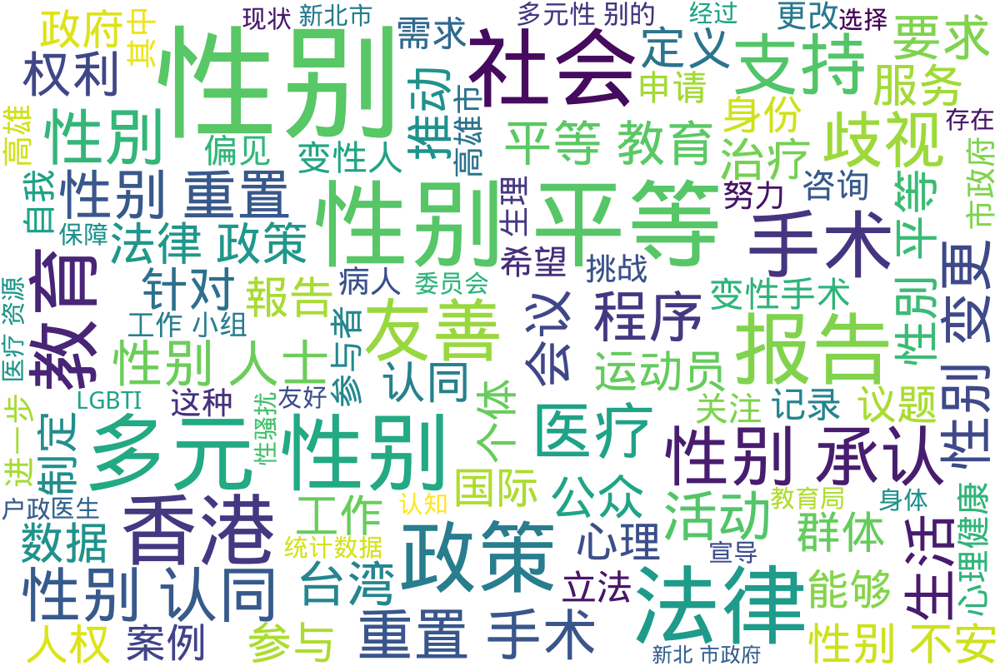

---
search:
  exclude: true
---

# 港澳台

该目录收录了关于港澳台地区政府及官方组织发布的与跨性别相关的文件和信息，涉及相关政策、法律和社会环境的内容。这些文件旨在提供更清晰的法律框架和社会支持，以促进跨性别群体的权益。

标签: `政府文件`, `港澳台`, `跨性别`, `法律政策`, `社会环境`

总计 29 篇内容

### 📄 文档

#### 2024

[2024_全國大專校院運動會_跨性別學生運動員參與政策](2024_全國大專校院運動會_跨性別學生運動員參與政策_page.md)

查看摘要

该文件是关于跨性别学生运动员参与114届全国大专院校运动会的试办实施计划，主要依据国际奥林匹克委员会（IOC）公布的最新指南制定了各项政策与程序。文件详细说明了跨性别学生运动员的定义、参赛资格的审查流程、所需提交的材料及相关的监控措施。此外，文件还列出参与运动的各项标准和要求，包括对睪固酮浓度的限制，确保比赛的公平性与安全性。特别强调，申请者不必强制接受医疗评估，并提供了与申请程序相关的咨询与协助管道，旨在促进跨性别学生的权益保护，推动性别平等的发展。

#### 2023

[PDF_行政院我國多元性別LGBTI者生活狀況調查_委託研究案辦理成果](PDF_行政院我國多元性別LGBTI者生活狀況調查_委託研究案辦理成果_page.md)

查看摘要

该PDF文件由行政院性别平等处发布，报告了台湾以多元性别群体（LGBTI）为研究对象的生活状况调查的成果与政策建议。文件记录了针对LGBTI群体的生活状况、歧视经验、医疗资源、心理健康等多个维度的调查结果，并提出了一系列的政策建议，旨在改善LGBTI群体的生活质量和社会地位。调查时间段为2022年10月1日至2022年11月30日，采集了共计13,104份有效问卷，内容涉及教育、就业、健康、歧视与敌意、法律与权益等方面，旨在为未来的政策制定提供数据支持。文件详细展示了LGBTI群体的特征与需求，包括身心健康状况、社会认同与接纳、政策建议等多个方面，为进一步推动性别平等与多元性别权益提供了详实的依据。

[高雄市性別友善觀光報告_2023](高雄市性別友善觀光報告_2023_page.md)

查看摘要

该文件是由高雄市政府观光局发布的《关于高雄市性别友善观光的报告》。报告围绕高雄市如何落实性别平等的国际公约CEDAW（消除对妇女一切形式歧视公约）展开，强调了政府在推动性别友好环境与旅游体验方面所做的努力。文中提到，随着高雄的发展，政府致力于消除性别歧视，建立友善的旅游环境，包括友善的厕所在内的多重设施、友好的住宿安排以及友善的旅游路线。此外，文件还详细列出了高雄在支持LGBTQ+群体、促进性别权利方面的历史和现状，包括过去的同志游行与性别友善政策的实施，目的是打造一个欢迎所有性别样貌的城市。

#### 2022

[臺北榮民總醫院多元性別友善就醫環境作業指導書_2022](臺北榮民總醫院多元性別友善就醫環境作業指導書_2022_page.md)

查看摘要

本文件为《臺北榮民總醫院多元性別友善就醫環境作業指導書》，旨在建构一个友好的医疗环境，以提升多元性别者的身心健康。文件详细定义了多元性别的涵义，包括女同志、男同志、双性恋及跨性别者，再者阐述了本院在推行性别平等的政策。内容中提出了多项重要原则，如不歧视多元性别者、医护人员需接受相关培训，以及提供多元性别友善的照护等。

文中还详尽列出了构建友好医疗场所的具体措施，包括提供友善的标识和信息、尊重患者的性别认同以及建立性别友善的咨询氛围等。此外，文件强调尊重隐私权，探讨了如何适当地称呼跨性别朋友，承诺保护与性倾向及性别身份相关的私人信息。最后，文件提及医院为患者提供的各种设施，如性别友善厕所及母乳哺育室，展示了医院为多元性别者构建友好环境的努力和成果。

#### 2021

[香港性教育現狀與挑戰報告_2021](香港性教育現狀與挑戰報告_2021_page.md)

查看摘要

本文件是关于香港的性教育现状及挑战的报告，指出香港在性教育方面的严重滞后，尤其是在性别多元社群的教育内容上不足。报告中提到，传统观念导致性玕不可讨论，严重影响性别教育的推广。教育工作者提到需要建立安全的环境，让学生能够自由提问。然而，实际调查显示，性教育的效果不理想，且目前的教育政策自1997年就未作修订，无法适应现在的需求。报告还强调了 网上性骚扰问题的上升，与性教育及性骚扰的密切关系，强调教师们对性别传统观念的坚持也是推广性的主要障碍。此外，香港教育大学的郭勤博士指出，性教育应当涵盖同性恋及性别认同等议题，呼吁对非二元性别群体的关注，以便改善现有教育体制，使其更加包容和全面。

#### 2020

[LGBTQIA性少数族群+咨询代表会问答_警察改革工作组](LGBTQIA性少数族群+咨询代表会问答_警察改革工作组_page.md)

查看摘要

该文件为2020年8月24日举行的匹兹堡警察局针对LGBTQIA性少数族群的咨询会议记录，内容涵盖了法律、社会环境及性别认同等议题。参与者包括警察、学者及性少数群体的代表，他们讨论了如何更好地服务于性少数族群，尤其是变性人和性工作者。会议中提到的关键问题包括：对警察的SOGIE（性取向、性别认同和性别表达）培训的必要性、性工作者的法律地位及其面临的社会歧视，还有如何改善警察与LGBTQ社区的互动。如Ciora Thomas（SisTers PGH主席）指出，性工作者因经济需求而受到社会的迫害，呼吁社会对他们采取更加包容的态度。最后，讨论了如何提高警察的意识与责任等问题，为制定更好、更具包容性的政策提供了基础。

[臺南市政府民政局性別平等宣導報告](臺南市政府民政局性別平等宣導報告_page.md)

查看摘要

该文件为臺南市政府民政局的性别平等宣导报告，涵盖了109年度一系列与性别平等相关的活动及其成效。这些活动的对象包括里长、新住民、学生及一般民众，宣导的主题包括多元性别、反对性别暴力、促进女性参与STEM等。文件中详细记录了每次活动的日期、参与人数、宣传内容及其目的。例如，在109年5月的性别平等宣导活动中，工作人员通过发放宣传海报和互动问答的方式向参与者传达“性别平等从你我做起”的理念。此外，文件还指出了各活动通过不同渠道的宣传手段，如社交媒体、直接在活动现场宣导等，以提高社会对性别平等的认知与支持。

[臺北市政府教育局109年性別平等工作成果報告](臺北市政府教育局109年性別平等工作成果報告_page.md)

查看摘要

该文件为「臺北市政府教育局109年性別平等工作成果報告」。文件详细列出了该年度台北市在性别平等方面实施的各种措施、活动及其成效。报告中提到，针对亲密关系暴力事件频发的现象，教育局以“性别与情感”为主题，结合课程内容，开展了一系列活动。例如，109年度共举办37场针对教育人员的校园性侵害、性骚扰及性霸凌防治教育研习，参与人数达2450人。并且，该局也鼓励学生在“生活小小事，谈情感”主题下进行征稿，展示了对情感表达的重视，增强学生的性别意识及同理心。此外，还有提及增加对未成年人保护及权益保障的培训，定期对校内存在的性别议题进行研究和报告。同时，文件中也列出了性别平等项目的预算情况和教育局的各项策略、措施，这些都助力于建立性别友善的校园环境。此报告不仅是对过去一年的总结，也是为未来进一步推动性别平等提供参考的文献。

#### 2019

[苗栗縣性別平等業務成果報告](苗栗縣性別平等業務成果報告_page.md)

查看摘要

该文件是苗栗县关于性别平等业务成果的官方报告，旨在总结和评估跨性别宣传活动的实施情况。报告中详细列出活动的名称为“难撕的标签-跨性别宣导”，并说明其进行的具体时间为108年下半年度。活动主要针对苗栗县政风处及其员工亲属，约有53人参与，其中男性24人（45.28%）和女性29人（54.72%）。该活动的目标在于增进参与者对性别议题的认识，尤其是对跨性别的理解，从而促进不同性别群体间的和谐相处。报告中提到，通过前导测验发现参与者对性平意识的认同度接近100%，且超过90%的参与者对跨性别这个术语有所了解。该项目希望通过互动式宣导、测验等多样化的宣导方式，增强对性别认同和性别多样性的理解和尊重，并将性别平等意识融入日常生活中。总体而言，该文件记录了苗栗县在推广多元性别和性别平等方面的努力与成效。

#### 2017

[性別承認跨部門工作小組諮詢文件_香港](性別承認跨部門工作小組諮詢文件_香港_page.md)

查看摘要

该文件是由香港性别承认跨部门工作小组拟备的咨询文件，旨在研究和探讨在香港实施性别承认制度所需的法律权利和相关行政措施。文件详细介绍了工作小组成立的背景、职权范围、研究方法和研究范围，提供有关如何保障变性人士法律权利的政策建议。此文件重点分析了香港现行法律制度与其他国家（例如英国）在性别承认上的法律比较，并讨论了性别承认影响的法律条文，如在婚姻、身份文件、医疗服务等领域的应用及其法律后果。此外，文件还涉及社会对变性和跨性别身份的理解与接受，以及面临的法律与社会挑战。文件最后部分总结了性别承认制度可能带来的利益与需考量的争议，寻求公众的反馈与建议。

[PDF_CB420917-1819_-_立法會](PDF_CB420917-1819_-_立法會_page.md)

查看摘要

该文件为公民党就香港《性别承认法》的意见书，文件详细探讨了跨性别人士在法律上的地位，尤其是在婚姻和性别认同方面所面临的挑战。文件引用了2013年W诉婚姻登记官案中的判决，强调已完成性别重置手术的变性人士在婚姻方面的权利，并指出香港作为国际社会的一部分，应借鉴英国2004年《性别承认法令》的相关内容，跟进立法萧条的问题。文件中提到跨性别人士在香港的社会地位、法律保障和生存现状，强调必须建立独立于性别重置手术之外的法律承认体系，以避免对跨性别人士的强制绝育和身体完整性侵犯，并指出国际上对跨性别权利的逐步推进。公民党主张应尽快制定《性别承认法》，并重新审视双性人群体的性别承认问题。

[PDF_性別承認議題公眾諮詢FAQ1_-_立法會](PDF_性別承認議題公眾諮詢FAQ1_-_立法會_page.md)

查看摘要

该文件为2017年由香港性文化学会发布的性别承认议题公众咨询FAQ，主要围绕香港政府对于性别承认的法律及社会环境进行讨论。文件中列出了一系列常见问题与答案，旨在帮助公众理解性别承认的基本概念和背景资料。它指出，性别不仅是生理与心理认同的体现，同时也是社会的法律问题。文件强调，已进行性别重置手术的变性人士享有法律的认可与保护，同时讨论了存在的法律空白及社会文化层面的歧视与包容度。值得注意的是，该咨询文件描述了几种不同的性别承认模式，包括自我声明模式、无需手术模式等，并探讨每种模式的利弊。通过对比全球不同地区的做法，文件为改善香港性别认同法律和政策提供了宝贵的参考。

[1997_關注婦女性暴力協會_性別承認諮詢意見書](1997_關注婦女性暴力協會_性別承認諮詢意見書_page.md)

查看摘要

该文件为关注女性暴力协会就性别承认跨部门工作小组的《性别承认咨询文件》所提出的意见书。文件详细阐述了性别承认制度的重要性，强调性别承认是一种人权，所有跨性别人士的选择权应被尊重。文件中提出了对16个咨询问题的回应，包括是否应为香港设立性别承认制度、在性别承认中订立医学诊断的规定、性别承认应该涵盖的医疗条件等。

协会认为，性别不应仅以二元方式处理，性别不安并不是疾病，提出法律上应允许跨性别人士在无须必须进行医学干预的情况下获得法律承认。此外，文件中还对性别承认的申请流程及必要条件提出了建议，强调任何医疗选择权应尊重个体差异，任何人都不应因状态而被迫接受医疗程序。此文件在讨论多元性别与法律的交汇点时，呼吁建立一个更加包容与理解的社会环境。

#### 2015

[PDF_零拒絕的愛-尊重與包容多元的性別差異_-_高雄市政府](PDF_零拒絕的愛-尊重與包容多元的性別差異_-_高雄市政府_page.md)

查看摘要

本文件是由高雄市政府教育局编写的一本手册，旨在推广和实施性别平等教育，确保每个学生在校内都能健康地成长。手册中详细介绍了《性别平等教育法》的相关知识，强调了实施这一法律的必要性和背景，包括过去在校园里发生的性别暴力事件，以及社会对性别问题的关注与反思。手册的结构分为两个主要部分：入门知识和校园现场。在入门知识部分，主要解答如何理解性别、性倾向、性别多样性等基本概念，并探讨教育者和家长在推动性别平等教育中的角色；在校园现场部分，通过真实的教学故事展示了性别平等教育的成效与实践，提及了如何在课堂上处理性别刻板印象和调适学生间的关系。这些案例让大家真实感受到教育的力量以及性别平等的重要性。除此之外，手册还提供了各种实用的建议和资源，以帮助教师和家长更好地理解和参与性别平等教育的工作。

[澳门大学法医学教程进度（2015-2016学年度）](澳门大学法医学教程进度（2015-2016学年度）_page.md)

查看摘要

本文件是澳门大学法学院2015-2016学年度的法医学课程讲义，详细列出了该年度上学期的教学进度安排。文件中包含每节课的讲授日期、讲师、授课内容及有关法律和医学实践的相关法律条款。课程内容涵盖法医学的基本概念、法医死亡学、法医解剖学、法医创伤学、以及法医精神科等研究领域。针对跨性别和多元性别的相关议题，例如‘性法医学’的讲授内容，也涉及对性别认同和法律问题的探讨，为研究和实践中的法律提供了重要依据。文件中还提到了一些与法医学相关的重要书籍，以供学习者深入参考。每堂课都安排了具体的学习内容和相关的法律条款，这为学习者提供了全面的学习资源和法医学应用的实际指导。

[內政部研商性別變更認定及登記程序](內政部研商性別變更認定及登記程序_page.md)

查看摘要

这份PDF文件记录了台湾内政部关于性别变更认定及登记程序的第三次会议的发言要旨。会议于104年5月6日下午召开，涉及的主题包括性别认同与登记的法律框架、不同相关方的意见及建议，和对跨性别者权利的保障。文件中提到，性别认同是基本人权，并讨论了不摘除性器官的个体如何进行性别变更的问题，强调相关程序及负责判断的人士的资格。此文献为台湾在性别变更法律政策方面的重要记录，反映出社会对性别认同的关注和法律的逐步改革。会议中多位与会者提出了对当前制度的改善建议，并讨论了未来可能的立法方向。

#### 2014

[PDF_跨性別是泛指任何人的性別認同及或其性別表達](PDF_跨性別是泛指任何人的性別認同及或其性別表達_page.md)

查看摘要

该文件由平等机会委员会发布，内容围绕跨性别人士和变性人在香港的权利、法律及社会环境。文中详细解释了跨性别和变性人的定义，强调跨性别是指人们的性别认同与出生时的性别不一致，而变性人则是希望以另一性别身份生活的人。文件还探讨了香港的法律框架，介绍了变性人所需的性别重置手术程序，以及相关的心理健康挑战如性别焦虑症。此外，文件指出，当前的法律体系未能充分保护跨性别人士的权利，包括在条件下更改身份证明文件的程序，以及由于现有规定可能引发的歧视问题。本文件的最后讨论了W诉婚姻登记官案的裁判及对香港的影响，包括推荐制定全面的性别承认法例的重要性。

[PDF_接受性別重置手術人仕的簡介_-_立法會](PDF_接受性別重置手術人仕的簡介_-_立法會_page.md)

查看摘要

该文件是关于性别重置手术的简介，主要由香港立法会发布，旨在提供对接受性别重置手术人士的基本信息和流程的说明。文件开头说明这一手术的相关背景，强调接受手术的个体均为心智健全与身体健康的成年人，他们因身体性别与心理性别不一致而感到痛苦。根据世界卫生组织的分类，这种状况被定义为易性症（Transsexualism）。文件详细列出了接受性别重置手术的过程，包括必要的心理评估、异性荷尔蒙的反应观察以及实生活中至少12个月的异性打扮体验。这些步骤旨在确保申请手术者经过深思熟虑，并充分理解手术的风险和影响。文件同时提到香港过去三十年来大约有一百位人士接受了性别重置手术，绝大多数接受手术的人士都能在手术后过上正常生活。最终，文件进一步描述了《条例草案》中关于手术的具体要求，如切除原有性器官与建造所选性别的性器官等，确保操作符合医学原则并且对病人要求足够弹性。强调手术并非酷刑，而是一种有效的治疗心理疾病的方法。这一定义为性别重置手术的合法性和合理性提供了支持。

[2014年婚姻修訂條例草案公聽會關於變性手術的意見摘要](2014年婚姻修訂條例草案公聽會關於變性手術的意見摘要_page.md)

查看摘要

本文件为《2014年婚姻修订条例草案公聽会关于变性手术的意见摘要》的官方文件，其内容记录了2014年4月23日首场公听会中多位人士对于变性手术及其法律规范的看法和意见。会议上提到的具体讨论内容包含了对变性人权益及生活现状的重视，特别是针对于变性手术的争议及医生袁维昌的专业回应。文中指出，公众对变性手术的认识存在误解，有部分意见认为性别变更的法律要求过于严苛，并认为强制进行变性手术侵犯了人权。袁医生回应了这些意见，强调变性手术对于跨性别者身心健康的积极作用，并表达了对加宽法律要求的看法，他提到：“做手术本身有好处，危险性不高”。此外，文中还提及了何韻詩等人士对法律及社会环境中跨性别问题的关注，提出的不只是一种法律上的改变，更是对跨性别群体生活状况的深思和关怀。

#### 2013

[各國跨性別登記制度_中华民国內政部委託研究報告](各國跨性別登記制度_中华民国內政部委託研究報告_page.md)

查看摘要

该文件为《各国跨性别登记制度》的研究报告，由中华民国内政部委托逢甲大学进行研究，主要探讨各国在跨性别者身份登记方面的法律政策与实施情况。报告包含对德国、瑞士、奥地利、日本、英国、加拿大、澳大利亚等国家的相关法律法规及立法沿革的详细分析。通过文献分析与比较法研究，报告旨在为改善台湾跨性别者的社会处境与法律地位提供参考。

文件首先介绍了研究的缘起与方法，接着详细阐述各国在跨性别者身份登记方面的法规与法律解释，分析这些法律在实践中的应用及社会反应，最后总结了各国立法的共同趋势与对台湾未来的建议，如放宽性别登记条件、增设非二元性别选择等。报告强调性别自主是基本人权，跨性别者应有权自主决定自身性别，并指出不同国家在这一问题上的框架与对待态度，呈现出多元与复杂的立法背景。

#### 时间未知，按收录顺序排列

[反对國小性別平等教育內容_台湾](反对國小性別平等教育內容_台湾_page.md)

查看摘要

本文件为台湾地区关于反对国家小学性别平等教育相关内容的正式文件。文中提出了对现行性别平等教育政策的批评和反对意见，强调这些政策对儿童成长及心理健康的潜在影响。文件内容可能涉及诸如教育体系中的性别意识形态冲突、父母及社会各界的反馈，以及对教育政策变更的呼吁。虽然文件的具体内容未被展示，但一般而言，这类文件往往包含政策建议、社会讨论及相关案例分析。

[PDF_同志QA_-_性別平等教育委員會](PDF_同志QA_-_性別平等教育委員會_page.md)

查看摘要

本文件由性别平等教育委员会发布，致力于介绍和解答关于性别多样性和跨性别者权益的问题。文件内容包括针对跨性别人士的常见疑问解答，例如跨性别的定义、过渡过程中的注意事项、以及如何支持跨性别个体等。此外，还讨论了在教育环境中实施性别平等教育的重要性，强调了教育工作者在推动理解与包容方面的角色。文件通过列举具体案例和相关政策，提供了实用的信息和指导，帮助社会大众更好地理解和尊重跨性别者的生活和挑战。

[PDF_跨性別者的日常生活_跨性別QA_大臺北跨性別友善資源_-_臺北市首座](PDF_跨性別者的日常生活_跨性別QA_大臺北跨性別友善資源_-_臺北市首座_page.md)

查看摘要

该文件为《跨性别者的日常生活：跨性别QA》，由大台北跨性别友善资源发布，为用户提供了关于跨性别者日常生活及其面临的一些挑战与资源的信息。文件中深入探讨了跨性别人士的生活经历，包括他们在身份认同、社会接受度、医疗支持等方面所遭遇的具体问题和遭遇的歧视。通过问答形式，文件还回应了社会对跨性别人士常见的误解，并提供了一些友好的建议和支持资源，以帮助社会更好地理解跨性别者的需求。最终，希望通过此文件能提升公众对跨性别者的关注，推动更为友好的社区环境。

[PDF_香港醫院管理局就性別不安所提供的治療](PDF_香港醫院管理局就性別不安所提供的治療_page.md)

查看摘要

该文件为香港医院管理局关于性别不安所提供治疗的正式文件。文件内容涵盖了对性别不安的临床定义、治疗方案以及可获得的医疗资源等方面的信息。它详细解释了性别不安患者在香港能获取的医疗支持，包括心理咨询、激素治疗和外科手术等医疗选择。同时，文件也提到相关的法律政策，确保患者在接受治疗时的合法权益。此文档显著反映了香港在性别认同及医疗支持方面的制度和实践，旨在提供对性别不安患者的指导和帮助。

[PDF_新北市政府參加彩虹城市網絡RCN支持多元性別友善計畫](PDF_新北市政府參加彩虹城市網絡RCN支持多元性別友善計畫_page.md)

查看摘要

此文件为新北市政府参与国际组织彩虹城市网络(RCN)支持多元性别友善计划的官方报告。报告详细介绍了该市在多元性别方面的政策进展、数据统计和活动策划。首先，文件提到新北市在110年（2021年）正式加入RCN，并承诺将多元性别族群的面向纳入政策中。这包括指派专员参与相关活动以及每年提交多元性别族群的政策成果。接着，报告呈现了国内外关于多元性别人口的研究数据，显示台湾的双性恋和同性恋者占比较大，并引用盖洛普的研究指出全美约有4.5%的人口为LGBT，其中跨性别者占0.6%。此外，此报告还分析了新北市在108至110年间针对多元性别族群开展的活动、服务和政策计划的数量，强调了推动性别平等的必要性和目标。最后，该文件展示了未来的活动策略，提升新北市政府对于多元性别群体的支持与能见度。

[PDF_5_性別不安有甚麼治療方法_-_醫院管理局](PDF_5_性別不安有甚麼治療方法_-_醫院管理局_page.md)

查看摘要

本文件是由香港医院管理局发布的一份关于性别不安（Gender Dysphoria）治疗方法的指南，详细介绍了性别不安的定义、成因、治疗方法及相关的医疗资源。文件的开头定义了性别不安，并指出这种状态是患者感受到的生理性别与其心理性别之间存在显著的差异，通常会导致强烈的心理困扰。接着，文件详细列出了一系列治疗方法，包括：

1. **荷尔蒙治疗**：由内分泌科医生评估患者体质，并在患者同意下开处方荷尔蒙，以帮助患者达到其希望的生理特征。
2. **实际生活体验**：患者在治疗期间需遵循其选择的性别角色生活至少12个月，体验该性别所带来的生活各方面变化。
3. **心理治疗**：精神科医生将在治疗过程中密切观察患者的心理健康，确保他们能够健康应对变化，帮助患者评估治疗带来的影响。
4. **性别重置手术**：在适合的情况下，医院将患者转介至外科医生，进一步讨论可能的手术治疗。

[性別平等教育委員會_性平大學堂徵答題目](性別平等教育委員會_性平大學堂徵答題目_page.md)

查看摘要

该文件为《性别平等教育委员会性平大学堂有奖征答题目》的PDF文档，包含了一系列与性别平等和性骚扰防治相关的选择题和判断题。题目内容涉及社会对性别角色的传统观念，诸如「做家事是女人的事」以及对安全性行为的相关认知。文件中还提及了同志关系与性病的关系，强调安全性行为是预防性病的根本之道。此外，文中列举了校园性骚扰实例，帮助读者理解性骚扰的定义和表现形式，包括同学之间的互动及不当行为的后果。最后，文件指出性别平等的真正含义不仅限于男女平等，而是应尊重所有性别取向者，涵盖更广义的多元性别观念。

[跨性别资源中心-港澳地区信息汇总](跨性别资源中心-港澳地区信息汇总_page.md)

查看摘要

该文件为《跨性别资源中心-港澳地区信息汇总》的PDF文档，旨在提供有关港澳地区针对跨性别者的资源和支持服务的全面信息。文件中可能包括有关医疗服务、心理咨询、法律支持以及社会服务等内容，帮助跨性别者在日常生活中获得所需的支持和帮助。此外，文件还可能列出相关组织及其联系方式，以及可供跨性别者使用的热线和帮助渠道。通过这样的信息汇总，期望能够增强跨性别者的社会支持网络，提升他们对自身权利和资源的了解。

[性別變更戶政法令研討及案例分享](性別變更戶政法令研討及案例分享_page.md)

查看摘要

该文件涉及性别变更户政法令的研讨与案例分享，内容详尽地探讨了性别变更登记的相关法律要求和案例分析。通过具体案例，例如居民O君提供的医疗诊断证明书，文件阐述了申请性别变更所需的必要条件，包括精神科医师的评估、诊断证明和不可逆手术的完成情况。依据户籍法第21条的规定，文件解释了性别变更登记的程序和法律要求，强调必须遵循相关法规完成登记。文件中还讨论了对“平胸手术”的法律认定问题，指出一旦进行该手术，将面临不可逆的身体变化，因此手术前需认真考虑。此外，还涉及到出生别变更登记的程序、相关人的出生别变更及其所需材料，指导如何在不同辖区间进行相关的户籍变更。

### 词云图 { data-search-exclude }

> 本内容为自动生成，请修改 .github/ 目录下的对应脚本或者模板
