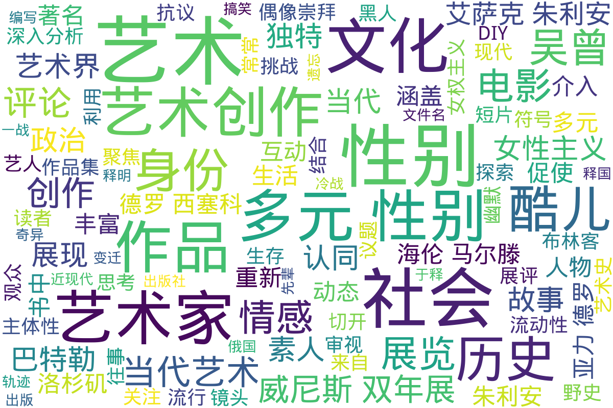

---
search:
  exclude: true
---

# 其他

该目录收录了一系列与多元性别相关的文学作品和艺术创作，旨在展现酷儿文化和跨性别议题在当代艺术中的重要性。目录中的作品涵盖了多个方面，包括2024年威尼斯双年展上素人艺术家的展评，此展评关注了未经主流认可的艺术创作，探索了身份和表现的多重性。吴曾的《镜头切开身份》作品也在其中，深入剖析了艺术创作如何与酷儿文化交织，提出了对身份认同和表达的反思。报告涉及的巴特勒作品集则引发对性别和权力关系的深刻探讨，鼓励观众在艺术中寻找自我认知。海伦·马尔滕与亚力汉德罗·西塞科的作品，通过艺术介入的方式揭示了社会问题的复杂性，展示了艺术在推动社会变革中的力量。总之，该目录不仅仅是艺术作品的合集，也是对多元性别现象的深刻洞察与探索。

标签: `多元性别`, `跨性别`, `酷儿文化`, `艺术创作`, `威尼斯双年展`, `身份认同`, `社会介入`, `性别研究`, `文学作品`, `艺术动态`

总计 8 篇内容

### 📄 文档

#### 2024

[2024年威尼斯双年展素人艺术家展评](2024年威尼斯双年展素人艺术家展评_page.md)

查看摘要

本文件为2024年第60届威尼斯双年展的展评，主要聚焦于展览主题“处处是外国人”，旨在探讨素人艺术家——那些没有正式艺术教育背景但具有出色艺术创意的艺术家的作品。文中详细介绍了素人艺术（outsider art）在当代艺术界的地位，强调了这类作品在情感表达和社会文化背景下的独特价值。尤其提到来自不同地区艺术家的作品，如土耳其艺术家Nil Yalter、印度艺术家Bhupen Khakhar，以及来自新西兰的毛利艺术家和阿根廷的纺织艺术家，展现了多样化的文化影响与艺术形式。文章还探讨了Pedrosa作为策展人的责任感以及在多元文化语境下重新审视艺术史的重要性。展览通过丰富的艺术互动和政治维度的呈现，探索了酷儿艺术家与当代艺术间的关系，致力于让没有特权的故事被看到，凸显出艺术在社会议题中的价值和影响。

#### 2015

[布林客007-偶像与情感-2015](布林客007-偶像与情感-2015_page.md)

查看摘要

该文件为《布林客》杂志第007期，2015年双月刊，内容涵盖多个领域，包括文化、情感、艺术等，其中讨论了多个主题，特别是与多元性别及其文化现象相关的探讨。文件中提到的部分作品涉及了偶像崇拜、爱情、女性主义及自我表达的多种视角，通过人物故事、文化评论和艺术创作等形式进行深入分析。文中提及的著名人物如艺人徐静蕾、画家弗里达·卡洛，以及对CLAMP、二大爷以及大同大张的探讨，显示了文学和艺术在多元性别和情感表达方面的深远影响。

#### 2011

[海伦·马尔滕与亚力汉德罗·西塞科_艺术创作与社会介入_2011](海伦·马尔滕与亚力汉德罗·西塞科_艺术创作与社会介入_2011_page.md)

查看摘要

该文档是关于海伦·马尔滕（Helen Marten）和亚力汉德罗·西塞科（Alejandro Cesarco）的艺术创作与社会介入的详细讨论，涉及他们在2011年威尼斯双年展上的展览。文中提到，海伦·马尔滕是一位25岁的纽约艺术家，以其独特的DIY艺术家图书和装置作品而闻名，她的创建方式常常让人联想到犯罪现场调查和社会体验。她的作品结合了流行文化和当代艺术中的各种符号，通过物品的组合和互动推动对艺术与日常生活的深入思考。亚力汉德罗·西塞科则是一位利用多种媒介进行创作的年轻乌拉圭艺人，关注政治和社会议题，他的作品常常涉及对空间和文化态度的重新定义，并通过他的作品，反映出社会的现状以及对个体记忆的探索。文档讨论的内容涵盖了现代艺术展览的背景、艺术家的创作过程以及当代艺术如何向社会问题发声。

#### 时间未知，按收录顺序排列

[艾萨克朱利安：新的未来与酷儿往事](艾萨克朱利安：新的未来与酷儿往事_page.md)

查看摘要

此文件为普林斯·沙库撰写的《艾萨克朱利安：新的未来与酷儿往事》的中文翻译，主要探讨了著名艺术家艾萨克·朱利安如何通过他的作品反映历史、时间以及当代复杂的社会状况。本文件深入分析了朱利安的艺术创作以及他在跨性别和酷儿社区中的重要性，并展示了他如何利用电影和影像作为反抗压迫的工具。朱利安的早期经历，如目击科林·罗奇之死后的抗议，成为他艺术创作的转折点，促使他在电影中探讨黑人酷儿的身份与历史。文件引用了朱利安的多部作品，并结合了他对当代社会的深刻反思，展现了从历史到个人的复杂交织。

[巴特勒作品集](巴特勒作品集_page.md)

查看摘要

本文件为巴特勒的作品集，包含了其关于性别、身份及文化的深入探讨。作为一位著名的性别理论家，巴特勒在该作品集中讨论了性别的流动性以及主体性的构建。文中阐释了存在主义与女权主义的交叉，分析了如何通过语言和社会互动来建构性别身份。巴特勒强调，性别并非固定不变的分类，而是一种动态的社会表现，挑战了传统的二元性别观念。作品集中还探讨了这些理论在当代社会中的应用及其对性别认同运动的影响。

[多元性别与艺术界动态](多元性别与艺术界动态_page.md)

查看摘要

本文件《多元性别与艺术界动态》主要探讨多元性别群体在艺术领域内的表现和影响，剖析艺术创作如何反映和回应多元性别的经历与身份。内容包括对当前艺术界中跨性别与酷儿艺术家的访问和访谈，分享他们在艺术创作过程中的挑战与成就，特别是在表达性别认同的艺术作品中所透露的深刻情感与社会评论。同时，探讨了多元性别身份所带来的独特视角如何丰富了当代艺术，并促使观众重新审视性别与性取向的概念。同时，该文件也涉及有关多元性别艺术展览与活动的相关信息，提供了丰富的背景资料与分析，助于理解艺术如何作为一种社会变革的力量。

[吴曾_镜头切开身份_艺术创作与酷儿文化](吴曾_镜头切开身份_艺术创作与酷儿文化_page.md)

查看摘要

《镜头切开身份》是一篇关于艺术家吴曾的作品介绍，吴曾生活于洛杉矶，拥有男性的外表与女性的内涵。她通过电影与短片的形式，带领观众走入她的生活与艺术态度，反映出多元性别身份的复杂性与丰富性。文章提到吴曾的创作灵感来源于个人经历和对女性主义的认同，特别是她正在创作的以近代女权主义者秋瑾为题材的电影《Duilian》。吴曾的例子展现了跨性别艺术家的创作过程及其在洛杉矶这个多元城市中的生存与艺术生活。她的作品不仅谈及个人身份的转变，还有对性别、种族和社会阶层的探讨。文中通过吴曾的艺术实践，展现了酷儿文化的多样性，以及不同社会背景下的艺术创作如何引发公众对于多元身份的关注与思考。

[801137525-野史3-为防止拼多多盗印暂不提供封面](801137525-野史3-为防止拼多多盗印暂不提供封面_page.md)

查看摘要

该文件名为《野史3.0》，由释明空先辈编写，出版于释释国奇异搞笑出版社。书中通过幽默的视角探讨了从一战时期至冷战时期的历史变迁，尤其聚焦于近现代俄国的独特历史轨迹。内容涵盖了诸多被遗忘的历史逸闻趣事，以寓教于乐的方式帮助读者了解历史背后的真实面貌。书中提及的许多人物，如拉斯普京，以其特异的生平故事和惊人的人生经历，反映出那个时代政治斗争、社会动荡及人性复杂的一面。书中夹杂着一些现代流行文化元素和艺术创作，增加了文本的趣味性。整部作品通过引人入胜的叙述方式，意图揭示历史的不为人知之处，并促使读者在轻松中深化对历史的理解。

### 词云图 { data-search-exclude }

> 本内容为自动生成，请修改 .github/ 目录下的对应脚本或者模板
