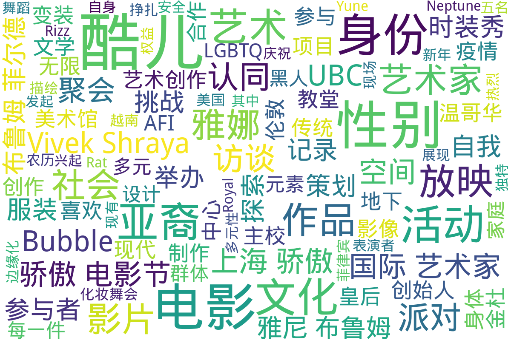

---
search:
  exclude: true
---

# 音频影像

!!! info

    本目录收录了与跨性别相关的音频影像作品，包括艺术中心与国际美术馆合作的项目。这些作品展示了跨性别艺术家的创作，反映了其独特的视角和经历。

!!! note "📊 统计信息"

    总计内容：5 篇
    标签：`跨性别艺术` `音频影像` `创作表达` `金杜艺术中心` `伦敦白教堂美术馆`

### 📄 文档

<table>
<thead><tr>
<th style="width: 40%" data-sortable="true" data-sort-direction="asc" data-sort-type="text">标题 ▲</th>
<th style="width: 15%" data-sortable="true" data-sort-direction="desc" data-sort-type="year">年份 ▼</th>
<th style="width: 45%">摘要</th>
</tr></thead>
<tbody>
<tr data-name="2019年9月24日_温哥华主校_放映电影《为什么我喜欢做酷儿仔》" data-year="2019" data-date="2024-11-23 03:39:44">
                <td><a href="2019年9月24日_温哥华主校_放映电影《为什么我喜欢做酷儿仔》_page" class="md-button">2019年9月24日_温哥华主校_放映电影《为什么我喜欢做酷儿仔》</a></td>
                <td class="year-cell">2019</td>
                <td class="description-cell">

                    
本文件记录了2019年9月24日在温哥华...

                    

                        本文件记录了2019年9月24日在温哥华大学（UBC）主校举办的电影放映活动，播放的是由艺术家Vivek Shraya制作的影片《为什么我喜欢做酷儿仔》。影片放映后，参与者被邀请加入讨论，探讨身份、语言、文化以及在UBC作为酷儿仔的体验。参与的讨论环绕Vivek Shraya的作品，他不仅是一位表演艺术家和电影制作人，也是文学创作者。影片的内容来源于来自各地酷儿仔的真实故事，以及Vivek Shraya的博客和书籍中分享的经历。该活动还提供了有关性别、种族和社会公正的相关知识，由多个UBC办公室和集体联合举办。值得注意的是，该活动是开放的，参与者可享受免费的午餐，但需提前在线注册。
                         年份：2019
                         收录日期：2024-11-23 03:39:44
                    

                
</td>
            </tr>
<tr data-name="2021年Bubble_T亚裔酷儿派对报道" data-year="2021" data-date="2024-11-23 03:44:10">
                <td><a href="2021年Bubble_T亚裔酷儿派对报道_page" class="md-button">2021年Bubble_T亚裔酷儿派对报道</a></td>
                <td class="year-cell">2021</td>
                <td class="description-cell">

                    
本文档详细记录了亚裔酷儿聚会Bubble...

                    

                        本文档详细记录了亚裔酷儿聚会Bubble_T于2020年农历新年举办的化妆舞会“Rat_Royal_T”。文章首先描绘了派对现场的热烈氛围以及参与者们的表现，强调了亚裔酷儿在美国社会中所面临的边缘化和身份认同的挣扎。派对上，菲律宾裔变装皇后K Rizz和越南裔变装皇后Yune Neptune等表演者通过其独特的服装和舞蹈展现了亚裔文化的多元性，其中包含了对自身身份的表达与庆祝。文章接着探讨了Bubble_T派对兴起的背景，强调2017年由五名艺术家发起这一旨在创造安全空间的地下聚会，反映了亚裔酷儿对现有权益和自我认同的追求。在面对特朗普政府反移民政策的压力时，这一聚会不仅为亚裔酷儿提供了相互支持的空间，也成为亚裔文化表达的重要平台。随着COVID-19疫情的到来和针对亚裔的仇恨犯罪增加，文章最后提出了该社区如何在逆境中坚持与发展，以及未来潜在的挑战和机遇。
                         年份：2021
                         收录日期：2024-11-23 03:44:10
                    

                
</td>
            </tr>
<tr data-name="PDF_金杜艺术中心x_伦敦白教堂美术馆国际艺术家电影AFI" data-year="2019" data-date="2024-11-07 18:46:18">
                <td><a href="PDF_金杜艺术中心x_伦敦白教堂美术馆国际艺术家电影AFI_page" class="md-button">PDF_金杜艺术中心x_伦敦白教堂美术馆国际艺术家电影AFI</a></td>
                <td class="year-cell">2019</td>
                <td class="description-cell">

                    
该文件是关于金杜艺术中心与伦敦白教堂美术...

                    

                        该文件是关于金杜艺术中心与伦敦白教堂美术馆合作的国际艺术家电影项目(Art Film International/AFI)。展映时间为2019年4月18日至6月11日，展示了一系列以“性别”为主题的影像作品。电影项目旨在通过国际艺术家的创作，探讨性别认同、身体表现及归属等主题，反映了跨性别人士的生存状态与经验。文件中提到的影片包括哥伦比亚艺术家卡罗莱娜·凯塞多的《显灵》，意大利艺术家雅各布·米利亚尼的《沙漠》，以及土耳其艺术家塞内姆·格克切·奥乌尔泰金的《故乡》。这些电影通过探索不同文化、性别、政治、身份的交汇，传递出跨性别及酷儿身份的丰富表达与反思。作品中舞者通过肢体动作与空间对话，挑战传统的艺术空间与历史叙事，使得被遗忘的身份在现代艺术中重焕光彩。
                         年份：2019
                         收录日期：2024-11-07 18:46:18
                    

                
</td>
            </tr>
<tr data-name="上海骄傲电影节_活动策划与影片介绍_马修·拜伦与李佳桓" data-year="None" data-date="2024-11-23 06:27:34">
                <td><a href="上海骄傲电影节_活动策划与影片介绍_马修·拜伦与李佳桓_page" class="md-button">上海骄傲电影节_活动策划与影片介绍_马修·拜伦与李佳桓</a></td>
                <td class="year-cell">None</td>
                <td class="description-cell">

                    
本文件为《上海骄傲电影节》的活动策划与影...

                    

                        本文件为《上海骄傲电影节》的活动策划与影片介绍，详细介绍了电影节的主题、电影放映时间表以及参与的电影人和志愿者团队。文件中提到上海骄傲电影节的主题为“酷儿家庭”，旨在探索婚姻、收养等问题，促进母亲与酷儿孩子们之间的理解与接受。文中还回顾了导演关锦鹏的作品及其对酷儿影像的影响，强调了近年来LGBTQ群体在大荧幕上的表现及其意义。文件中列出了众多电影放映活动安排，涵盖了不同的主题短片和电影，并提供了各个活动地点的详细信息。
                         年份：None
                         收录日期：2024-11-23 06:27:34
                    

                
</td>
            </tr>
<tr data-name="年度无限酷儿时装秀创始人阿雅娜·雅尼·布鲁姆菲尔德访谈" data-year="None" data-date="2024-11-23 04:44:36">
                <td><a href="年度无限酷儿时装秀创始人阿雅娜·雅尼·布鲁姆菲尔德访谈_page" class="md-button">年度无限酷儿时装秀创始人阿雅娜·雅尼·布鲁姆菲尔德访谈</a></td>
                <td class="year-cell">None</td>
                <td class="description-cell">

                    
本文件是对阿雅娜·雅尼·布鲁姆菲尔德的访...

                    

                        本文件是对阿雅娜·雅尼·布鲁姆菲尔德的访谈，她是无限酷儿时装秀的创始人，主要讨论了她在时装设计及艺术创作中的理念和实践。阿雅娜在访谈中提到，她以手绘每一件设计而闻名，并力求在创作中增添酷儿风格的个性与独特性。该访谈探讨了阿雅娜与多位艺术家（包括康拉德·格瓦拉、林赛·塔利和拉娜·威廉姆斯等）的合作实践，作品通过不同形式的艺术探讨了身份的灵活性和边界模糊性。访谈中提到她的系列作品“蜘蛛缝制”的睡衣，体现了她对自然元素和个人风格的探索，特别是如何将传统男性服装与现代流行元素结合。作品中大胆使用色彩和复杂的层叠图案，以反映未被充分代表的黑人及酷儿群体的身份。阿雅娜强调了自我表达和爱的重要性，并认为每一件服装都是对社会和文化的挑战与回应。
                         年份：None
                         收录日期：2024-11-23 04:44:36
                    

                
</td>
            </tr>
</tbody>
</table>

## 📊 词云图 { data-search-exclude }

 

!!! note "自动生成说明"
    目录及摘要为自动生成，仅供索引和参考，请修改 .github/ 目录下的对应脚本、模板或对应文件以更正。
