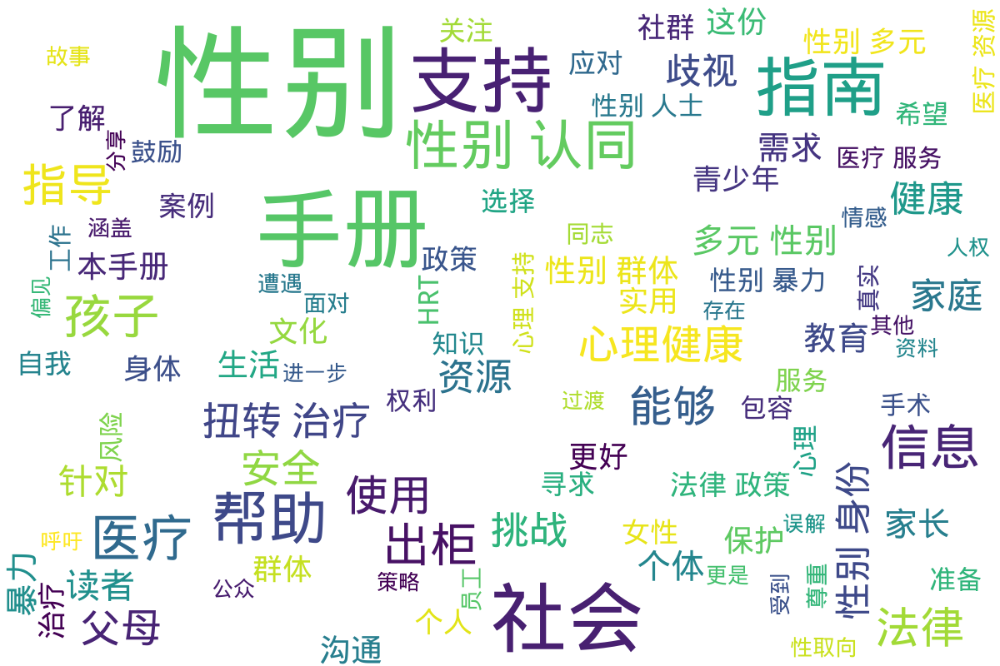

---
search:
  exclude: true
---

# 跨性别相关手册指南

该目录包含跨性别相关的非政府组织（NGO）手册指南，旨在为社区成员提供资源和支持，帮助他们了解可用的服务与信息。

标签: `跨性别`, `非政府组织`, `资料指南`, `社区支持`

总计 55 篇内容

### 📁 子目录

- [雌二醇凝胶自制方法](雌二醇凝胶自制方法) (4 篇内容)

### 📄 文档

#### 2024

[性别友善语言与服务关系建立指导](性别友善语言与服务关系建立指导_page.md)

查看摘要

该文件为性别友善语言与服务关系建立指导手册，旨在帮助服务提供者在与多元性别受众建立关系时，使用更为包容、尊重的语言。文中详细列出了应避免使用的性别代词和称谓，并提供了推荐的中性代词使用方法，例如在没有明确性别的情况下，使用‘他’、‘TA’或‘人’等更为中性的称谓。这有助于服务对象感受到尊重和接纳，使他们更容易接受服务。在文件的最后部分，提到了在首次接触时应如何称呼他人以及提供帮助的礼貌用语，强调了避免使用性别人称的重要性。该指南包含了具体的语言示例和使用说明，以帮助服务人员在日常工作中更有效地支持多元性别人士。

[嗓音训练指南](嗓音训练指南_page.md)

查看摘要

本文档专为跨性别女性（MtF）设计，旨在帮助从零基础开始的学习者在日常生活中有效地进行嗓音训练。与市面上常见的伪声教学和声乐练习不同，本文档中的嗓音训练方法对天赋几乎没有要求，确保几乎所有人都能达到女性化的音高。此外，本文档中教授的方法更适合在长时间的日常生活中使用，不会对声带造成伤害。然而，相较于其他方法，本文档中的方法训练周期较长，需要系统的、计划性的练习。  

在编写本文档的过程中，跨性别言语训练研究小组的成员（以下简称“我们”）系统学习和研究了言语训练，结合相关的医学资料、互联网上的公开资源以及多位学习者的个人体验，通过汇总这些经验和心得，完成了这份嗓音训练教学文稿。本文档的主要练习思路与大部分医院的嗓音训练方法基本一致，旨在为那些因各种条件限制而无法参加医院嗓音训练的跨性别女性，提供基础性的嗓音训练指导，帮助她们达到与医院训练相近的效果。  

嗓音训练的练习思路为，先进行音高部分的练习（约为3周），再进行音色部分的润色（3周-更长时间）。其中音高部分的练习为必修课程，音色部分的练习为选修课程。  

音高的Pass有一个相对具体的衡量标准，为185-220+之间，练习的目标也是达到这个音高。音色并没有Pass的标准，音色因人而异，也因每个人的个人喜好不同而存在差异，并没有“一定pass”的音色，在音色练习板块中，提供了3种方法供大家选择练习。  

因为本文档的定位属于自学指南，文中尽可能多的提供可以量化的练习标准，辅助大家尽可能的在没有指导的情况下完成嗓音女性化的练习。

#### 2023

[评估职场中LGBTQI_的包容性](评估职场中LGBTQI_的包容性_page.md)

查看摘要

这份文件是关于评估职场中LGBTQI+包容性的变革工具包，由Out & Equal于2023年发布。文件详细介绍了全球各地LGBTQI+社群在职场中面临的包容性和非包容性情况，并列举了124个联合国成员国的法律变化对LGBTQI+权益的影响。此外，文件提供了针对企业如何制定和评估反歧视政策、建立和维持包容性文化、提升LGBTQI+职场包容性的具体指南和最佳实践，包括如何制定无歧视保护、平等的伴侣和家庭福利、包容性医疗保障，以及如何建立性别中立的设施等。“包容性医疗保险”部分指出，企业应与保险提供商合作，确保跨性别和间性员工能够获得必要的医疗服务。文件还强调，需要推动外部社群参与、慈善事业和公共宣传，以实现更广泛的LGBTQI+包容性。这些信息和行动建议旨在帮助企业提高LGBTQI+人员的归属感和安全感，帮助创建一个更加包容的工作环境。

[PDF_BSA_指南有关性别认同问题的投诉](PDF_BSA_指南有关性别认同问题的投诉_page.md)

查看摘要

本文件为BSA指南，主要针对性别认同问题的投诉进行详细叙述。文件指出，性别认同不仅在社会中具有重要意义，而且在媒体报道中的地位也日益重要。社会对性别认同的反应呈现出两极分化，争议纷纷。这份指南的发布旨在指导管理机构如何考量与性别认同相关的投诉，强调了在表达言论自由的同时，必要的社会责任和约束。指南介绍了性别认同的概念以及相关法律背景，包括新西兰法律如何承认个体在出生证明上更改生理性别的权利。同时，文件认定跨性别者为受到歧视和诽谤标准保护的社会群体，讨论了在播出节目中涉及性别认同问题时的注意事项，比如性别错称、弃名错称等可能对个体造成的伤害。文件还提到使用包容性语言的重要性，并指出基于跨性别恐惧的投诉通常不太可能获得支持。

[出柜指南_来自UCSB_RCSGD_2023](出柜指南_来自UCSB_RCSGD_2023_page.md)

查看摘要

这份出柜指南由加州大学圣巴巴拉分校（UCSB）的跨性别与多元性别资源中心（RCSGD）编写，旨在为希望出柜的个人提供指导和支持。指南详细阐述了出柜的定义、重要性以及如何评估出柜的时机和准备出柜的计划。内容涵盖了与出柜相关的多个方面，包括性别身份、性别表达及生理和情感倾向的探索。特别提到了一项名为‘性别独角兽’的活动，旨在帮助个体理解性别与性取向的流动性。此外，该指南还提供多个资源与组织支持的信息，以帮助出柜者在这一重要时刻获得所需的支持和照顾。整体而言，这是一本极具实用性的出柜资源，为人们提供了丰富的思考工具和情感支持。

[针对戒网瘾学校非法绑架未成年人的逃生方法解析](针对戒网瘾学校非法绑架未成年人的逃生方法解析_page.md)

查看摘要

本文件为《针对戒网瘾学校非法绑架未成年人的逃生方法解析》，由暮光计划全体成员编写，旨在为未成年人提供在面临被相关机构绑架威胁时的生存指导与逃生策略。文件包含了详细的逃生准备、对突发情况的应对、临时武器的使用以及反击的方法。首先，文中强调了应对突发情况的准备，包括反应准备和攻势预备，提醒未成年人在日常生活中建立应对危机的意识。其次，文件通过分析各类绑架可能的情景，提供了相应的防护措施，如房间加固和设置警报，以及在日间的逃生准备和出行安全的注意事项。文中提到的具体应对措施如利用常见物品进行防卫、识别跟踪者和实施初步应对，展示了极为详细和严谨的方法论。纸质文档中引用了包括国际公认专家的相关书籍，体现其理论基础。总之，此文旨在为未成年人提供在极端情况下的生存技能，强调反应的迅速性及主动性，并记录了针对潜在绑架情境中的各类应对方案与策略，帮助未成年人在遇险时最大限度保护自己。

#### 2022

[跨性别和多元性别人群健康照护指南（第八版_](跨性别和多元性别人群健康照护指南（第八版__page.md)

查看摘要

本文件是《跨性别和多元性别人群健康照护指南（第八版）》的中文翻译，旨在为跨性别及性别多样化群体提供医疗保健的标准和指导。书中汇集了来自全球各地的医疗专业人士的理论与实践经验，针对跨性别群体的医疗需求提出科学、系统的照护建议。指南详细讲述了医疗保健过程中涉及的多种问题，包括心理健康、激素治疗、外科手术及相关法律政策等方面的内容，强调了尊重个体选择与需求的重要性，同时也提供了面对医疗体系中的挑战时所需的资源和支持。该文献的发布意在提高公众对跨性别与多元性别问题的理解，促进更包容和平等的社会环境。

[伴您同行_专为跨性别儿童的父母准备的指南_SG出柜指南_原版_](伴您同行_专为跨性别儿童的父母准备的指南_SG出柜指南_原版__page.md)

查看摘要

《伴您同行》是专为跨性别儿童的父母准备的一本综合性指南。这本手册由新加坡的跨性别组织Oogachaga、X计划、T计划及新加坡跨性别小组的跨性别员工和志愿者共同撰写，旨在为家长提供清晰的信息，以帮助他们理解和支持孩子的性别认同。此外，本指南探讨了关于性别角色认同、性别转换的常见问题，提供了父母如何与孩子沟通及构建一个支持性环境的建议。内容包括如何应对孩子出柜的情感反应，跨性别儿童可能面临的社会和法律障碍，以及在医疗方面的资源和支持。这本指南不仅是一个实用的工具，也为家长提供了情感支持，让他们了解到可以向哪个组织寻求帮助。这对于希望更好理解并支持自己跨性别孩子的家庭极具参考价值。

[智同跨性别性健康手册2022年第一版](智同跨性别性健康手册2022年第一版_page.md)

查看摘要

《跨性别性健康手册》是针对跨性别及性别多元群体的第一次专门性健康教育手册，旨在提升跨性别个体的性健康意识和知识，以便更好地保护自己和他人的健康。这本手册的编写目的在于弥补目前性健康宣传中对跨性别和性别多元人群的忽视，手册详细讲述了性健康的基础知识，例如与性伴侣的沟通、知情同意、心理健康以及安全与健康的性行为等。同时，手册也探讨了跨性别群体在性健康方面面临的特有风险及传播疾病的感染风险，并提供了相关的医疗资源和求助热线信息，使跨性别者能在遇到性健康问题时能够得到及时的帮助。此外，手册强调了性健康和心理健康之间的关系，提醒跨性别者关注自我心理健康和寻求专业支持。

[2022版跨性别医疗照护手册](2022版跨性别医疗照护手册_page.md)

查看摘要

本文件是2022版跨性别医疗照护手册的PDF版本，旨在为跨性别人士提供全面的医疗照护指南。手册中涵盖了跨性别个体在医疗过程中可能遇到的各种问题，包括健康管理、性别确认治疗、心理健康支持以及如何寻求医疗帮助。手册还特别提示了在医疗环境中常见的歧视行为，强调健康照护提供者应采取包容和尊重的态度。此外，手册还提供了相关资源和联系方式，帮助跨性别者能够更好地获取他们所需的医疗服务。本手册的编制意在提高医疗机构对于跨性别人士的理解与支持，促进其身心健康。

[SG出柜指南_去风险删减版](SG出柜指南_去风险删减版_page.md)

查看摘要

该文件为《SG出柜指南_去风险删减版》，由Oogachaga、X计划、T计划与新加坡跨性别小组共同撰写，旨在帮助跨性别儿童的父母理解和支持孩子的性别认同。指南通过问答的形式，涵盖了许多与跨性别儿童相关的主题，包括性别角色认同、家长如何面对孩子的出柜、如何支持孩子在过渡过程中的需求，以及在社会和法律上可能面临的挑战。文中还包括关于性别转换的不同方式（如社交转换、法律转换和医学转换）的详细介绍，以及跨性别者在新加坡所面临的歧视和社会环境的讨论。指南强调了父母在支持孩子过程中所需的态度，并列出了多个支持性资源和组织，为需要更多帮助的家庭提供信息与指导。

#### 2021

[PDF_HRT_激素替代疗法HRT_NHS_SCOTLAND](PDF_HRT_激素替代疗法HRT_NHS_SCOTLAND_page.md)

查看摘要

该文档是有关激素替代疗法（HRT）的一份详细指南，主要提供了HRT的定义、适应症、操作流程及其益处和副作用等信息。文档的核心内容为：激素替代疗法在缓解绝经症状方面具有显著的效果，如潮热、情绪波动和阴道干燥等症状，详细解释了雌激素和孕激素的角色与作用。文档还特别强调了如何开始HRT，包括需要咨询的医疗专业人员，及开始HRT的时机。此外，HRT的两种主要类型——复方HRT和单药HRT的区别也被清晰地列出，提供了不同方式的用药选项，如口服、贴剂、植入剂和凝胶等。文档中还提及了适合进行HRT的女性以及不适合进行HRT的健康状况，如乳腺癌和血栓病史等，提醒读者在开始治疗前应进行充分的风险评估。附带的部分描述了症状停止后的HRT停药注意事项及替代疗法的建议。文档最后附上了进一步的信息获取渠道。

[PDF_数字暴力报道提示单记者和媒体的实用参考指南](PDF_数字暴力报道提示单记者和媒体的实用参考指南_page.md)

查看摘要

这份文件为记者和媒体提供了一份有关数字暴力的实用参考指南，重点讨论了数字暴力的定义、影响，以及在报道此类事件时应该采取的责任与注意事项。文件指出，数字暴力是技术促成的性别暴力，通常由个人、团体或国家行为者施加，特别是在匿名和较少惩罚的环境下。这种暴力形式包括在线骚扰、性别化虚假信息、仇恨言论等。文件还指出，幸存者常常受到严重的心理影响，特别是女性和LGBTQI人群，舆论环境与性别不平等交织，推动这种暴力的普遍存在。编写该指南的目的是提高公众对数字暴力的认识，呼吁政府和社会采取行动来打击这种现象。

[《跨性别者购药反诈防骗指南_V2.0》](《跨性别者购药反诈防骗指南_V2.0》_page.md)

查看摘要

《跨性别者购药反诈防骗指南_V2.0》是一本专为跨性别者编写的自用药购买安全指南，旨在帮助跨性别社群有效识别和避免购药过程中的诈骗行为和假药危害。指南在前言中提到，随着新冠疫情的蔓延，药品市场面临断货，导致许多自用药的跨性别者在购药时感到无比焦虑，骗子趁机通过各种手段进行诈骗，给跨性别者的健康和财产带来巨大损失。

#### 2019

[跨性别证件修改手册](跨性别证件修改手册_page.md)

查看摘要

《跨性别证件修改手册》是由彩虹律师团编撰的一本详尽指南，旨在帮助跨性别者及其支持者们了解如何修改个人证件中的性别信息。该手册中详细介绍了修改身份证、户口本及学历证书等官方文件的法律依据、所需材料、申请程序及可能遇到的障碍和解决方案。此外，手册中还包含了成功故事，以鼓励和启发跨性别者积极争取自己的法律权利。该手册的内容包含了法律和政策的说明，提供了跨性别者在证件修改过程中的实用指导，是跨性别者维护自身合法权益的重要参考资料。

#### 2016

[是非男女-3](是非男女-3_page.md)

查看摘要

本手册为《是非男女》系列中的第三册，主要为跨性别同盟手册，旨在教育社会如何接纳跨性别人士。手册内容包括跨性别的基本概念、出柜的多种形式、法律权益的历史背景等，特别详细阐述了跨性别者在生活中面临的挑战以及应对歧视的方法。手册中设有不同章节，例如如何成为跨性别同盟，香港的跨性别法律权益倡导时间轴，针对跨性别者在校园、工作场所、宗教等领域的状况进行探讨，以及提供丰富的社会支持及应对歧视的策略，旨在让大众增加对跨性别群体的理解，促进社会对性别多样性的包容。此外，手册还分享了跨友（守护天使）和跨粉（跨性别粉丝）的概念，倡导社会倾听和尊重跨性别人士的故事和需求。

[关于跨性别者和性别非二元_人群的初级和性别肯定护理_指南_UCSF](关于跨性别者和性别非二元_人群的初级和性别肯定护理_指南_UCSF_page.md)

查看摘要

本文件是由加州大学旧金山分校跨性别者健康促进中心发布的《关于跨性别者和性别非二元人群的初级和性别肯定护理指南》。该指南旨在提供一种有力的工具，以帮助初级卫生保健提供者更好地满足跨性别者和其他性别非二元人群的健康需求。文件中详细介绍了跨性别者的健康问题，强调跨性别者在接受医疗服务过程中所遇到的歧视、偏见和困难，以及这些问题对其健康保健的影响。根据2011年的研究数据，很多跨性别者因先前的负面经历而推迟求医，甚至在就医时需要向医疗提供者解释基本的医学知识。指南还提供了关于激素治疗、体检考虑、跨性别与非二元性别患者的护理流程等诸多内容，并列出了一系列适用的证明和数据，旨在增强医学界对跨性别者健康问题的认识和理解。

#### 2015

[亚太跨性别健康蓝图](亚太跨性别健康蓝图_page.md)

查看摘要

《亚太跨性别健康蓝图》是一份重点针对亚洲及太平洋地区跨性别者及其社群的卫生保健的指导文件。该蓝图旨在提供全面的跨性别健康照护构想，以提升跨性别者的卫生保健可及性和人权保障。文件内容包含对跨性别者的统计数据、社会排斥及其应对措施的论述，指出跨性别者在基本的卫生保健服务方面所面临的严重障碍与困难。此外，蓝图详细阐述了跨性别者的身份认同、面临的歧视、暴力和健康需求，并提出法律承认和政策保障的重要性，进而提供具体的临床照护标准。该蓝图还特别强调跨性别社群与卫生保健工作者、政策制定者间的对话和合作，以增进对跨性别者健康权和人权的认识和保护。

#### 2014

[是非男女-2](是非男女-2_page.md)

查看摘要

《是非男女第二册：跨性别家长手册》是一本专为跨性别人士的家长编写的手册，旨在帮助家长更好地理解和支持他们的跨性别子女。书中包括了跨性别的基本概念、跨性别者的生活经历、家长可能会面对的问题和疑虑等内容。手册介绍了香港的跨性别资源中心，强调了性别认同、性倾向、间性人等重要概念，并提供了跨性别子女与其家长、社会的关系说明和建议。内容不仅涵盖了理论知识，还有许多实际的建议和关心，帮助家长们更好地应对与子女之间的沟通与理解。此外，书中也有真实的跨性别孩子的心声，这些内容希望能够唤起家长的共鸣，增进家庭间的理解与支持。

#### 2013

[青少年'性与生殖健康咨询技能手册](青少年'性与生殖健康咨询技能手册_page.md)

查看摘要

本文件为《青少年性与生殖健康咨询技能培训手册》，由耿玉田主编，旨在为青少年提供必要的性与生殖健康知识和有效的咨询技能，以帮助他们在青春期阶段更好地理解身体变化与性相关问题。手册分为几个部分，包括青少年在不同发展阶段的生理、心理和性行为变化，以及如何为青少年提供有效的咨询服务。手册强调青少年应当享有的生殖健康基本权利，以及为减低非意愿怀孕和性传播感染的风险，需要通过性教育和心理咨询等方式进行有效的干预。手册中详细讨论了咨询者应掌握的技巧，包括倾听、情感回应和沟通技能等，旨在帮助咨询者更有效地与青少年沟通。同时，该手册也介绍了世界卫生组织对青少年性与生殖健康的国际指导原则。

#### 2012

[跨性别ABC](跨性别ABC_page.md)

查看摘要

《跨性别ABC》是一本关于跨性别者身份及相关概念的指南，旨在普及跨性别相关的知识。该书分为多个部分，从基础定义开始，如性别认同、性别表达、跨性别、性倾向等，逐步深入到跨性别者在社会中所面临的各种问题和挑战。文本中提到性别焦虑不再被视为精神疾病，而是一种需要理解的状态。此外，本书还针对常见问题进行解答，如跨性别者的性别过渡过程、跨性别与同性恋的关系等，强调了性别认同的自然性和不可改变性。这样的信息对于提升公众对跨性别群体的理解与支持具有重要意义。

[是非男女-1](是非男女-1_page.md)

查看摘要

《是非男女（Gossip Boys and Girls）》是一本旨在提高公众对香港跨性别群体认识的本土跨性别阅读手册。书中详细阐述了跨性别人士的性别身份及其可能的性倾向，探讨跨性别群体在社会中所面临的歧视、偏见以及生活挑战。内容涉及生理性别与社会性别的区别、跨性别与性倾向之间的关系、易服和变性人群体的多元性。书中还探讨了香港跨性别群体的历史与现状，强调了对跨性别人士的需要支持和法律保障的重要性。该手册通过个人故事的分享，旨在帮助社会大众更好地理解跨性别议题，促进对跨性别者的包容与尊重。

[WPATH_SOC_V7](WPATH_SOC_V7_page.md)

查看摘要

本文件是世界跨性别健康专业协会（WPATH）发布的《手册指南：变性者、跨性别者和非性别常规者的健康照护准则》（第七版）的中文翻译版，目的是为专业人士提供针对变性者、跨性别者和非性别常规者的临床指导。文件详细介绍了照顾准则的目标和使用方法，以及全球适用性中涉及的文化和社会差异，强调尊重和包容的态度对于提供有效的医疗服务的重要性。内容涵盖性别不安的定义、流行病学研究、治疗方法、心理健康支持、以及青少年和儿童的照护指南等，确立了跨性别健康照护的最佳实践和标准。这些指导方针旨在促进以证据为基础的治疗，同时倡导社会对性别多样性的尊重与接纳。文件还包括详细的附录，例如医学风险评估、荷尔蒙治疗标准等，适用于医疗和心理健康专业人士，帮助他们更好地理解和满足跨性别人士的需求。

[Gossip_Boys_and_Girls_-_跨性別資源中心](Gossip_Boys_and_Girls_-_跨性別資源中心_page.md)

查看摘要

本文件《是非男女：Gossip Boys and Girls》是由香港跨性别资源中心（Transgender Resource Center）出版的阅读手册，旨在教育和提高社会对跨性别人士的理解与接纳。手册中详细讨论了跨性别的概念，包含与性别身份、性倾向、以及社会环境相关的诸多议题，试图打破社会对跨性别群体的误解和偏见。书中提到，跨性别人士在生活中会经历多重挑战，包括心理上的挣扎、社会的歧视和身体上的困扰。该手册中引入了许多真实的生命故事，并强调了跨性别朋友所面临的社会环境与法律政策的问题，从而希望能为跨性别社区争取更多支持和理解。除此之外，书中还包括了一些针对跨性别人士的医疗资源和相关法律政策的说明，作为实用指南，帮助跨性别人士获取信息与服务。手册的出版背景还有助于消除社会对跨性别群体的误解，推动跨性别权利的平等。

#### 2011

[q-a-for-parents-family-of-transgender-2011-simplified-chinese](q-a-for-parents-family-of-transgender-2011-simplified-chinese_page.md)

查看摘要

本文件是《性别变异及跨性别青少年的父母与家庭成员问答手册》，旨在为跨性别或性别变异青少年的家庭提供指导和支持。手册中探讨了如何识别孩子的性别变异，如何支持他们寻求真实自我的方法，以及家庭在面对社会偏见时应如何应对。手册特别强调了父母在这种情况下的责任，提醒他们要鼓励孩子自由表达自我，营造安全和包容的环境。此外，手册还附有一些常见问题的解答，帮助父母更好地理解和接纳孩子，促进家庭和谐与理解。

#### 2009

[幫助家裡有同志_（女同性戀、男同性戀、雙性戀、跨性別）成員的家庭指南](幫助家裡有同志_（女同性戀、男同性戀、雙性戀、跨性別）成員的家庭指南_page.md)

查看摘要

该文件是一本关于如何帮助家庭接纳和支持他们的同志（包括女同性恋、男同性恋、双性恋和跨性别）子女的小指南。它由加州援助组织的Caitlin Ryan博士及其团队发布，旨在提高家庭对同志子女的理解和支持，减少这些青少年的抑郁、自杀、药物滥用和艾滋病等健康风险。文中指出，家庭的接受与支持对同志青少年的成长至关重要，接受的环境可以帮助他们建立自尊，从而促进其身心健康。指南中包含了研究结果，以及建议和具体行为指南，供家长和照料者参考，以减少对同志子女的排斥情，增进家庭关系并促进子女的健康成长。

#### 时间未知，按收录顺序排列

[跨性别_如何安全注射激素](跨性别_如何安全注射激素_page.md)

查看摘要

本手册《跨性别：如何安全注射激素》由一碗面皮撰写并插图，Pippe编辑，Manjusaka校对，旨在为跨性别者提供安全注射激素的实用指南。手册强调了激素替代疗法的安全性与有效性，指导读者如何进行肌肉注射，并详细解释了注射所需的器材和步骤。在注射前，手册提醒用户进行身体检查，并在激素使用中遵循医嘱。此外，本手册强调了注射的部位选择及注意事项，警告关于可能的风险，例如过量使用激素所导致的健康问题。同时，手册提醒用户避免共享注射器的危险，并提供了一些医疗资源的联系信息，鼓励跨性别者与专业人士保持沟通。手册内容严谨，参考了WHO的最佳实践，适合有需要的成年人阅读。

[跨儿的性别困惑与身份认同](跨儿的性别困惑与身份认同_page.md)

查看摘要

该文件是关于跨性别者心理健康与身份认同的手册，旨在提供对跨性别者性别困惑、身份认同及心理支持的深刻理解。作者欢喜，心理学硕士，心理工作者及跨儿心理小组发起人，详细探讨了跨性别者常见的性别困惑，包括对身体特征的感受、性别认同与社会期望之间的矛盾等。文中强调了跨性别身份认同的多维度，包括性别认同、性别表达以及个体的情感倾向和性倾向。同时，文件中提及了跨性别者在社会与医疗体系中的地位，批判了扭转治疗的危害，并呼吁对跨性别者心理健康的重视与研究。还包含了心理工作者为跨性别者提供支持时需要注意的态度与知识，以及跨儿心理小组的成立背景与目标，强调社群的重要性与多元化。

[我的跨性别孩子-_父母手册上册](我的跨性别孩子-_父母手册上册_page.md)

查看摘要

该文件为《我的跨性别孩子——父母手册（上册）》，旨在帮助父母理解和支持他们的跨性别孩子。手册由卓卉莐和梦怡执笔，强调跨性别身份不是一种疾病，并对此进行了详细的解释，包括性别认同及被指配性别的区别，跨性别者的定义，及社会对跨性别者的误解等内容。手册还包含父母常见问题的解答，例如：跨性别是先天还是后天的？我能抱孙子吗？什么是激素治疗，以及这些对孩子安全是否构成威胁等问题。手册强调了社会对跨性别者认识的不足，并鼓励父母以开放和支持的态度接纳和理解自己的孩子。手册中还提供了一些法律和健康方面的参考，帮助父母更好地支持他们的跨性别孩子。

[跨性別者自助手冊](跨性別者自助手冊_page.md)

查看摘要

这份《跨性别者自助手册》是专为跨性别人士撰写的指导手册，内容涵盖了跨性别者在性别认同、过渡过程、法律承认等多方面所需的信息与支持。手册分为五大单元，首先介绍了性别认同及如何与自己和他人''outcome''。接着，手册详细讨论了社交过渡和身体过渡，包括改造外表、荷尔蒙疗程及相关的医疗资源。手册还提供有关法律层面的信息，包括更改法定姓名和身份证性别的程序，以及跨性别者的婚权问题。每个单元都包含真实故事与建议，旨在帮助跨性别者理解自身经历，寻求支持，勇于表达自己的性别认同。手册的撰写体现了对跨性别者多元与独特经历的尊重与支持。

[支持新西兰的彩虹人群性少数人群：精神心理健康专业_人员实用指南](支持新西兰的彩虹人群性少数人群：精神心理健康专业_人员实用指南_page.md)

查看摘要

该文件是《支持新西兰的彩虹人群（性少数人群）：精神心理健康专业人员实用指南》的PDF版本。它旨在为在新西兰为性少数人群提供心理健康支持的各类专业人员提供指导信息，包括心理咨询师、心理治疗师、社会工作者等。指南内容丰富，涵盖了心理健康领域中支持彩虹人群的多个方面，包括基本术语的理解、与心理健康相关的核心原则，以及支持不同身份的彩虹人群（如跨性别者、双性恋者等）的最佳实践和建议。文中重点探讨了性别认同、性别表达和性别流动性的概念，强调了创造友好的理疗环境的重要性，同时也提供了针对心理健康支持的一些具体建议和反思的工具和资源。文件也深入讨论了新西兰的彩虹人群所经历的社会和法律背景，呼吁消除针对这些群体的歧视和污名化，并倡导心理健康专业人员应具备相关的文化和社会知识，以便更好地支持这部分群体。

[跨性別社福醫護手冊](跨性別社福醫護手冊_page.md)

查看摘要

《跨性别社福医疗手册》是一部针对跨性别者在社会福利和医疗护理方面的指导手册。该手册详细介绍了跨性别者的特定需求，包括在医疗系统中可能遇到的挑战、可获得的医疗资源，以及如何更好地为跨性别者提供支持的策略与方法。手册还提供了成功案例，展示了某些机构和个人如何有效地服务于跨性别群体。通过这一文件，读者可以了解跨性别者的经历，以及有关医疗政策、法律支持和社区服务的相关信息，旨在提高跨性别者的生活质量及社会参与度。

[PDF_跨性别_反暴力_手册_跨青年教育中心](PDF_跨性别_反暴力_手册_跨青年教育中心_page.md)

查看摘要

该文件是《跨性别反暴力手册（社群版）》，由跨青年教育中心出品，旨在为跨性别社群提供有关反对暴力的资源和指导。手册主要分为四个章节，第一章介绍了跨性别相关知识与名词，包括性别认同与性别表达等基本概念；第二章分享了多个社群故事案例，通过真实的经历突显跨性别者所面临的暴力与困境；第三章提供了如何求助和预防家庭暴力的策略，通过情感支持与专业帮助来提高跨性别者的生活质量；最后，第四章涉及相关的法律法规，谈论了在中国变更性别标记和姓名的相关条款。手册还提供了案例分析，展示了如何有效应对跨性别者遭遇的家庭暴力、被迫改变性别表达的情况，以及扭转治疗的法律和社会问题，以助于跨性别者更好地理解自身的权利和社会现状。

[应对扭转治疗手册_-_同志亦凡人](应对扭转治疗手册_-_同志亦凡人_page.md)

查看摘要

《应对扭转治疗手册》是一本针对跨性别群体及其支持者、社群和相关机构的重要材料，旨在提高大众对于扭转治疗（Conversion Therapy）的认知，以及提供抵制和应对的策略。该手册详细地介绍了扭转治疗的定义、历史背景及其对跨性别人士身心健康的影响，同时提供了具体的案例分析和专业建议。书中包含了扭转治疗的危害性、现行法律的相关政策、以及如何寻求心理支持和医疗帮助的信息。此外，手册也强调了跨性别权益的重要性，呼吁社会各界抵制此类不当治疗，保障跨性别人士的基本人权和尊严。通过深入浅出的方式，手册对受影响的个体及其家庭提供了切实可行的指导和希望，力求对抗扭转治疗带来的负面影响。本书适合所有关心跨性别问题的人士阅读，包括患者、心理咨询师、法律从业者及社会工作者等。

[PDF_社群指南_性少数性工作者经历的恐同与恐跨性别](PDF_社群指南_性少数性工作者经历的恐同与恐跨性别_page.md)

查看摘要

该文件是关于性少数性工作者经历的恐同与恐跨性别的社群指南。文件详细探讨了跨性别及性少数群体面临的各种歧视和侵犯，包括来自法律、医疗、社会等多个方面的歧视和暴力。文中提到，性少数性工作者因其双重身份而更加脆弱，面临更严重的法律风险和医疗服务的获取难题。尤其对跨性别者，许多国家未承认其性别身份，导致一系列社会、法律与医疗上的困境。此外，文中指出，恐同和恐跨性别观念如何加剧了这些人的边缘化，加剧了暴力和人权侵害的发生。为了应对这些问题，文件中还提供了相应的建议和应对措施，呼吁社会各界关注性少数性工作者的基本人权，以求改善他们的生存状况和法律处境。

[坦荡出柜_亚太裔LGBTQ人群生活指南](坦荡出柜_亚太裔LGBTQ人群生活指南_page.md)

查看摘要

本文件《坦荡出柜：亚太裔LGBTQ人群生活指南》旨在为亚太裔LGBTQ人群在出柜过程中提供支持与指导。文件详细讨论了出柜的重要性，以及在亚太裔文化中出柜可能面临的独特挑战和复杂性。文件强调，无论个体的性别认同或性取向如何，每个人都应享有真实、完整的生活权利。它提供了一些实用建议，帮助读者在出柜前创造安全空间以及评估个人的特殊情况。该手册还包含关于家庭接受度的探讨，以及如何支持家人应对出柜带来的各种反应。强调了在许多文化中，尤其是亚太裔文化中，传统和家庭责任对LGBTQ人群出柜过程的影响。文中引用了多位亚太裔家庭成员的真实故事，展现了出柜后家庭关系的改善和成长。文件还探讨了信仰与身份整合的复杂性、移民经历的影响以及文化双重认同对LGBTQ亚太裔的挑战。

[关于LGBTQ群体的倡导与支持建议](关于LGBTQ群体的倡导与支持建议_page.md)

查看摘要

该文件是一份关于LGBTQ群体的倡导与支持建议手册，旨在为社区工作者和人权倡导者提供实用的建议和指导，以更好地支持性别和性取向多元化的个体。虽然无法提取文本内容，但文件通常包含策略性建议，倡导组织方法，以及如何有效开展相关活动的方案。此外，还可能涉及如何理解和应对与LGBTQ群体有关的社会偏见和歧视的方式。手册可能推荐了多种资源，包括教育材料、联系信息和案例研究，以帮助推动对多元性别群体的理解与支持。

[跨性别工作者厕所通行指南](跨性别工作者厕所通行指南_page.md)

查看摘要

本文件为《跨性别工作者厕所通行指南》，旨在为跨性别工作者提供清晰的厕所使用指南，以确保他们在公共场所的隐私和安全。该指南涉及多个重要方面，包括如何选择合适的厕所，相关法律法规，及如何处理在公共场所可能遭遇的歧视或骚扰情况。该手册还推荐了一些支持性资源和组织，帮助工作者在遇到问题时寻求帮助，维护自身权益。尽管无法提取具体文本，但该文件显然关注了跨性别社区面临的实际问题，力求帮助他们在日常生活中获得更好的体验与保护。

[中国跨性别出柜指南](中国跨性别出柜指南_page.md)

查看摘要

《中国跨性别出柜指南》是一本为跨性别者提供实用建议与支持的手册。手册中详细探讨了出柜的多个方面，包括出柜的对象选择（如父母、朋友、亲戚），以及出柜前的心理准备和相关的法律、经济因素。文中指出，选择出柜对象时，要确保他们的接纳程度和自己所处的安全环境。手册强调，无论是否成年，出柜都应基于个人的准备程度而非外界因素驱动。书中多次提到勇气的重要性，尤其是在面对可能的反对与伤害时。指南还提供了对如何与父母谈论出柜的细致建议，强调理智、情感和准备的重要性，劝告跨性别者要给自己和家人适应的时间。此外，手册也关注了经济独立性在手术与激素治疗中的重要性，提醒读者应充分考量自己的经济能力和心理承受力。

[北同跨性别医疗照护手册](北同跨性别医疗照护手册_page.md)

查看摘要

北同跨性别医疗照护手册是一本旨在为跨性别者提供医疗支持和照护建议的指南。这本手册详细介绍了跨性别者在过渡过程中可能遇到的各种医疗需求，包括激素替代疗法、心理咨询、手术选择及术后护理等。此外，手册中也提供了与医疗相关的重要法律信息以及如何选择友好的医疗服务提供者的建议。通过生动的案例和经验分享，该手册鼓励跨性别者积极主动地寻求适合自己的医疗照护，并在社会中推动对跨性别者权益的更广泛理解和尊重。

[应对扭转治疗手册](应对扭转治疗手册_page.md)

查看摘要

《“遭遇扭转治疗怎么办”—— 应对扭转治疗手册》是一本由同志亦凡人团队撰写的指南，旨在为性/别少数群体提供应对扭转治疗的实用信息和建议。手册的主要作者包括匡匡、FanFan、楷楷、陈军米和晓宇，得到了众多专家的修改意见，旨在提升读者的认识与应对能力。手册首先介绍了‘扭转治疗’的概念、历史、现状及其对性别少数群体的影响，指出该方法缺乏科学性和有效性，且其实施过程往往伴随暴力和心理伤害。其次，手册提供了一系列适用于即将或正在遭遇‘扭转治疗’的个体的应对建议，包括如何识别风险、如何应对强制治疗、可以寻求帮助的对象以及具体的法律工具和案例支持。在最后部分，手册附有可供参考的资源列表和法律文书模板，为读者提供更全面的支持。

[性侵害幸存者自助手册2.0](性侵害幸存者自助手册2.0_page.md)

查看摘要

《性侵害幸存者自助手册2.0》是一本为经历过性侵或性虐待幸存者而编写的指导性手册，由Somerset and Avon Rape and Sexual Abuse Support（SARSAS）组织发布。手册旨在帮助幸存者理解和处理因创伤经历导致的各种反应，包括心理和情感上的挑战。手册通过不同章节详述了创伤后可能出现的情绪反应，提供了应对技巧，如着陆技术、情绪管理等，还列出了许多自助建议，如如何寻找倾诉对象、如何面对闪回、如何照顾自己的身体等。作为自助手册，作者在手册中强调要温柔对待自己，并理解每个人对创伤的反应都是独特的。本书还包含针对幸存者的具体技巧与自助包，目的是让幸存者能够在面对创伤时能够获得必要的理解与支持。

[泰国手术指导](泰国手术指导_page.md)

查看摘要

该文件为《泰国手术指导》PDF手册，主要内容是为计划前往泰国接受性别重置手术的跨性别者提供实用信息和指导。文中详细列出了手术前需要准备的物品，包括有效期6个月以上的护照和现金要求、落地签证费用、以及如何与医生联系等。还包括了在曼谷机场的入境注意事项和医疗诊所的相关信息。文档特别提醒读者在前往手术前须谨慎考虑，没有心理医生证明的情况更需谨慎行事。此资料不仅提供了实际的旅行准备信息，也反映了跨性别者在追求身体认同过程中所面临的实际挑战与考虑。

[自切教程萱酱版](自切教程萱酱版_page.md)

查看摘要

这份文件是一个关于自切的教程，标记为萱酱版。尽管具体内容未能提取，但通常此类教程会涵盖跨性别群体中有需要的人士在自我过渡过程中可能会面临的各种情况和方法。自切是指在医疗资源不足或缺乏支持的情况下，跨性别者出于性别认同的需要而自行进行身体上的改变。这种行为通常伴随有风险，因此安全和有效的方法非常重要。文件可能会提供一些指导、注意事项和个人经验分享，旨在帮助有类似经历的人士更好地理解自切过程以及相关的心理与生理影响。

[跨性别出柜手册](跨性别出柜手册_page.md)

查看摘要

《跨性别出柜手册》是一份专为跨性别者及其支持者编写的指南，目的是帮助跨性别者在出柜过程中更加顺利、有效地沟通和分享其身份。手册中包含了出柜的步骤、注意事项以及在不同社会和家庭环境中可能遇到的挑战。同时，这本手册还分享了成功的出柜案例，为经历相似境遇的人士提供鼓励和支持。此外，手册也提醒跨性别者需要自我保护，如何选择合适的时间和环境进行出柜，以减少可能带来的负面影响。整体而言，这份手册为跨性别人士提供了一个重要的工具，帮助他们在探索和表达自我身份的过程中获得更大的勇气和自信。

[跨性别安全指南](跨性别安全指南_page.md)

查看摘要

本文件为《跨性别安全指南》的PDF版本，旨在为跨性别群体提供安全相关的指导与建议。指南从技术安全、身份保护、心理评估等多个方面提供了实用的建议，尤其是针对可能面临家庭或社会压力的跨性别者。内容涵盖了如何在使用手机时保护自身隐私，包括提出避免使用国产软件、备份重要信息等技巧。对于 Android 和 iOS 用户，提供了关于如何保障手机安全的具体操作建议，如刷机、修改IMEI等。除此之外，该指南还侧重于在家庭冲突中如何评估家长的态度、如何寻求安全援助以及在危机情况下的应急行动指南，如逃跑时的现金交易等。文件包含丰富的安全技巧，示范了如何保护个人信息，减少被追踪和监控的风险，也是对跨性别者生存环境的重要记录与分析。

[shizu's_跨性别女性HRT资料兼指南__v1.0_](shizu's_跨性别女性HRT资料兼指南__v1.0__page.md)

查看摘要

这份文件是关于跨性别女性的激素替代治疗（HRT）的医学资料与指南，作者shizu通过该资料分享了她对HRT的理解和建议，特别是针对中文读者群体在亚洲，尤其是中国地区对这一领域知识的匮乏。资料详细介绍了HRT的基本概念、激素的种类及其作用，重点强调雌激素和抗雄激素药物在女性化过程中的重要角色。文件中列出了接受HRT后可能出现的生理变化及其时间线，包括乳房发育、皮肤变化、体毛生长等，同时提供了HRT治疗中常见药物的剂量与风险分析。重要的是，文件还提到激素水平测试在HRT中的必要性，强调个体差异与医嘱的重要性。为了补充信息，文件附带了一些相关QQ群和Telegram信息，方便读者进一步交流与学习。

[关于跨性别者个⼈人身份信息的更更改经验分享](关于跨性别者个⼈人身份信息的更更改经验分享_page.md)

查看摘要

该文件为酷儿论坛发布的关于跨性别者个人身份信息更改的经验分享手册。内容包括跨性别者在更改身份信息过程中遇到的具体步骤及其建议，涉及公证、身份证、学籍、护照、银行资料等多个方面。文件详细记录了作者在不同环节中所需的材料、时间安排以及相关机构的要求，例如更改身份证时需要原身份证、户口本和公证书等。在每个步骤中，作者与各个部门的工作人员的沟通经历和解决方案也被详细描述，提供了宝贵的实用信息和建议。同时，作者强调了这些经验仅供参考，不代表官方立场。文件还给出了一些联系电话和邮箱，方便有需要的读者进一步咨询。

[出柜手册-620](出柜手册-620_page.md)

查看摘要

本手册是为年满16周岁及以上的跨性别者及性别酷儿设计的出柜指南，旨在帮助他们在出柜过程中做好充分的思想准备和情感准备。手册内容详细阐述了出柜前需要积极的自我认同和知识储备的重要性，包括理解性别认同和性取向之间的区别，以及如何获取跨性别相关的医疗资源和权威支持。手册强调与父母沟通的策略，说明出柜是一个长期、渐进的过程，并提供了多种方法来铺垫与父母的对话，确保在出柜时的情感安全。此外，手册还提醒出柜者在出柜过程中保持冷静与温和，理解父母的感受，并建议在出柜后继续保持关心与沟通，增进与父母的关系。

[反扭转治疗内部工作手册](反扭转治疗内部工作手册_page.md)

查看摘要

该文件为《反扭转治疗内部工作手册》，旨在提供跨性别及多元性别个体在面临危机时的指导。内容包括两种情境下的应对措施，分别是“未被抓走即将抓走”的情况和“已被抓走”的情境。对于未被抓走的个体，手册建议打印劳动合同，并寄给合适的公益组织，以正式成为其员工，从而增强法律和社会支持。对于已被抓走的情况，手册强调立刻报警，并提供了处理警察不立案的流程，包括需要打110以有记录以及后续的投诉流程。这些建议突显了法律正当性和实用性，旨在有效保护跨性别者的权益.

[如何应对扭转治疗——李晓晨](如何应对扭转治疗——李晓晨_page.md)

查看摘要

本文件由李晓晨撰写，内容详尽地探讨了关于‘扭转治疗’的概念和应对方法。扭转治疗意指通过心理咨询或治疗改变一个人的性取向，使其试图向异性倾斜。这种治疗方法包括多种手段，如精神分析、厌恶疗法、电击治疗等，但这些方法常常被认为侵犯了个人的基本权利，因此本文件详细介绍了扭转治疗的侵权行为，以及受害者如何进行维权。文中提到，很多家庭因对性倾向的误解而强迫家人接受扭转治疗，李晓晨在文中提供了针对这种情况的应对策略，包括家庭沟通、自我保护以及与社会支持组织联系的建议。文件还对法律救济措施进行了说明，强调了个人在谋求权益时应掌握的证据保存方法和法律条款，以助于维权行动。

### 词云图

> 本内容为自动生成，请修改 .github/ 目录下的对应脚本或者模板
