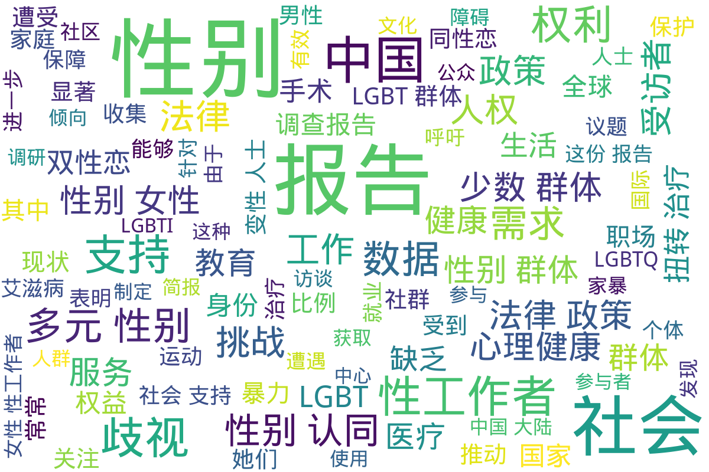

---
search:
  exclude: true
---

# 统计报告

本目录包含关于跨性别群体及多元性别相关统计报告和研究的文件，旨在提供深入分析和数据支持，以帮助了解跨性别及多元性别者在各种社会环境下的生活和面临的挑战。，《2012年父母对跨性别青少年的支持影响报告》探讨了家庭支持如何影响跨性别青少年的心理健康和生活满意度，强调了接纳对青少年情绪与社会适应的重要性。《2013年扭转治疗调查报告》深入分析了扭转治疗对同志群体的心理社会影响，强调这种治疗的无效性和潜在危害，引发对该治疗必要性的质疑。《2015年亚太催化剂-北京上海跨性别女性性工作者生活状况调查》和《2016年愛滋病預防項目指標調查報告-男跨女跨性别人士》则着重揭示了跨性别性工作者和男跨女跨性别者面对的法律、医疗和社会支持挑战，尤其在健康服务和生活条件方面的困境。《2017年中国跨性别人口综合调查报告》则是全国性统计调查，旨在通过数据分析促进针对跨性别者权利的社会认识与政策倡导。接下来的报告如《2020年跨性别就业与职场调查报告》和《2021全国跨性别健康调研报告》，聚焦于跨性别者在职场以及健康方面的状况，揭示了就业歧视和医疗服务不足的问题，从而为更包容的社会政策提供建议。《2023年行政院多元性别生活状况调查研究报告》分析了多元性别群体在台湾的生活现状，强调了社会支持的重要性以及对歧视的应对机制。《我想保留天生的模样_美国双性儿童遭受的非医疗必要手术》和《跨性别人士在保安部门遇到的性骚扰》强调了特定人群（如双性儿童和跨性别者）在社会与法律环境中的特定挑战，提出了对改善政策和社会认知的需求。这些报告对理解跨性别与多元性别群体的现状至关重要。

标签: `跨性别`, `多元性别`, `统计报告`, `社会支持`, `家庭接纳`, `扭转治疗`, `性工作者`, `心理健康`, `性别认同`, `就业歧视`, `法律问题`, `健康状况`, `社会调查`, `双性人权利`, `人权`

总计 51 篇内容

### 📄 文档

#### 2024

[PDF_中国大陆对LGBTQ_群体的正面态度](PDF_中国大陆对LGBTQ_群体的正面态度_page.md)

查看摘要

这份文件是一项关于中国大陆对LGBTQ群体的正面态度的研究报告，揭示了中国公众对LGBTQ群体的熟悉程度、接纳程度以及相关政策议题的态度。研究结果显示，总体而言，中国大陆的公众同意对LGBTQ群体持正面看法，尤其是对于LGBTQ学生和员工在社会和制度层面享有平等权利和保护的观点。

报告指出，68%的受访者认为应保护LGBTQ学生，而62%赞同职场应给予平等待遇。社会接纳LGBTQ群体的比例为53%，其中52%的受访者支持婚姻平等，认为应认可同性婚姻。尽管态度总体向好，但报告也指出，对于参与邻里关系及参加同性婚礼等私人关系的人数比例略低，与46%的受访者表示不介意成为邻居，或参加同性婚礼。

报告反映了自2010年以来，尽管面临社交媒体资源限制和政府干预，LGBTQ权利在中国有一定的增长。报告分析认为：调查评估了中国公众对LGBTQ群体及其权利的了解程度，试图通过此次调研推动对LGBTQ议题的公共讨论，因为这些议题在官方政策层面的表现仅部分代表公众态度。

#### 2023

[2023_行政院多元性别生活状况调查研究报告](2023_行政院多元性别生活状况调查研究报告_page.md)

查看摘要

《行政院多元性别生活状况调查研究报告》是一份由社团法人台湾彩虹平权大平台协会受行政院委托进行的全面性研究，分析台湾多元性别（LGBTI）者的生活状况。这份报告深刻探讨了台湾多元性别群体在生活中面临的各种议题，包括健康与福祉、社会支持、歧视与偏见等方面的问题。研究由多位学者和研究人员协同主持，旨在透过系统的问卷调查，详细描绘多元性别社区的现状，以提供数据支持政策制定与社会环境改善。报告首先回顾了台湾多元性别者的主要生活面向，强调这些个体常常受到歧视、污名和社会排斥，面临着比其他人群更大的社会不利和边缘处境。特别指出2019年欧洲调研与台湾的对比，提供一定的国际视野。研究中还进一步分析了受访者的性别认同、年龄、族裔、教育和工作状况、收入水平，以及他们的伴侣与婚姻状态。对于社群支持的力量，报告指出虽然存在社会敌意，但多元性别者间的社区联结和支持是积极的因素。健康与出柜情况也是报告中的重点章节。调查发现，受访者心理健康状况不容乐观，广泛性焦虑和抑郁症状普遍存在，尤其在没有得到足够社会支持时更加明显。报告依据受访者出柜的状况分析了社交环境对多元性别者的直接影响。在政策建议部分，研究团体提出了短期与中长期的目标，包括完善性别平等教育、调整法规制度，与在各体制中增进同性认识，期望透过这些政策介入能有效改善社会对多元性别者的敌意和排斥，并促进其社会地位的提升。

[中国多元性别女性的生活与权益_研究报告（2023_年_第一版）](中国多元性别女性的生活与权益_研究报告（2023_年_第一版）_page.md)

查看摘要

这份名为《中国多元性别女性的生活与权益》的研究报告，首刊于2023年的第一版，是由非营利组织同语出品。报告详细地探讨了中国多元性别女性在家庭、教育、就业、健康和法律领域所面临的复杂挑战。报告强调多元性别女性在家庭、学校和公共场所中遭受的多重暴力，其特殊的脆弱性以及在受到侵害后的救助困难。教育与文化领域的问题同样突出，偏见和污名化导致多元性别女性难以获得公平的教育机会，并缺乏法律的有力保护。在就业方面，报告指出多元性别女性在招聘和职场中面临交叉歧视，这种歧视既源于性别刻板印象，又因性倾向、性别认同和表达。家庭与伴侣权益方面，报告揭示出制度障碍和政策缺失对多元性别伴侣的生育权、监护权带来的巨大挑战。报告详述了多元性别女性在生理和心理健康方面遇到的医疗歧视，以及有关性别认同法律承认的严苛条件。这些挑战呼吁法律政策的变革与社会的关注。结尾部分，报告提出了一系列政策建议，呼吁立法机关和社会机构共同努力，消除歧视并保障多元性别女性的合法权益和社会地位。

#### 2022

[中国多元性别未成年人的生活与权益](中国多元性别未成年人的生活与权益_page.md)

查看摘要

这份名为《中国多元性别未成年人的生活与权益》的研究报告，由刘明珂、匡匡和ming共同撰写，徐玢统筹，方世新校对，廖爱晚翻译，并由gogo设计，是一本探讨中国多元性别未成年人权益的报告。此报告于2022年发布，旨在通过对现有法律政策的分析及现实问题的收集，填补中国在多元性别未成年人整体权益研究上的空白。该报告阐述了尽管法律政策不断完善，多元性别未成年人在免受暴力、健康权、受教育权及文化权利方面仍面临多重挑战。通过文献法和二手资料分析，该报告整合了对未成年多元性别人群的数据和重要发现，并引用联合国《儿童权利公约》等相关法规，分析中国多元性别未成年人的整体权益状况。

报告指出，多元性别未成年人经常遭受家庭暴力和校园霸凌，而暴力事件管理的责任主体往往处理不力。健康权方面，多元性别未成年人的性权利未得到充分保障，受艾滋病影响的未成年人数据匮乏，防艾教育措施也未能显著改善对艾滋病人群的歧视。跨性别未成年人的医疗需求未被充分重视，间性儿童遭受强制手术，严重侵犯了其身体自主权。心理健康方面，较非多元性别群体差的心理健康状况表明服务不足，涉及医疗系统和心理专业人士的歧视进一步加剧了这一问题。同时，强制扭转治疗仍然存在，对多元性别未成年人的身心健康造成严重威胁。受教育权方面，在校园环境中，因性别身份受到的歧视依然普遍，校园内对多元性别教育的严重不足，公共设施缺乏对跨性别和间性未成年人的包容。文化权利环节，多元性别内容的审查削弱了多元性别未成年人获取正确信息的渠道。

基于以上问题，本研究提出改善策略，建议在立法、执法及社会支持层面上作出改进。立法上，报告建议制定或修改法律，将性倾向、性别身份与表达等作为禁止歧视的依据，制定有效的跨性别和间性未成年人的医疗政策，并放松文化产品的内容审查。执法上，严格落实相关法律规定，加强对暴力行为的处理，并提升责任主体的多元性别平等意识。社会层面，应关注多元性别未成年群体的需求，通过学校教育和公共文化传播推进多元性别平等观念。研究认为保护多元性别未成年人的权益符合中国政府有关儿童权利及2030年可持续发展议程的承诺，是实现国家现代化建设的要求。

[PDF_反人权运动对性工作者的影响简报](PDF_反人权运动对性工作者的影响简报_page.md)

查看摘要

本简报详细探讨了反人权运动对性工作者的多方面影响，特别是如何通过各种意识形态和联盟对这些群体构成威胁。近年来，各类反对边缘群体权利的运动在全球范围内逐渐增强了影响力。本文特别指出，反移民权利团体的游说导致更严格的边境政策，侵犯了迁徙和移民的权利，进而影响到性少数群体的基本权利获取，例如性与生殖健康服务及性别确认护理的机会。原教旨女权主义者与废娼主义团体一直在攻击性工作者的身体自主权和人权，这种攻击行为也对以移民妇女与有色人种女性为主的性工作者产生更大威胁。\n本简报基于2022年5月至6月的深入研究，通过对全球八个国家—柬埔寨、喀麦隆、加拿大、厄瓜多尔、萨尔瓦多、莱索托、北马其顿和西班牙—的NSWP成员组织进行电子咨询及访谈而成。参与研究的受访者包括275名性工作者，以及艾滋病毒感染者、移民性工作者、性少数性工作者和使用毒品的性工作者，代表了顺性别、跨性别、非二元和性别流动的多样性别认同者，他们在不同环境中就业。研究发现，主流媒体和社会，往往因性工作者身份的交叉性而对他们产生系统性忽视，而这些身份交叉影响其获取基本劳动权利、个人隐私和人权保护的能力。\n同时，简报指出了“反人口贩运”运动常常将性工作与贩运及剥削混为一谈，从而助长种族化的刻板印象及加强边境政策为由实施的暴力行为。这一策略在全球范围内的实施已对跨境性工作者的权利产生深远负面影响，削减了他们自由流动和合法就业的机会。支持“终止需求”模式的原教旨女权主义者及废娼团体试图通过立法禁止性工作来推行“性别平等”，这一策略更增添了性产业中的剥削和暴力现象。\n本文详细阐述了现有的反权利运动如何策划战略，回顾了其对性工作者及组织的影响，并对这些运动的责任方提出了抵制及应对建议，这些提案旨在更好地保护和增强性工作者的权利。

[多元性別統計報告_澳洲與加拿大人口普查_2022](多元性別統計報告_澳洲與加拿大人口普查_2022_page.md)

查看摘要

这份名为《多元性别统计报告: 澳洲与加拿大人口普查 2022》的文件旨在探讨和分析在澳大利亚和加拿大进行的多元性别统计数据的收集与分类。文件开头提到，认识一个人多面向的性别特征需要从复杂的性别统计及分析入手，特别是在对‘性别’概念的理解逐渐深入的背景下，数据收集方式越来越多样化，体现出生理性别（Sex）、性别认同（Gender）和性倾向（Sexual Orientation）等多个维度。报告提到，自2019年以来同性婚姻在两个国家得到法律承认的背景下，多元性别的观念也逐渐获得了更广泛的社会认同。

在介绍了澳大利亚统计局的性别分类标准后，文件指出，2016年标准首次将‘Sex’和‘Gender’进行了明确区分，并在2021年的人口普查中引入了非二元性别选项。2021年人口普查中报告显示，统计出可与性别相关的多元数据，包括对同性伴侣的统计，以及这些伴侣中结婚与孩子同住的情况。这些数据表明，澳洲的同性伴侣数量已经达到78,425对，其中约30%的伴侣是已婚，这反映出对于多元性别及相关家庭形态的接纳度在逐步上升。

接着，文件也详细描述了加拿大的情况，强调其作为全球首个收集跨性别和非二元性别数据的人口普查国家的地位。2021年的人口普查结果显示，加拿大的跨性别和非二元性别者人数超过十万，占15岁以上人口的0.33%。特别的，Z世代和千禧一代中的跨性别及非二元性别比例得到了显著的提升，显示出年轻一代在性别认同上的开放性和表达的勇气。

最后报告提及我国的多元性别统计现状，指出目前依然存在着较大的分类不一致性，且在2020年的人口普查中仍然保持传统的二元性别选择。虽然主体内的数据搜集与性别有关的调查体系逐渐建立，但在多元性别的具体分类和数据分析方面仍显不足。通过这份报告的研究与对比，期望帮助政策制定者更好地理解不同性别人群的情况与需求，从而推动更为合理的性别相关政策的制定。

#### 2021

[2021全国跨性别健康调研报告](2021全国跨性别健康调研报告_page.md)

查看摘要

《2021全国跨性别健康调研报告》是继2017年后的第二次全国性跨性别群体大规模调查，意在详细了解跨性别者的生活、健康状况及面临的社会环境。本调查报告概述了从医疗服务、精神健康到家庭关系及公共领域等多个重要方面的数据，充分体现了跨性别者在国内的生活实况。报告详细介绍了性别认同、性别表达的定义，并探讨了性别肯定医疗及其它医疗经历，揭示了该群体遭受的扭转治疗、不平等的法律挑战以及在公共场所、校园、职场中面对的问题。同时，报告还为社会建设、立法完善、医疗服务改善等政策提出了建议。这份报告的重要意义在于通过科学数据提高跨性别议题的社会能见度，推动对性别少数群体的理解，助力制定更包容的公共政策，进而改善他们的健康状况。特别值得注意的是，本次调研的样本广泛，涵盖了9390位参与者，最终有效样本数为7625人，其中跨性别女性占37.2%，跨性别男性占19.2%，这表明虽然性别认同和性倾向的多样性普遍存在，但整个社会对这些群体的包容仍需增强。报告也涉及性别焦虑问题，揭示出性别未对齐引发的广泛焦虑，呼吁建立更具包容性的社会支持体系。

[公众对变性人士权利的看法_中国_-_Williams_Institute](公众对变性人士权利的看法_中国_-_Williams_Institute_page.md)

查看摘要

这篇名为《公众对变性人士权利的看法：中国》的报告由卢奕嘉、泰勒·布朗、刘明珂和阿里·绍联合撰写，旨在探讨中国公众对变性人士及其权利的态度。该报告主要分析了2017年中国对变性人士的全球态度调查中的数据，试图提供有关社会对变性人士及其权利的认知与看法的新见解。

报告指出，尽管中国社会趋向于接受某些与变性相关的现象，但总体来看，对变性人士的接受程度仍然较低。数据表明，家庭对变性人士的接受程度为57.6%，显示超过一半的受访者对家庭的支持持否定态度，反映出在家庭环境中，对变性身份的巨大社会阻力。同时，约70.8%的变性人士在学校遭遇暴力，显示教育环境中对变性人士的态度亟待改善。

与此形成对比的是，报告提到，尽管社会普遍对变性群体的接受度低，但部分知名的变性人士，如金星女士，依然在公众生活中扮演着重要角色，拥有广泛的观众基础，这种现象表明，在更广泛的社会层面上，对于真正认识的变性人士，公众的接受度往往更高。

报告还强调了变性人士在法律上的脆弱性。中国的法律框架并未对变性权利进行全面的保障，缺乏有效的反歧视法律，使得变性人士在就业、教育等关键领域面临巨大的不平等待遇。特别是在更改身份证件上的性别标记时，变性人士需满足复杂的证明要求，这进一步限制了他们的生活和职业发展。

关于变性人士的法律权益，报告指出，虽然变性人士可以更改身份证上的姓名和性别标记，前提是提供相应的医疗证明和法律文件，但在其它诸如学历证书或职业资格证书的性别标记更改方面，他们仍面临极大的困难。变性人士在家庭、社会和职业生活中面临的抗拒和歧视使其心理健康处于高度风险之中，报告中提到，变性人士的自杀未遂风险显著增加，家庭冲突与他们的心理生存现状息息相关。

基于这些数据和分析，报告最后提供了一些建议，希望能够引导政策制定者和公众更深入地理解变性人士的需求与所面临的挑战，以推动社会更加包容与尊重多元性别的环境。总的来看，这份报告不仅揭示了中国公众对变性人士的态度，也为改善他们的生活质量和权益保障提供了宝贵的参考。

[LGBTQ+_老年人调查报告](LGBTQ+_老年人调查报告_page.md)

查看摘要

这份题为《俄勒冈州 LGBTQ+ 老年人调查报告》的文件是由 Goldsen Institute 提供的，反映了在美国俄勒冈州的 LGBTQ+ 老年人群体的生活状况、需求和面临的挑战。本文详细介绍了俄勒冈州年满55岁或以上的 LGBTQ+ 人群，通过数据分析揭示了该群体在人口统计特征及生活状态上的多样性和特定需求。调查发现，该群体包括比例较高的有色人种，与异性恋老年人相比，他们更年轻，更有可能处于联邦贫困线以下，并且生活在社会支持较弱的环境中。

报告指出，LGBTQ+ 老年群体面临的主要社会支持需求包括医疗健康服务、社会支持计划、心理健康和药物治疗、食品和药物援助，以及交通服务。研究显示，虽然他们在一定程度上表现出了“反弹”能力，如社交适应能力较强、对LGBTQ+社群的积极参与，但这些老年人仍在生活中经历显著的歧视，尤其是在性取向、性别认同及表达、年龄等方面。这引发了一系列与健康、经济和社交孤立相关的问题。

文件中详细描述了服务未被满足的领域，比如多数参与者反映在申请服务时遇到了困难，费用过高，而已有服务缺乏对LGBTQ+包容性也是一大问题。关于老年人虐待、自杀念头以及 COVID-19 影响等方面的数据也在文件中得到呈现。

基于调查结果，文件建议通过政策制定来满足LGBTQ+老年人的需求，包括增加对医疗保健、社交支持，在技术援助和设备提供上做出改进，以便减少社交孤立和促进更好的交流。同时，还呼吁在养老、医疗、法律服务者中对包容性进行培训，以减少护理障碍。该研究由ODHS下属老年人和残障人士服务处资助，并指明了进一步改善服务及制定战略计划的需求所在。

[犹他州药物滥用治疗系统健康差异报告_2021](犹他州药物滥用治疗系统健康差异报告_2021_page.md)

查看摘要

《犹他州药物滥用治疗系统健康差异报告_2021》详细探讨了犹他州公共心理健康和药物滥用治疗系统的健康差异问题。报告特别聚焦于处于过渡年龄段的青年（特别是16-24岁），黑人、原住民和有色人种LGBTQ+群体（简称BIPOC），以及有发展障碍人士。通过大量的数据调查与访谈，报告揭示了在这些特定群体中，面临的独特挑战和障碍，尤其是在与心理健康和药物治疗相关的服务利用率方面。

报告中的调查显示，处于过渡年龄段的青少年在职业管理上存在明显的不足。他们在行政管理职位的比例明显低于其他群体，约是白人同事的50%。这样的现象在BIPOC群体中尤其显著，只有8%的黑人、原住民和有色人种LGBTQ+青年在职场中担任管理职务。与此同时，调查还发现，这些受访者中高达60%的人经历过工作场所的歧视和贬损，种族主义、跨性别歧视和同性恋歧视成为主流。特别是一小部分受访者提到自己的性别和种族身份常常遭到质疑和否定。

在对这些调查结果的分析中，作者强调了导致健康差异的结构性原因，包括医疗资源的不平等分配、社会歧视和偏见等。同时，报告列出了针对这些问题的具体建议，如加强工作场所的多样性意识，改善对BIPOC与LGBTQ+群体的支持措施，及时识别和处理职场中的歧视行为等。

该报告最终旨在为政策制定者和实践者提供清晰的现状描述以及相关的可行性建议，以便更好地服务于这些处在边缘化位置的群体，实现更公平的医疗服务和支持结构。这一研究对于理解和改善复杂的健康差异问题，尤其是对少数群体面临的歧视和挑战具有重要的学术价值和社会意义。

#### 2020

[探讨LGBT群体的权_利_骄傲与偏见](探讨LGBT群体的权_利_骄傲与偏见_page.md)

查看摘要

该文件《探讨LGBT群体的权利：骄傲与偏见》由经济学人智库发布，深入探讨了全球LGBT群体的权利状况，特别关注亚洲地区在LGBT平权方面的进展与挑战。文件开头指出，美国最高法院在2015年决定同性婚姻合法化是LGBT权利斗争中的重要里程碑，并认为这一进展为亚洲国家接过权利接力棒提供了契机。随着复杂的政治背景和社会变迁，LGBT权利在某些亚洲城市得到了新的关注，尤其是在台湾和中国透过法律裁决促进了平权的进展。报告强调，尽管西方企业在推进性少数群体权利方面起到了积极的作用，但在亚洲，许多企业的反应仍然较为谨慎，有时甚至表现得较为保守。 

在调查方面，报告涉及了359名来自中国大陆、印度、香港、印度尼西亚、日本、新加坡和台湾的全职员工，分析了他们对LGBT权利的看法和实际体验。结果显示，40%的受访者认为公开LGBT身份会影响职业发展。与西方国家相比，亚洲的职场环境在LGBT友好的政策和实践上仍显不足。尽管如此，调查也显示出在职场中促进LGBT多元化与包容性的潜在利益，42%的受访者认为能吸引和留住优秀人才，而38%则认为这会提高员工生产力。

报告进一步探讨了企业高层领导对LGBT议题的支持程度，显示出在亚洲的许多企业中，缺乏公开其性取向的LGBT成员，这种缺失无疑阻碍了整个社会对这一群体的包容态度。文件中指出，中国和印度的受访者在LGBT多元化和包容性方面取得了显著进展，许多人表示愿意与不同性取向的同事一起工作，参与LGBT支持团队或活动。

在结尾部分，报告总结了亚洲地区面临的诸多挑战，包括宗教保守主义影响与政府的严格管控，尽管如此，文件也展现了积极的前景。越来越多的企业开始认识到LGBT权利的重要性，并在推进相关政策与实践方面有所进展，显示出出人意料的变革潜力。

[2020年《跨性別就業與職場調查》報告.docx](2020年《跨性別就業與職場調查》報告.docx_page.md)

查看摘要

本文件是《2020年跨性别就业与职场调查报告》，由台湾同志运动发展协会的跨性别小组发起和完成。调查的目的是深入了解台湾地区跨性别者在就业和职场中的真实体验与挑战，为制定相关政策和改善职场环境提供数据支持。该调查于2020年7月14日至7月25日期间进行，共收集到有效问卷191份。调查涵盖了16岁以上、具有职场经验的跨性别者，调查对象包括跨性别女性、跨性别男性、以及非二元性别认同者。

报告详细介绍了参加者的性别认同分布、年龄及教育背景，并分析了跨性别者在就业和职场中遇到的各种困境，如性别身份与原生性别社会期待之间的不符、工作性质的刻板印象、求职时遭受歧视等。报告也揭示了跨性别者在职场中由于性别身份而面临的特殊挑战，包括薪资分配不均、职业生涯发展受限以及可能发生的职场骚扰和排挤。

在职场类型的选择上，调查显示跨性别者较多集中于信息科技、制造及行销销售领域；而在企业经营管理及高层职位的从事比例极低，这表明跨性别者在职场中的晋升机会有限。调查还指出跨性别者的失业率显著高于社会平均水平，并且有部分跨性别者的收入低于法定基本薪资，反映出跨性别群体在经济上的脆弱性。

为改善当前状况，许多跨性别者希望企业能够举办性别多元意识提升讲座，提高对跨性别及性别多元文化的认知，创建更为包容友善的职场环境。同时，他们也表达了对性别友善企业的支持意愿，大多数受访者表示在相等条件下更倾向于应聘或消费于性别友善企业。

#### 2019

[中国跨性别者寻求性别确认医疗程序时遇到的障碍_国际特赦组织](中国跨性别者寻求性别确认医疗程序时遇到的障碍_国际特赦组织_page.md)

查看摘要

该文件为国际特赦组织发布的报告，标题为《我需要家长同意才能做自己——中国跨性别者寻求性别确认医疗程序时遇到的障碍》，于2019年首次出版。报告从多个角度探讨了中国跨性别者在寻求性别确认医疗程序时所面临的多重障碍，尤其是对激素疗法和性别确认手术的获取问题。报告开篇提到，跨性别者在现有的公共卫生系统中被严重忽视，缺乏必要的信息与资源，受访者普遍反映很难找到足够的支持和医疗指导。 

文件详细介绍了跨性别者面对的三个主要障碍：一是相关医疗程序的信息匮乏，导致许多跨性别者对如何进行性别确认医疗缺乏了解，必须依赖于同路人的经验；二是寻求性别确认手术的诸多先决条件，如需要家长的同意，这对许多跨性别者尤其是尚未成年者造成了极大的困扰和阻碍；三是来自社会的污名化及歧视，使得跨性别者在医疗机构内外遭受多重压力，影响其能够安全并持续地接受医疗程序的能力。整个报告通过对15名跨性别者的访谈，深入反映了这一群体的困境和需求。

在关于性别确认医疗程序的部分，报告特别强调了激素疗法的重要性及其在性别确认过程中的角色，同时指出中国医疗系统在这一领域的缺失和滞后。报告还对中国的公共卫生政策提出建议，要求国家更好地培训医疗专业人员，提高对跨性别者的医疗供给能力，并提供更为明确的性别确认手术和激素疗法的指南，旨在改善跨性别者的医疗环境和生存状态。通过展示跨性别者在寻求医疗过程中经历的种种挑战，这份报告不仅揭示了医疗卫生体系的问题，也呼吁对跨性别者人权的重视和保护。

报告使用的词汇表对核心概念进行了基本释义，包括“跨性别”、“性别确认医疗程序”等，为读者理解提供了便利。整体而言，该报告是关于中国跨性别者群体生存状态与医疗需求的重要文献，具有重要的社会价值与启示意义。

[PDF_中国彩虹媒体奖2018-2019_年度彩虹媒体监测报告](PDF_中国彩虹媒体奖2018-2019_年度彩虹媒体监测报告_page.md)

查看摘要

《中国彩虹媒体奖2018-2019年度彩虹媒体监测报告》是由中国彩虹媒体奖组织发布的一份系统研究报告，旨在分析LGBTQ相关议题在中国大陆媒体中的呈现情况和发展趋势。报告从多个维度对2018年度的媒体报道进行了详尽的量化统计和质性分析。报告开篇指出，自1983年“同性恋”一词首次出现在中国电视节目《新闻联播》以来，社会对同志社群的态度和法律保护没有显著改善。报告认为，媒体报道对性少数群体的客观呈现和推动非歧视性的社会文化至关重要，并对此进行了持续的监测和分析。

报告详细介绍了2018年中国大陆媒体关于LGBTQ议题的762篇原创报道，其中网络媒体贡献绝大多数。内容涵盖的主题多样，包括法律政策、文化娱乐、健康HIV、教育发展等。其中，法律政策类报道最多，占37.1%。显著的是，涉及跨性别社群的报道数量增长明显，占总体的16.7%。而HIV相关的报道则主要集中在艾滋病日前后的时段。尽管社会空间有限，网络媒体在同志议题中体现了重要影响力，其报道数量逐年提升。

从媒体态度来看，超过半数报道保持中立立场，旨在呈现事件本身并平衡各方观点。约有43.3%的报道积极展现同志群体视角。然而，仍有一部分报道带有主观负面倾向。针对这些媒体趋势，报告总结了同志社群与媒体合作的积极影响，并呼吁继续推进对LGBTQ议题的全面、多元报道，以促进不受歧视的社会文化氛围。

报告不仅提供了年度内各类媒体报道的统计数据，还分析了LGBTQ事件和主题在媒体中的表现，并提出了同志社群与媒体今后合作的可能方向，认为即使在限制越来越多的公共讨论环境中，仍可以寻求突破和创新的合作方式。

[PDF_中国跨性别者受教育权状况研究报告_201903_v10pdf](PDF_中国跨性别者受教育权状况研究报告_201903_v10pdf_page.md)

查看摘要

本报告《中国跨性别者受教育权状况研究报告》由联合国开发计划署和亚太跨性别网络联合发布，重点研究跨性别者在教育方面的权利及其所面临的挑战。报告里提到，跨性别者常常被社会边缘化，并且由于性别认同的公开性别表达，常常遭遇欺凌和不友好的环境。报告中的数据表明，在1640名参与调查的跨性别受访者中，有11.9%的人曾因性别认同遭到父母或监护人强迫接受“扭转治疗”。

研究中提到，受教育权被视为基本人权，而教育环境则是未成年人自我认识和社会交往的重要场所。对跨性别者来说，教育不仅仅关乎个人发展，更是保障其其他人权的重要基础。虽然年满20岁的合格跨性别者在法律上可以申请性别肯定手术，但这一程序常常伴随各种障碍，且许多跨性别者在完成手术后仍旧能够在身份文件上与社会认同之间面临巨大反差。在中国，关于跨性别者的社会认知仍滞后于实际需求，法律承认和社会支持亟待改进。

本报告通过文献分析和焦点小组访谈两种方法，提供了关于跨性别者在教育领域的法律保护现状，包括法律条款随着国际标准变化而逐步完善，提到国际人权标准与国内法律的结合，对比了中外在这方面的制度差异。相较于国外较为完善的相关法律体系，中国在跨性别者受教育权的法律保障及实际执行上存在明显的不足，这个问题在城市与乡村的表现也有所不同，城市中的机会更为多样和开放，而乡村则缺乏必要的知识普及和社会支持体系。调查还发现，教育者的性别意识以及教育机构的友好设施将极大影响跨性别学生的接受程度和自我认同感。通过提供相关建议，报告希望能引起社会的关注，同时为政策的修订提供依据。

#### 2018

[全球跨性别健康与幸福指数议题](全球跨性别健康与幸福指数议题_page.md)

查看摘要

该文件为一份关于全球跨性别健康与幸福指数的统计报告，由TvT社群（Transrespect versus Transphobia Worldwide）于2018年12月发布。报告的撰写团队包括多位跨性别活动家和研究人员，他们通过，以确保全球跨性别者和性别多元群体的健康和权利受到关注。报告不仅概述了跨性别者的健康状况，还涉及了他们在医疗、法律和社会经济环境中面临的挑战。

报告中的一部分重点讨论了跨性别者在就医过程中遭遇的歧视和障碍。跨性别者的医疗保障往往缺乏，许多情况下其健康需求并未得到重视，甚至需要面临压迫性的要求才有可能获得必要的医疗服务。这种情况在全球范围内各不相同，部分地区的跨性别者能够获得更全面的医疗保障，而其他地方却面临严重的医疗隔离。这一现象的根源在于对跨性别身份的病理化和社会文化的污名化。

特别是在法律方面，许多国家缺乏针对跨性别群体的保护措施，使得他们在教育、就业和医疗等领域受到系统性的边缘化。报告中指出，仅在过去十年内，就有2982起针对跨性别者的谋杀案件被报告，这一数字反映了全球范围内对跨性别群体的极端暴力和歧视现象，尤其是在某些法律保护不健全的国家。跨性别者不仅需面对公共医疗系统的缺乏和压迫，也常常要承受来自社会结构的暴力与歧视。

报告提到在性健康方面存在的问题，包括艾滋病病毒及其他性传播疾病的感染率较高，这一问题追溯到社会对跨性别者的隔离以及缺乏培养跨性别健康相关意识的医疗专业人士。

总之，这份报告的重要性不仅在于提供关于跨性别者健康的现状分析，更在于呼吁需要更好的法律保护、更人性化的医疗服务和更广泛的社会支持，以抵抗针对跨性别者的暴力和歧视。希望通过这份报告能够促进对跨性别者及性别多元人群的理解、研究和政策的改善，以实现更好的健康和幸福指数。

[跨性别者性别认同的法律承认_中国相关法律和政策的评估报告](跨性别者性别认同的法律承认_中国相关法律和政策的评估报告_page.md)

查看摘要

本文件《跨性别者性别认同的法律承认——中国相关法律和政策的评估报告》由联合国开发计划署和中华女子学院合作完成，旨在深入评估中国关于跨性别者性别认同的法律及政策现状，探讨其中的法律承认与保护不足的问题。该报告以丰富的研究方法和数据支持，呈现了跨性别者在中国面临的挑战与困境，并提出了一系列解决方案。

报告开篇指出，跨性别者在法律上的承认与保护缺乏，使其更容易受到伤害和边缘化。文学部分引用了联合国开发计划署驻华代表处国别主任的主旨讲话，强调社会对跨性别者的污名与歧视普遍存在，尤其是在教育、工作和医疗等领域，影响了跨性别者们的生活状况。在法律框架方面，文件认为虽然已有政策努力争取平等，但大多数法规仍未明确承认跨性别者的性别认同，导致许多跨性别者无法享有法律赋予的基本权利。

报告内容结构清晰，分为多个部分，首先从研究背景出发，详细说明了研究的范围及方法，并分析了中国关于人权保障的法律和政策，特别是宪法和《国家人权行动计划》。第二部分讨论了变更性别标记和姓名的相关规定，指出现行法律要求跨性别者必须接受性别肯定手术后才能修改身份证上的性别，这一苛刻条件无疑限制了其合法权益。

随后，报告探讨了跨性别者医疗相关的规定及实施状况，强调了对跨性别者病态定性的错误认知，以及申请手术过程中的复杂性和经济负担。报告中引用了相关的法律规定和实施情况，指出这些规定常常使得跨性别者在医疗服务访问过程中遭遇困难与障碍。

报告也关注了与就业、教育以及保障性别平等相关的规定，指出虽然有法律禁止性别歧视，但在实际操作中，这些法律并没有得到有效的执行。跨性别者在职业生涯中依然面临着就业歧视和职场暴力，导致他们的生存状况更加恶劣。

结尾部分，报告总结提到必须通过提高社会对跨性别群体需求的理解，促使法律与政策的进步以及实施，以实现对跨性别者的法律承认。报告强调法律性别承认是实现跨性别群体人权的基础一步，期待能够为跨性别者创造一个平等与安全的社会环境。

[香港男跨女跨性別人士愛滋病風險及流行情況調查2017](香港男跨女跨性別人士愛滋病風險及流行情況調查2017_page.md)

查看摘要

本文件为《香港男跨女跨性別人士愛滋病風險及流行情況調查2017》的详细调查报告，由香港卫生署衞生防护中心特别预防计划发布。该报告旨在了解和更新香港地区跨性别女性（男跨女）的艾滋病病毒（HIV）流行情况，并分析其相关的高危行为和防控措施。报告的引言部分指出，男跨女跨性别人士是一个被忽视和难以接触的群体，海外的各种研究表明，他们的艾滋病毒流行率可能相对较高。因此，自2014年起，卫生署将跨性别女性纳入艾滋病预防项目的指标调查，并首次在本研究中构建了以社区为基础的调查模式。

调研的时间范围设定为2017年4月26日至9月30日，参与者通过互联网填写双语问卷。最终，共104名跨性别女性参与了调查，其中93.3%自认是华人。研究结果显示，性活跃的跨性别女性群体中，艾滋病毒的流行率为5.11%。这一下降的数据（相比2014年的HAIRS数据18.6%）赋予了跨性别女性群体在HIV防控工作上取得进展的希望，同时也提示我们需要持续关注该群体的健康状况。

不仅在HIV流行率的分析上，报告还涵盖了参与者的性行为模式和安全套使用情况。69.4%的受访者表明自己为性活跃状态，数据显示与男性、女性及其他跨性别者的最近一次性交行为中，安全套的使用率分别为64.8%、44.4%及60.0%。相较于以往的调查结果，可以看出跨性别女性群体在性行为上的安全意识尚需提升。

在遭遇性传播疾病方面，约12.5%的参与者在过去12个月内被诊断出至少一种性病。就爱滋病暴露前预防药物（PrEP）的使用情况而言，只有1.9%的受访者曾服用该药物，这个低比例同样许多与心理和社会接受度有关。约66.7%的已知阳性者均已接受艾滋病专科护理，说明 日常医疗资源的利用状况有所改善。

通过综合展示跨性别女性的生活现状与健康保障，报告不仅为后续的公共卫生政策提供了数据支持，而且强调了需要更有效的行为干预与教育措施来提升群体的健康意识和安全性行为的实践。因此，该调查的成果为香港地区针对跨性别女性的艾滋病风险管理与预防提供了重要的参考，也为今后的针对性研究奠定了基础。

[骄傲与偏见-变革的动力-经济学人智库报告-2018](骄傲与偏见-变革的动力-经济学人智库报告-2018_page.md)

查看摘要

《骄傲与偏见——变革的动力》是由经济学人智库于2018年发布的一份重要报告，旨在探讨在商业与经济领域中关于LGBT（男同性恋、女同性恋、双性恋与跨性别者）群体的多元化与包容性问题。这项研究基于对82个国家的1043位高管的意见调查，探讨了这些高管在工作场所对LGBT人群的态度及其对多元化的影响。报告的执行摘要指出，63%的受访者认为管理层对LGBT文化的支持是推动工作场所进步的关键因素，但对LGBT的偏见仍然普遍存在，且年轻一代的员工在推动变革方面扮演着越来越重要的角色。

报告中涵盖了多个重要主题，包括对LGBT人群的现状的直面和对多元化及包容性的领导者的必修课。特别是，在高管中，85%的受访者认为LGBT员工应该能够在工作场所中公开自身身份，而70%表示他们为支持LGBT权利而感到自豪。然而，仍有19%的高管意识到公司中存在隐蔽的歧视，这揭示了职场中对LGBT群体的包容性政策尚未普遍落实。

该报告还提到，女性对LGBT人群的支持普遍高于男性，这表明了性别和性取向之间的联系。尤其是女性和LGBT群体共同经历的歧视历史，使得它们之间的斗争可以相互激励。同样，报告指出，在当今的商业环境中，公司忽视LGBT职员的权益可能会导致吸引人才和提升企业创新能力的失利。根据瑞士信贷的研究，支持LGBT权利的公司股票表现往往优于那些不支持的公司。这表明，创建对LGBT人群友好的工作环境不仅是道义上的责任，还是一种商业上的理智选择。

通过调查企业在LGBT人群包容性方面的现状，报告进一步强调了需要建立更加包容的职场文化，以减少职场偏见，提升员工的工作体验并激发更大的创新潜力。整体而言，这份报告为企业在推动LGBT权利和多元化政策提供了实用的建议和见解，为政策制定者、企业领导者以及关心社会变革的各界人士提供了值得深思的数据与案例。

[跨性别者性别认同的法律承认-中国相关法律和政策的评估报告-中华女子学院-UNDP](跨性别者性别认同的法律承认-中国相关法律和政策的评估报告-中华女子学院-UNDP_page.md)

查看摘要

《跨性别者性别认同的法律承认——中国相关法律和政策的评估报告》是由联合国开发计划署（UNDP）与中华女子学院共同编写的一份综合性报告，旨在系统分析和评估中国现行法律与政策对跨性别者性别认同的承认及其保护的状况。该报告总结了跨性别群体在中国所面临的法律和社会挑战，强调跨性别者缺乏法律承认与保护所带来的风险，以及社会对他们的污名与歧视，以引起更广泛的关注与反思。

报告首先从法律背景入手，阐述了中国现有法律框架以及人权保障的相关规定。尽管中国宪法对人权有基本保障，但在跨性别者的性别认同承认上，现行法律及政策仍存在显著不足。《性别重置技术管理规范》的实施规定苛刻，诸如必须完成性别肯定手术才可更改身份证性别的要求，使得许多希望改变自己性别标记的跨性别者陷入困境。这种情况下，个人的性别认同常常被法律所忽视，导致严重的社会排斥和心理健康问题。

该报告还提到，实施对跨性别者的病态定性与性别重置手术的复杂申请程序，使得跨性别者在医疗和就业等方面面临额外的障碍。从就职环境来看，报告呼吁加强就业中的性别平等，提出禁止性别歧视及性骚扰的相关规定应更加切实落实。报告总结了相关的数据统计与研究资料，这些资料反映出跨性别者在工作、医疗、教育及社会服务等方面遭遇的不平等待遇，强调需要通过法律和政策层面的改变，来保障他们的基本人权。

同时，报告也呼吁社会各界，包括法律政策实施机构，积极参与跨性别者权益倡导。通过提升跨性别者的公共话语权，能够推动法律层面的改进，进而实现跨性别者的全面合法与人权承认。报告提及了其他国家与地区在跨性别者权利保护方面的较好实践，为中国提供了可参考的借鉴。

总之，《跨性别者性别认同的法律承认——中国相关法律和政策的评估报告》不仅是对现有法律与政策的深刻反思，也是推动跨性别者平等权利的重要文献，期望能够为未来的法律改革与社会接受提供有力支持。报告最后附带了相关的法律、政策条款与建议，其中包含了对未来发展的期望与实用性建议。

#### 2017

[中国跨性别群体-_生存现状调查报告](中国跨性别群体-_生存现状调查报告_page.md)

查看摘要

《中国跨性别群体生存现状调查报告》是由北京大学社会学系主办的，对于中国大陆地区跨性别群体的生存状况进行的首次定量调查。该报告的主要目的是通过大规模的问卷调查，为国家和社会的跨性别相关法律政策提供数据支持，促进性少数群体的社会议题能见度和利益保障。调查于2017年开展，收集了5,677份问卷，最终有效问卷为2,060份，有效问卷率为36.3%。从样本的地域分布来看，受访者主要来自东部和大城市，其中北京、广东、上海、山东和浙江的受访者在全样本中占比42.4%。

在样本分析中，报告首先定义了相关的性别与性取向的概念，包括性别认同、性别表达及性取向等，列举了跨性别男性、跨性别女性、性别酷儿等身份的定义，并对各身份群体的心理状态进行了量化分析。样本显示，超过两成的受访者在青春期发育时经历了强烈痛苦与焦虑，尤其是跨性别男性与女性的比例最高，达到90.6%和85.7%。

关于跨性别者对激素治疗的需求，该报告指出62%的跨性别者有激素治疗的需求，其中的跨性别女性与男性需求比例显著，分别为88%和71%。然而，报告也揭露出在国内关于激素治疗的渠道困难和满意度低的问题，尤其是许多跨性别者选择通过非正规途径获得相应药物，甚至出现自残的心理状态。醒目的数据表明，61%的跨性别者表示在获取激素治疗时遭遇困难，甚至有25%的受访者在无法获得激素治疗时会感到抑郁。

除了激素治疗，报告还调查了性别重置手术的需求与实现情况。报告显示，51%的跨性别者有进行性别重置手术的需求，但仅有1.4%的受访者得以实际进行手术。原因主要是经济压力、家庭的反对及年龄限制等，77.8%的跨性别女性与56.2%的跨性别男性对手术的需求无处实现。调查还指出，71.2%的受访者在国内医院进行手术时经历了歧视或隐私侵犯等情况。

整体而言，此次调查不仅为了解中国跨性别群体的生存状态提供了重要的基础数据，还反映出社会环境对跨性别者的深层影响，促进了对跨性别群体在法律政策和社会问题上关注的必要性与紧迫性。

[PDF_我想保留天生的模样_美国双性儿童遭受的非医疗必要手术](PDF_我想保留天生的模样_美国双性儿童遭受的非医疗必要手术_page.md)

查看摘要

《我想保留天生的模样》是一份由人权观察和双性行动（interACT）联合撰写的报告，详细探讨了在美国双性儿童自婴儿时期即被施行的非医疗必要手术。报告指出，这类手术通常是以“正常化”为理由去执行，它们可能导致被手术儿童终生无法恢复的身体及心灵创伤。手术常常是为了让儿童的身体外貌更易被社会接受，而非出于任何紧急健康考虑。这类外科干预常常在婴儿时期进行，剥夺了儿童本人对其身体和性别做出自主决定的权利。

双性人并不罕见，但常受误解，受到医学界二分性别观的限制。生物性别并非非此即彼，而是一个光谱。但在社会的压力下，许多双性儿童被迫接受手术矫正，以符合理想的“男孩”或“女孩”形象，即使这种手术缺乏充分的收益证据，常常导致严重的生理伤害和情感困扰。报告援引了对多位双性人、双性儿童父母以及医疗从业者的深度访谈，指出当前医学界对于双性特征的处理仍不够透明，缺乏有效自律。这种现状导致许多双性儿童在无法参与决策的年纪遭遇不必要的手术，只因父母和医生希望他们“看起来正常”。

报告详细描述了双性特征的多样性及医疗处理的复杂性。大多数外科手术并非为了拯救生命而进行，然而即便在医学界慢慢认识到手术的风险与争议后，类似的程序仍在美国持续进行。报告中还提及几位双性人的个案，他们在成年后才得知这些手术对其身体所产生的影响，并且对医护人员的处理方式感到困惑和愤怒。报告呼吁进一步对这类手术进行限制，并强调应当尊重儿童的身体自主权，避免因社会偏见而仓促进行性别矫正手术。

[2016年愛滋病預防項目指標調查報告-男跨女跨性別人士](2016年愛滋病預防項目指標調查報告-男跨女跨性別人士_page.md)

查看摘要

这份报告是《HARiS - 2016年爱滋病预防项目指标调查-男跨女跨性别人士》，主要关注于在香港的男跨女跨性别社群的爱滋病预防和相关健康行为状况。报告指出，该社群往往被忽视，难以抵达。为了更深入了解相关情况，这个社群在2014年的爱滋病预防项目指标调查中首次被纳入为高危社群之一。调查的目标是以社区为基础，收集其相关风险行为和检测行为的指标数据，以便在时间上追踪和评估香港的爱滋病计划的覆盖率和成效。此次调查由香港中文大学何鸿燊防治传染病研究中心进行，且有三间非政府机构参与。在2016年4月至6月期间，受访者通过自愿爱滋病病毒测试服务、外展和网络活动进行招募。符合资格的参与者为那些曾经与男性有口交或肛交并界定自己为女性的男性。

调查结果显示，有87名受访者参与，人口统计数据显示60.9%为华人，27.6%为菲律宾人，5.7%为泰国人，他们多在20至29岁之间。报告指出，在各类性伴侣中使用安全套的比例不尽如人意，如在有感情关系的伴侣中使用率降至55.6%。关于爱滋病病毒检测，65.5%的受访者曾接受检测，且大部分在非政府机构完成测试。报告中特别提到了受访者中有37.9%非华裔，他们较少利用爱滋病服务。

调查中还讨论了酒精和药物使用的情况，发现32.2%的受访者在性行为前或过程中使用酒精，10.3%使用药物，芳香剂和冰尤为常见。这些发现表明需要在这个社群中加强关于安全套及定期检测的宣传，并利用外展服务提升服务的可及性。报告由香港卫生署的卫生防护中心特别预防计划出版。

[Chinese_Transgender_Population_General_Survey_Report](Chinese_Transgender_Population_General_Survey_Report_page.md)

查看摘要

这份名为《2017中国多元性别人口普查报告》的文件由北京大学社会学系特别呈现，专门针对中国的跨性别和性别非顺应人群进行统计分析。它以在线调查的形式收集数据，旨在为政府部门、国际组织以及非营利和营利机构提供中国跨性别人口的最新统计基础，增进社会对这一群体相关社会问题的认识。文件的调查目标包括改变社交性别角色期望的性别非顺应者，性别认同不符合男女二元分类的性别酷儿，以及跨性别男性和女性，力图推进符合跨性别社区需求的政策和法律倡导，并反对针对跨性别者的歧视。此次调查为全国首创，覆盖所有省市自治区，东部地区被访者居多。分析中详细介绍了调研方法，即通过移动设备或电脑完成在线问卷，主要通过微博、微信、知乎等社交媒体进行推广。截止到2017年9月，共收到5677份调查问卷，其中有效问卷为2060份。调查主要对被调查者的出生性别、内心性别认同等进行了深入研究，发现大多数参与者来自北京、广东、上海、山东和浙江等地，占总数的42.4%。

[2017_Chinese_Transgender_Population_General_Survey_Report](2017_Chinese_Transgender_Population_General_Survey_Report_page.md)

查看摘要

该文件为一份题为《2017年中国跨性别人口综合调查报告》的统计报告，主要围绕中国跨性别及性别不顺从人群进行调查研究。这是由北京大学社会学系主导的全国性统计调查，旨在通过收集及分析跨性别群体的数据，提供政府部门、国际组织以及非盈利和盈利性组织关于中国跨性别群体现状的统计基础。这也是中国首次进行此类全面的量化调查，目标包括提高跨性别相关社会议题的可见性、为制定符合跨性别社区需求的法律政策进行倡导、促进跨性别者在社会中的权利与利益，反对歧视。

文件定义了一系列关键术语和概念，包括：跨性别者（跨性别男和跨性别女）、性别酷儿、穿衣打扮者等。该文件详细介绍了研究的方法论，调查采用在线问卷方式，参与者可以通过手机或计算机填写。调查问卷在微博、微信、知乎等社交媒体账号上进行宣传推广，截止2017年9月，共收集到5677份问卷，其中2060份（占比36.3%）为有效问卷。调查样本的地理分布主要集中在中国东部地区，包括北京、广东、上海、山东和浙江等省市。

参与者的身份基于对几项特定问题的响应而被判定为跨性别男性、跨性别女性、性别酷儿或穿衣打扮者。例如，问卷中的问题包括：出生时被分配的性别、内心深处的性别认同、是否曾以与出生时分配性别不同的性别生活等。报告通过总结有效数据和分析结果，全面反映中国大陆跨性别人口的生存状况，并对性别多元的理解、认同以及社会支持体系进行详细阐述。

[PDF_阴阳人双性人间性人组织现状1](PDF_阴阳人双性人间性人组织现状1_page.md)

查看摘要

这份名为《阴阳人/双性人/间性人组织现状》第二版的报告详细分析了阴阳人（间性人）运动的现状及其在全球范围内的发展与挑战。报告由美国犹太人世界服务组织、爱斯翠雅正义女神女同性恋基金会和跨性别平权全球行动组织联合调查并发布，涵盖了54个在阴阳人议题上开展工作的组织。调查揭示了这些组织在资金和组织架构方面的需求和经历，展现了阴阳人运动在许多地区遇到的独特挑战，包括严峻的资源短缺和资金申请的障碍。

阴阳人群体由于身体特征不符合传统的男性或女性分类，常常遭遇污名、羞辱、歧视和暴力。医学上的病理化处理使得许多阴阳人在幼年时期接受了不必要且不可逆的医疗干预，如生殖器手术和激素治疗，这些操作不仅无助于医疗，反而可能导致严重的终生问题。报告指出，阴阳人由于受到社会和文化的刻板印象影响，面临从身体自主权、教育、工作等多方面的人权侵犯。阴阳人组织要在如此艰难的环境中争取人权和社会支援，尽管资源匮乏，它们依然在本地和国际上积极参与倡导活动。

该报告呼吁捐赠者和活动家们加强沟通，以增加阴阳人运动的可持续资源。尽管这项全球运动在过去数年显著扩展，但公共和私人领域对其资金支持仍严重不足。许多阴阳人组织面临财政资源稀缺、志愿者比例畸高的问题，甚至有组织披露资金来源主要依赖创办人及其家属的捐赠。调查显示，政府及传统资助者往往忽视阴阳人议题，这进一步限制了相关组织的发展空间。即使获得资金，这些组织的预算也往往极低，使得带薪员工更为稀缺。这不仅制约了运动的发展，也让工作的倡导者面临极度的心理和身体压力。

阴阳人组织在功能性需求上也急需支持，包括能力建设、申请资助的技巧和内部治理的建设。活动开展中多数依靠倡导、教育、社区支援及社会服务等策略展开，然而这些策略的实施因资金和人力的短缺而受到严重阻碍。报告期望通过持续的关注与资助，能使阴阳人组织更有效地为其社区服务，保障更多人权并打破对身体多样性的社会污名。

[反家暴法_在跨性别群体中的应用实况_及跨性别群体对反家暴法的_改进建议2017](反家暴法_在跨性别群体中的应用实况_及跨性别群体对反家暴法的_改进建议2017_page.md)

查看摘要

本报告名为《反家暴法在跨性别群体中的应用实况及跨性别群体对反家暴法的改进建议》，由跨儿中心概念于2017年发出，旨在详细探讨和分析反家暴法对跨性别群体的适用情况，以及这一群体在遭受家暴后的法律需求与改进建议。反家暴法自2016年3月实施以来，为反对家庭暴力提供了法律依据。然而，跨性别人士在法律保障方面依然面临诸多挑战与困难，尤其在遭遇家庭暴力的情况下，他们的具体需求并未得到充分回应。

报告中详细说明了一些性别概念的定义，包括性别认同、被指配性别、跨性别、顺性别等。其中，跨性别人士的家暴问题尤为突出，与顺性别异性恋群体及顺性别性少数群体相比，家暴发生的概率和极端暴力的比例明显更高，这使得跨性别个体在法律保护和医疗系统中处于弱势地位。

根据2017年联合国开发计划署与北京大学社会学系共同发布的《2017中国跨性别群体生存现状调查报告》，跨性别群体遭遇极端暴力的比例，例如被迫进行“扭转治疗”或强迫发生性行为，几乎是其他性少数群体的两倍，反映了这一群体亟需改善的生存现状。在2017年年中的时候，跨性别中心因感于家暴问题的严重性，已经开始将反家暴工作正式纳入其工作方向之一。该中心通过多种渠道接受跨性别社群的家暴求助，帮助受害者链接到法律援助和当地资源。 

报告中还数据驱动分析了自2017年5月到11月间跨性别中心接到的求助情况，总共接到69次求助，其中52次为家暴求助。跨性别避难所的建立为那些遭受暴力和压迫的跨性别人士提供了庇护和咨询，显示了社会对这一问题的关注和努力。该报告进一步总结了跨性别家暴的态势，包括施暴者的典型身份、受害者的情况、施暴原因等，揭示出大部分暴力来自于原生家庭，尤其是父母的虐待。

[同语《多元性别权益：从草根到联合国》](同语《多元性别权益：从草根到联合国》_page.md)

查看摘要

《多元性别权益：从草根到联合国》是一份由中国民间非营利组织同语（Tongyu）出品的报告，其内容围绕跨性别及多元性别权益的进展与现状展开。报告从历史入手，回顾了70多年前在国际人权机制尚未形成的背景下，西方的同性恋者如何冒着风险组织起来并争取权利。相较之下，今天的LGBTI社群在联合国层面上取得了显著的进展：2005年，有32个国家签署支持LGBTI人权的声明，至2011年，联合国人权理事会通过了第一项相关的实质性决议。这一系列的历史数据表明，国际社会对LGBTI人权的关注度逐渐提升，但同时也指出了与此相伴的反攻现象，报导中提到，如今的嘲讽与暴力时有发生，尤其是在某些国家，恐同的言论与行为更是对LGBTI群体造成了持续性的压力。

报告对同语的背景进行了叙述，强调该组织自2005年成立以来的使命与核心价值，致力于通过社群动员与公共教育，提升公众对多元性别议题的理解，努力消除歧视，争取平等权益。虽然在国际层面上，LGBTI权益得到了越来越多国家的支持，与会国在议会中的投票行为也逐渐向着包容和公正转变，但在许多地方，特别是在中国，跨性别与多元性别人群仍然深藏柜中，难以对外表达自己的身份与需求。

报告还提到，在许多国家，由于政治操控与社会环境的压制，LGBTI人群的权利面临着更为严峻的挑战，一些国家通过立法来强化对LGBTI群体的歧视。例如，乌干达在2012年通过的刑法修订，就是将恐同作为政治利益的工具，忽视了基本人权。报告强调，国际LGBTI运动的前景在于利用“人权”这一框架，倡导人权是相互联系的，并强调各个层面人权机制的运作模式，从而为跨性别及多元性别的权益探讨出一条可能的出路。

总体而言，该报告提供了一份详实的数据与分析，旨在为推动中国LGBTI群体的权益发展带来启示与行动指引，鼓励更多的民间组织参与到国际人权机制中去，以提升对多元性别人群的认知与支持。

[跨性别校园与证件修改调查报告](跨性别校园与证件修改调查报告_page.md)

查看摘要

该文件为《跨性别校园与证件修改调查报告》，主要探讨跨性别群体在教育体系中所面临的性别认同及证件修改的相关问题。报告由北京影响法律事务所与广州性别与性教育中心联合撰写，并得到了广州跨性别中心的协助，旨在以实证数据分析跨性别者在学校教育及证件变更过程中的所遇到的困难及其影响。本报告的第一部分介绍了研究的背景，明确了研究内容及其重要性。从2017年7月起，他们向116所大学及相关教育部门申请公开政府信息。根据收集的数据，报告指出，受到跨性别者的数量在调查期间并未受到重视，且未记录到自2014年至2016年期间高校中有关在经历性别认同转变后的学生申请修改性别信息的记录。

在报告的调查部分，从2017年8月20日至9月5日，广州性别与性教育中心进行了网络问卷调查，收集了128份有效的反馈。结果表明，尽管性少数团体常常会遭受校园霸凌，但跨性别群体在校园内受到的欺凌情况更加严重。通过分析调查结果，报告发现，接受采访的128名跨性别者中，只有40.63%的人没有经历过校园欺凌，其中，语言侮辱和攻击（46.88%）以及孤立（35.16%）是两种最常见的被欺凌类型，而遭受来自个体或团体的暴力也是审理调查的重要部分。报告披露的数据显示，52.34%的跨性别者能够顺利完成学业，对于那些未能顺利完成学业的跨性别者，约9.25%的人被要求停学或休学，另有18.15%的人考虑暂停学业。虽然这项调查是基于有限的样本，但仍然反映了跨性别者在接受教育过程中面临的严重问题。

最后，该报告指出跨性别者在申请证件变更时所面临的法律和社会障碍。根据现行法律，跨性别者只有在经历了完全的性别重塑手术后才能申请身份证和户籍信息的性别修改。同时，工作单位的管理层也需要批准这些信息的变更，这为跨性别者的生活和职业发展带来了更大的挑战。整体来看，本报告希望通过详细的数据和研究背景，引发社会对跨性别权益的关注和尊重，以推动更多的法律改革和社会支持。

#### 2016

[跨性别组织现状第二版](跨性别组织现状第二版_page.md)

查看摘要

本文件为《跨性别组织现状（第二版）》，由美国犹太人世界服务组织、爱斯翠雅正义女神女同性恋基金会及跨性别平权全球行动组织联合发布，旨在分析全球范围内跨性别组织的需求与挑战，尤其是面对资金与资源匮乏的现状。

报告的执行摘要中指出，跨性别组织在全球范围内为跨性别人群争取人权，抵抗歧视、暴力和边缘化，但它们的工作和发展受到严重的资金限制。调查对象为455个活跃在跨性别议题中的组织，结果显示虽然目前面向跨性别相关工作的资助项目有所进步，但资源的可获得性依然严峻。绝大多数跨性别组织的年度预算低于50,000美元，其中74.8%的预算不到10,000美元。

报告进一步揭示，全球各地的跨性别人群持续遭受各种形态的歧视和压迫，包括在教育、就业、医疗等日常生活中的安全和合法权益无法保障。这些组织在满足跨性别个体的医疗需求、变更法定性别及身份证件时面临严重问题，缺乏认可和保护对他们的健康和生活造成重大影响。

另外，调查还指出，跨性别组织在争取资金时常常受到特定的障碍，例如缺乏全职员工与能力建设支持。报告强调有必要提高资助的数量与质量，以适应日益增长的跨性别运动的需要，尤其是关注来自弱势群体的跨性别个体。同时，报告还提到，自主性跨性别组织的比例在增加，2016年对此类组织的代表性达到了85%。

该文件不仅提供了关于跨性别组织的详细调研数据，还阐释了跨性别运动面临的多重挑战，呼吁社会各界增强对跨性别组织的支持。综上所述，该报告极具参考价值，为进一步了解跨性别组织在全球范围内的现状、需求与优先事项提供了重要依据。

[SOGIE_Report_-_Being_LGBTI_in_China](SOGIE_Report_-_Being_LGBTI_in_China_page.md)

查看摘要

这份文件是由联合国开发计划署（UNDP）发布的题为《成为中国LGBTI：针对性取向、性别认同和性别表达的国家社会态度调查》的统计报告。报告的核心内容是揭示中国关于性取向、性别认同和性别表达（SOGIE）的社会态度。这项调查是中国迄今为止规模最大的性别与性少数群体相关的全国性社会态度调查。报告通过详细的数据分析呈现了性别与性少数群体在社会中所面临的种种挑战，包括社会接受度、歧视、法律和政策环境等方面。报告分为多个部分，首先是调查的介绍，包括研究目的、关键概念解释、研究方法以及调查样本的概况。接下来是关于性别与性少数在日常生活、医疗、法律和社会服务等方面的主要发现。报告详细探讨了这些群体如何在家庭、学校、职场、医疗环境等场合遭遇到歧视并展现了少数群体在这些环境中所面对的不公待遇和心理困境。调查显示，社会对于性别与性少数群体的接受度存在地区和年龄上的差异，年轻一代普遍表现出较高的接受度。报告中还有多个图表展示如少数群体在公众生活的可见性、媒体对其形象的呈现、及职场和学校中性别多样性教育的情况。研究总结出多项应对措施和建议，希望能改善性别与性少数群体的社会处境。这份报告不仅为政策制定提供了依据，同时也旨在提升公众对该话题的认知和理解，从而推进这一领域的社会进步。

[中国性少数群体生存状况（中文版）](中国性少数群体生存状况（中文版）_page.md)

查看摘要

这份题为《中国性少数群体生存状况 - 基于性倾向、性别认同及性别表达的社会态度调查报告》的文件是由联合国开发计划署发布的，旨在探讨中国境内性少数群体的生活境况及其在社会中所面临的态度与挑战。整份报告基于对超过30,000名中国受访者的问卷调查，为迄今为止最大规模的探讨性少数群体生存状况的研究之一。报告详细描绘了中国性少数群体在各类社会环境中的能见度问题，指出在学校、职场、宗教社群等背景下，性少数人士公开自己身份的比例极低，仅约5%。然而，在家庭内部的“出柜”率稍高，但也只有15%。报告揭示了性少数群体广泛遭受的歧视状况，其中家庭、学校以及工作单位是歧视最为明显的场所。根据调查结果，这种歧视导致了社会边缘化现象，包括更高的失业率和工作不稳定性。报告特别指出，部分性少数人士被迫结婚，接受子女压力，甚至接受不受认可的“扭转治疗”。这种社会排拒和内部压力对他们的心理健康造成了极大负担。尽管面临这些挑战，报告中也指出了一些积极的变化。尤其是年轻一代对性少数群体持更加开放和接受的态度。大约70%的受访者不认同将同性恋视作病态，近85%的人支持同性婚姻法律化，显示出公众态度的逐步转变。然而，这种新态度的影响力及能否转化为政治行动还有待进一步观察。报告提供的这些调查数据与分析，为推动社会的包容与多元化政策提供了坚实的依据。此报告由联合国开发计划署、北京大学社会学系及北京同志中心等多方协作完成，所展现的数据和分析为推动对性少数群体更广泛的包容与理解，建设更开明的社会大环境提供了坚实的基础。

#### 2015

[PDF_跨性別人士在保安部門遇到的性騷擾](PDF_跨性別人士在保安部門遇到的性騷擾_page.md)

查看摘要

这份调查报告书详细记录了跨性别人士在香港保安部门内受到性骚扰的情况，由平等机会委员会赞助跨性别资源中心进行的一项研究。这项研究旨在揭示跨性别人士在与香港的警务处、入境事务处和惩教署等保安部门互动时所遭遇的性骚扰及不被尊重的经历。研究背景表明，跨性别者经常因为其性别身份与证件性别的不一致而面临误解，尤其是在缺乏对跨性别社群的了解和缺乏有效指引的情况下，保安人员可能无法给予跨性别人士恰当的对待。报告强调了缺乏针对跨性别人士的前线培训，是导致这些问题的重要因素。调查通过质性研究方法，对17位跨性别者进行了深入访谈，探讨其在保安部门中的受待遇经历，并提出改善的建议。研究的主要发现涉及三大保安部门，并提供了分析结果和改进建议。这份研究希望能够推动香港保安部门制定更全面的跨性别政策及指引，以更加人性化的方式处理相关事务。

[2015年亚太催化剂-北京上海跨性别女性性工作者生活状况调查](2015年亚太催化剂-北京上海跨性别女性性工作者生活状况调查_page.md)

查看摘要

这份由亚洲催化剂于2015年1月发布的调查报告详细研究了北京市和上海市跨性别女性性工作者的生活状况。在中国，跨性别女性性工作者在日常生活、工作条件、服务获取以及法律框架方面面临着许多挑战。报告指出，这些性工作者由于其性别身份和职业而承受着加倍的社会污名。在公共服务领域，尤其是医疗卫生方面，她们常常遭到孤立和羞辱，这导致许多人选择自我药疗和从事危险的过渡实践，如自行使用荷尔蒙。

跨性别者在中国并不直接受到法律处罚，但由于缺乏反歧视法和推动非歧视性医疗服务及HIV相关服务获取政策的执行，她们缺乏有效的法律保护。由于性工作在中国属于非法行为，跨性别性工作者还受到警察的压制，并由于社会及其他因素而参与高风险活动，这使她们面临更高的HIV和性病感染风险。

报告对她们的日常生活进行了深入的调查分析，并指出，女装性工作者群体结构复杂，包括与男性发生性行为的男性、跨性别者和易性者。她们对HIV的易感性及其多样的健康需求需要得到详尽评估，必须有针对性地制定策略应对。考虑到中国在制定2016-2020年新的HIV/AIDS行动计划，现在是为跨性别群体制定HIV预防和护理策略的良机。本报告试图通过其调研结果，引发社会对这些女性呈现性工作者现实情况的更多关注，并呼吁政府及国际捐助机构采取有效措施改善她们的生存条件。

[MY_LIFE_IS_TOO_DARK_TO_SEE_THE_LIGHT](MY_LIFE_IS_TOO_DARK_TO_SEE_THE_LIGHT_page.md)

查看摘要

这份名为《MY LIFE IS TOO DARK TO SEE THE LIGHT》的报告是一项关于北京市和上海市跨性别女性性工作者生活状况的调查。在这份报告中，主要研究了跨性别女性性工作者的日常生活、工作条件、服务获取途径以及法律框架。报告指出，作为一个高度边缘化的群体，跨性别女性性工作者在社会和政策层面面临广泛的歧视，这限制了她们获得广泛的服务和法律保护的机会。由于性别认同和职业的双重压力，她们在寻求公共服务时常常会遭受孤立和羞辱，特别是在医疗环境中，这导致不少人自我药疗，进行潜在危险的过渡行为，例如自行使用荷尔蒙。

根据报告，中国的跨性别者虽然不一定面临直接的法律惩罚，但由于缺乏反歧视法律及对医疗和艾滋病相关服务无差别获取政策的执行，她们并未受到有效保护。性工作在中国是违法的，这进一步使得跨性别性工作者在警察的压迫下可能从事高风险活动，增加了感染艾滋病和性病的风险。

报告研究发现，女性性工作者社区非常复杂，其中包括男同性恋、跨性别个体和跨性别者。他们对艾滋病的脆弱性以及各种健康需求需要被仔细评估和有策略地针对。在中国正在起草2016-2020年艾滋病行动计划的背景下，此时是发展针对跨性别社区的艾滋病预防和照护策略的良好时机。报告还提供了关于中国跨性别者法律承认的现状和国际框架的进一步分析，最后给出了对中国政府和国际捐助者的具体建议。

[Report_-_Awareness_and_Attitudes_towards_GenderSexual_Minority_among_Psychiatry_and_Psychological_Counseling_Practitioners](Report_-_Awareness_and_Attitudes_towards_GenderSexual_Minority_among_Psychiatry_and_Psychological_Counseling_Practitioners_page.md)

查看摘要

这份PDF文档是由北京LGBT中心撰写的一份关于精神病学及心理咨询从业人员对性别/性少数群体的认知与态度的报告。文章的撰写者为张凌昊和蔡耀，协调人是沈强，咨询顾问是辛盈。报告的主旨是探索心理健康及心理咨询从业者对性别/性少数群体及转化治疗的态度，以期向性少数群体提供更广泛的心理健康服务，并为去病理化工作提供更多的数据支持。因此，北京LGBT中心设计了一份名为“精神病学及心理咨询从业人员对性别/性少数群体的认知与态度”的问卷调查。通过问卷收集的数据分析显示，大多数精神病学及心理咨询从业人员愿意接待性别/性少数群体的访客，并感到舒适为其提供咨询，但仍有少部分从业者对性少数群体存在误解。关于转化治疗的消除工作还有待加强。问卷调查的目的是了解从业者对性别/性小数群体的认知、态度及接受程度，以及影响这些因素的可能原因。最后，报告指出了专业人员在LGBT群体精神健康方面的培训重要性，并为北京市LGBT中心及相关组织的宣传和心理健康服务提供了基础数据。这份报告收集了来自全国27个省市参与者的反馈，其中59%为精神健康领域的从业者。

#### 2014

[精神卫生与心理咨询从业人员对性少数的态度调查报告（中文版）](精神卫生与心理咨询从业人员对性少数的态度调查报告（中文版）_page.md)

查看摘要

这份文件是由北京同志中心发布的《精神卫生与心理咨询从业人员对性少数群体态度调查报告（中文版）》。报告详细探讨了在中国精神卫生与心理咨询行业中，相关从业人员对于性少数群体（包括但不限于同性恋、跨性别者等人士）的态度以及对性倾向扭转治疗的看法。该报告的撰写者为张领豪和蔡瑶，统筹由申强负责，顾问为辛颖。文中首先提供了关于调查背景的概述，并引述了先前的研究成果，指出调查的必要性和目的。根据2014年发布的《心理健康报告》，在调查的1653名性少数群体中，有约37%的人曾考虑过寻求心理服务，但其中55%的人表示由于对咨询师的技术不信任和担心隐私泄露等原因选择不寻求服务。因此，本研究的主要目的是了解精神卫生和心理咨询从业人员对性少数群体的认知程度、态度以及影响因素。在研究中，参与调查的对象几乎覆盖了中国28个省市，其中59%为精神卫生从业者，31%为心理咨询从业者，10%来自其他相关领域。

调查结果显示，尽管大多数受访者对性少数群体的接待感受良好，但仍存在部分受访者对于性少数群体的潜在歧视。报告强调，性倾向扭转治疗在中国的现状并不乐观。通过SPSS软件对有效问卷的数据分析，得出了一些结论。例如，精神卫生与心理咨询从业人员对性少数群体的知识掌握程度显著影响他们的态度，尤其是对扭转治疗的看法。提高对性少数群体的认知与理解，通过开展多元性别培训，有助于改善专业人员的态度，从而降低歧视行为。文末提出了一些切实可行的建议，强调了持续开展性少数友好的心理咨询服务的重要性。这份报告不仅为理解当前中国社会对性少数群体的心理服务现状提供了数据支持，并对未来的服务改进和研究方向提供了重要参考。

#### 2013

[2013年扭转治疗调查报告](2013年扭转治疗调查报告_page.md)

查看摘要

《扭转治疗调查报告》是由北京同志中心扭转治疗调研组于2013年发布的一份调查研究文件。本文档深入探讨了扭转治疗，即试图改变个体性取向的各种实践。从最初的定义来看，扭转治疗包括对性别行为和性别表现的改变，或是减少同性情感和性吸引的感觉，但不包括对来访者的支持或帮助其自我认同的心理治疗。

在研究方法部分，报告列出了研究中的样本选择及访谈过程。研究选取的被试来自不同的社会背景，通过深度访谈的方式收集了其接受扭转治疗的经历和感受。访谈结果详细记录了接受治疗者的不同体验，包括治疗动机、治疗过程及其对个体生活的影响。被访者普遍对治疗效果持怀疑态度，并提到治疗中的痛苦经历，反映了扭转治疗在实践中带来的身心压力和潜在危害。

报告特别关注了扭转治疗对同志群体的心理和社会影响，指出寻求治疗往往源于社会压力和内在的自我矛盾。尽管有部分案例声称通过治疗改变了性倾向，但整体效果普遍不佳，许多个体在疗程结束后仍无法接受自我。

在建议部分，报告呼吁相关主管部门加强对扭转治疗的监管，建议心理健康从业者提供更多的支持和理解，而不是尝试改变性取向。同时，报告强调了对同性恋个体支持的必要性，建议同志个体寻求社区支持来增强自我接纳。

该调查报告还反映了关于同性恋去病理化的国际趋势，特别是在治疗方法上逐渐偏向于心理咨询的变化。文末通过数据统计和案例研究总结了扭转治疗的低成功率和对个体身心的潜在危害。报告批判性地讨论了相关疗法的有效性，并对未来研究方向提出了具体建议。

[中国同志中心心理健康报告](中国同志中心心理健康报告_page.md)

查看摘要

《中国同志中心心理健康报告》由北京同志中心和中国科学院心理研究所合作完成，旨在深入研究中国同性恋、双性恋以及变性者（简称LGBT）群体的心理健康状况及其所遭受的社会压力。这份报告详细记录了调查背景、方法、样本特征以及相关评估工具的使用。调查结果揭示了LGBT群体在性倾向、身份认同、婚姻态度等方面的抑郁情况及自我效能水平，并着重探讨了社会歧视带来的心理压迫。

报告指出，由于同性恋现象以及社会文化对其的复杂态度，LGBT群体长期面临社会偏见和压力。然而，我国现有的精神疾病诊断标准（CCMD-3）自2000年起已不再将同性恋视为精神障碍，尽管如此，公众对同性恋的接纳程度依然较低。报告引用了大量数据分析和文献研究，指出即便在相对开放的大学生群体中，对同性恋的不接纳比例仍然显著，例如报告中提到梁斌对成都高校大学生的调查显示，41.2%的学生认为同性恋违背传统道德。

报告还涉及对“扭转治疗”的调查，揭示媒体常报道的治疗方法对LGBT群体心理健康造成负面影响，参与访谈的人士对其态度多表现为质疑和不认同。该报告通过分析心里健康数据和具体访谈，呼吁社会和相关机构提高对LGBT群体的支持和包容度，提高公众对LGBT群体心理健康需求的认知，以便更有效地提供有针对性的心理服务。报告透彻地展示了这一群体的真实生活情况，并希望通过进一步研究改善其生活现状。

#### 2012

[2012年父母对跨性别青少年的支持影响报告](2012年父母对跨性别青少年的支持影响报告_page.md)

查看摘要

《2012年父母对跨性别青少年的支持影响报告》是一份关于青少年心理健康和生活满意度研究的重要文件，着重探讨了父母支持对于处于16至24岁年龄段的跨性别青少年健康和生活质量的影响。这份报告是由多伦多儿童援助协会和Delisle青年服务组织共同编制的，其目的是通过为跨性别群体及相关社区提供初步数据来改善他们的健康状况。 

研究主要集中在跨性别青少年的健康结果，包括他们的心理健康、自尊、抑郁症状和自杀倾向，特别是家庭的接受或拒绝对这些结果的预测作用。多项研究已表明，对公开身份的同性恋、双性恋及跨性别成年人的家庭接纳会在青少年时期对保护他们免受负面结果方面起到显著作用。报告使用了社群推动的样本获取方法，在2009年至2010年间收集了433名跨性别参与者的数据，其中包括123名青少年。

参与者通过互联网或纸质问卷的方式提供关于健康及其社会决定因素、心理社会因素、医疗经验和性健康的相关信息。结果表明，那些在性别身份和表达方面获得父母强烈支持的跨性别青少年更有可能（72%）对生活感到满意，且有更好的心理健康（70%）相比那些没有得到充分支持的同龄人。报告还发现家庭支持对青少年整体身体健康的评估有潜在影响。

该报告不仅在学术界具有重要参考价值，也为社区组织和政策制定者提供了有力的数据支持，强调了支持性家庭环境在跨性别青少年成长过程中的积极作用。

[全球性工作项目网络2012年度报告](全球性工作项目网络2012年度报告_page.md)

查看摘要

《全球性工作项目网络2012年度报告》是由全球性工作项目网络（NSWP）发布的一份详细报告，旨在展现全球性工作者，尤其是女性、男性及跨性别性工作者在健康和人权方面的需求与权利。报告指出，NSWP是一个由性工作者领导的组织，致力于帮助全球各地的性工作者发出声音，倡导对性工作者的法律保护，并反对一切形式的对性工作的刑事化。报告中表明，NSWP的宗旨是承认性工作是一项工作，反对对性工作者及其相关人员的法律压制，支持性工作者的自我组织与自决，这些倡导为性工作者创造了一个更安全的工作环境。

在2012年度的报告中，NSWP强调了迎接挑战与机遇的年度主题，特别是强调对性工作者的普遍医疗服务的可及性，包括艾滋病及性相关的健康服务。报告中提到，2012年是令人振奋的一年，全球性工作者的人权在多个方面获得了新的机会，尽管也面临许多挑战。NSWP组织了旨在提升性工作者权利的国际活动，包括性工作者自由节，这一活动作为2012年世界艾滋病大会的替代场所，聚集了来自全球的650多名性工作者及支持者，讨论了性工作者在健康、权利与生存环境方面所面临的问题。

报告中列出了多个具体亮点，包括《性工作研究》的发布，以及在全球推动针对男性和跨性别性工作者的需求和权利的倡导。每一期的《性工作研究》均由性工作者进行审阅，确保文章真实反映性工作者的观点与经验。NSWP还任命了关注阳性性工作者及男性与跨性别性工作者政策的全球政策官员，旨在提升这些群体的可见度与权利。通过建立区域网络，NSWP致力于增强性工作者的自我组织能力，确保他们在健康和人权政策中拥有发言权。

本报告也提到了2012年理事会的新成员名单及其背景，表达了对卸任理事会成员的感谢。全年的活动回应了越来越多的法律与社会环境对性工作者的恶劣影响，NSWP的目标始终是推动对性工作者人权的全球性支持与提升组织化能力。总之，该报告是对2012年全球性工作者状态的全面总结，同时也是未来推动性工作者权利倡导的重要参考文献。

#### 时间未知，按收录顺序排列

[北京上海跨性别女性性工作者生存状况调查](北京上海跨性别女性性工作者生存状况调查_page.md)

查看摘要

该文件是关于北京和上海跨性别女性性工作者生存状况的调查报告，旨在通过数据收集和分析，为有关跨性别女性性工作者的实时生存环境提供系统化的信息。报告中提到的调查内容涉及多个方面，包括跨性别女性性工作者的生活条件、工作状况、健康管理和社会支持等。这些信息不仅揭示了这一群体面临的挑战，还提供了她们生活中的具体实例和亲历故事.

从内容来看，该报告包含了一些关键的数据统计和实地访谈的结果，展现了跨性别女性在社会中常常遭遇的偏见和歧视。例如，调查显示在这两座城市中，许多跨性别女性因性别身份的原因被迫从事性工作，以此维持生计，而她们在这一行业中所面临的生存困难是显著的。

具体来说，报告提到许多受访者表示她们的经济来源主要依赖于性工作，但同时她们在健康照护和社交支持方面面临着严重的缺乏。调查结果显示这些跨性别女性不仅身体健康受到威胁，因此她们的心理健康也多有担忧，报告中举了一些实例来说明她们在心理上所承受的压力和问题。

调查也触及到法律政策层面，分析了缺乏保护性法律法规对跨性别女性的影响。相应的，报告呼吁社会各界对此问题给予更多的关注与重视，并提出了一些切实可行的建议，以期能够改善跨性别女性性工作者的生存现状。报告最后总结出跨性别群体在社会资源配置中的弱势地位，并强调了建立社会支持系统的重要性。这些内容可能会为今后政策的制定和修正提供参考依据，并为进一步的研究奠定基础。

总的来说，此调查报告不仅具备一定的学术价值，还对实际的社会问题提供了深入的洞察，阐明了跨性别女性在城市环境下的具体状况与挑战，为相关决策提供数据支持与建议。

[T_S_W简报09_跨性别性工作者的需求与权利](T_S_W简报09_跨性别性工作者的需求与权利_page.md)

查看摘要

这份简报专注于跨性别性工作者面临的需求与权利，特别是在全球性工作项目网络（NSWP）论坛上所揭示的问题。简报主要通过在线问卷和焦点小组面谈的形式收集信息，探讨这些工作者在法律、社会、以及日常生活中的实际境遇。文件揭示了跨性别性工作者所处的交叉压迫环境，社会对跨性别偏见的普遍存在，以及对性工作的“恐跨性别”和“憎妓”态度的结合，使得跨性别性工作者成为最边缘化和脆弱的群体之一。这种仇恨和歧视在不同国家的法律体系中表现得尤为明显，有的国家甚至对性别和性工作者实施刑事定罪，从而使这些人缺乏法律保护。简报描述了跨性别性工作者在就业、教育、住房和医疗等基本权利方面遭受的歧视。这种歧视不仅影响了他们的基本生活质量，也使他们在法律和社会结构中更加边缘化。文件中指出，支持跨性别性工作者的法律和政策非常稀少，仅在个别国家，如新西兰和澳大利亚的某些地区，有过非刑罪化改革。

除此之外，简报也着重讨论了针对跨性别性工作者的暴力问题。由于法律保护和社会支持的缺乏，这些工作者在工作中极易成为暴力和仇视犯罪的目标。报告详细描述了来自警察、帮派和社会公众的暴力行为，其中包括威胁、恐吓、敲诈，甚至谋杀。最后，简报为那些从事倡导与政策设计的组织提出建议，呼吁更有效的支持措施来保护跨性别性工作者的权利，并引用一些成功动员社区行动的实例，加强社群的自我倡导和权利保护。

[PDF_中国大陆跨性别群体激素干预获取情况调查报告](PDF_中国大陆跨性别群体激素干预获取情况调查报告_page.md)

查看摘要

这份报告是关于中国大陆跨性别群体获取激素干预情况的一份详细调查文档。报告由跨儿文化联合复旦大学公共卫生学院学生，通过多个月的准备、讨论、专家咨询和前期调研之后形成。调查的目的是全面了解中国大陆跨性别群体在获取激素干预时所面临的各种情况和挑战，旨在通过收集和分析问卷数据来揭示这些问题。此调查是由于跨性别社群在安全获取激素干预的紧迫需求及所遇挑战的背景下展开的。

报告首先对性别认同及相关术语给予解释，然后深入探讨跨性别群体对激素干预的需求及其现实意义，包括为何性别肯定手术无法替代激素干预，以及激素干预如何帮助有需求的跨性别儿童。激素干预不仅是一种重要的医学方法，可以帮助跨性别人士对抗身体不希望的变化，还提供选择性的医学方案给那些无法或不愿进行性别肯定手术的跨性别人士，同时也维护了心理健康。

调查收集了大量的问卷数据，这些数据覆盖了中国大陆多个省份，重点描述了地方性的获取差异和挑战。详细的数据分析包括受访者的年龄、性别认同、所得收入、教育背景及职业等信息，特别关注于跨性别群体在获取激素的过程中面临的医疗指导缺失、正品药物稀缺，以及定期检查和监控的不足等问题。

报告还引用了国际相关的医学指导原则，提倡在跨性别医疗中如何确保安全有效的激素使用和监控。结论部分对未来的政策、社会支持和医疗条件的改善提出了建议，希望通过数据推动更好的医疗服务和社会认识，以帮助跨性别群体安全有效地获得激素干预。

总之，这份报告以详实的数据和科学的分析提出了对跨性别群体激素干预状况的深刻见解，并提出了未来改进的方向，是对促进跨性别健康及社会理解的重要贡献。

[PDF_性工作者经济赋权简报](PDF_性工作者经济赋权简报_page.md)

查看摘要

这篇简报以性工作者经济赋权为主题，讨论了许多国家性工作的刑事定罪对性工作者所造成的广泛影响。以印度USHA组织为例，该简报指出，即使在法律环境限制的情况下，通过经济赋权项目，性工作者也能获得一定的自立与资助能力。例如，一名性工作者分享了通过银行账户和贷款方式来改善生活的经历。整体而言，由于性工作在大多数国家不被视为合法工作，性工作者普遍缺乏劳动权利，面临金融服务排斥、暴力、剥削及社会歧视等问题。简报指出，性工作者往往因缺乏银行账户、储蓄计划、贷款和合法信贷等基本就业福利而遭受重大经济风险。COVID-19大流行也进一步凸显了性工作者在社会的边缘化和缺乏保护。文件批评了现有经济赋权项目未能从性工作者的实际需求出发，只是形式上引导性工作者转行，而未能就性工作者的设计需求进行有意义的参与。因此，这些项目常常忽视了由性工作者主导的成功实践。很少有项目被广泛宣传或推广，也很少收到充足资金支持。简报记录了各地成功的性工作者经济赋权实践，并提出了改善性工作者经济不安全的建议，主要涉及金融服务的获取和替代收入来源的提供，反对以康复为中心的项目方向。

[PDF_让我们谈谈性工作_全球性工作项目网络](PDF_让我们谈谈性工作_全球性工作项目网络_page.md)

查看摘要

该文件是由全球性工作项目网络（NSWP）发布的关于性工作者权利的术语声明和指南，旨在为性工作和性工作者提供一种基于权利的视角，并反对对他们的污名化和歧视。文件以详细的语言和结构，探讨了性工作者的多样性，涵盖了女性、男性和跨性别性工作者，以及其他性别认同和性取向的性工作者，包括女同性恋、男同性恋和双性恋性工作者。文件指出，性工作作为一种工作形式，应该被理解为成年参与者之间自愿的，并为世界范围内大量人口提供了生计保障，同时强调某些用以指代性工作的术语如何可能被污名化。NSWP倡导性工作者应当享有健康和社会服务的权利而不受虐待和歧视，并致力于改变主流误解和负面刻板印象。文件详细介绍了性工作法律框架的多种方式，包括刑事定罪、合法化和非刑罪化，并强调了基于权利的途径对改善性工作者健康和人权的重要性。文件还批评了某些语言使用如何助长性工作者的负面形象，并推动了关于性工作的公共讨论需更具包容性和非评判性的呼吁。整个指南通过明确的术语对比表，提倡性工作者权利的用语，拒绝使用污名化和歧视性的术语。

[家庭虐待服务需求研究报告](家庭虐待服务需求研究报告_page.md)

查看摘要

这份名为《家庭虐待服务需求研究报告》的文件，深入探讨了英格兰和威尔士家庭虐待受害者和幸存者在获得支持方面所面临的挑战。报告首先指出，受害者和幸存者在面对家庭虐待时，常常受到“邮编抽奖”的影响，这意味着他们所处的地理位置直接影响他们能否获得必要的支持和资源。报告强调，尽管在提高对家庭虐待这一公共卫生危机的认识方面取得了一定进展，然而仍有超过230万人在过去一年内遭受家庭虐待，他们对于专业支持的需求远未得到满足。

报告中总结了对超过4000名受害者和幸存者、500多名服务提供者的访谈和调查结果，显示出获得专业支持的受害者感到更加安全，74%的受害者和幸存者表示因为获得支持，他们的生活发生了显著变化，感到自己拥有了更多控制权。与此同时，报告明确指出，少数族裔社区的受害者和幸存者面临着更为复杂的情况，尤其是在获取“by and for”专业支持的需求上，他们更需要能够理解其特定背景的组织来提供帮助。

该文件详细列出了受害者和幸存者寻求支持的多重需求，包括咨询、心理健康支持、法律帮助及一对一的权利维护等。许多受访者希望获得更为全面的社区和实际帮助，比如法庭方面的指导、社会服务的协助以及帮助他们处理财务问题的支持。尤其是在“by and for”服务方面，对于来自少数族裔、LGBT+以及残疾群体的受害者而言，专业组织能够提供更为精准的支持，能够更好地建立信任，帮助他们应对复杂的家庭虐待背景。

报告还提到，服务的独立性至关重要，许多受害者对法定服务持有恐惧心理，认为只有通过独立专业机构才能获得更好的支持。尽管有相对较高比例的受害者寻求到了求助热线和个案支持，但总体而言，获得期望中其他类型支持的比例仍然不高。报告总结了各种区域间在支持获取上的显著差异，东南部和东北部等地区在心理健康支持方面的差异极为明显，显示了“邮编抽奖”在实际支持中造成的困境。  

【鸣谢】部分对各个支持机构和受害者的表达无私感谢，尤其是对愿意参与访谈和反馈的受害者和幸存者们。总的来说，这份文件利用详实的数据和丰富的案例，呼吁英格兰和威尔士的国家和地方政府、公共服务及服务提供者以更为主动的姿态，共同努力满足现存的庞大需求，确保所有受害者和幸存者都能够得到必要的帮助和支持。

[全球移民政策与女性工作负担分析报告](全球移民政策与女性工作负担分析报告_page.md)

查看摘要

《全球移民政策与女性工作负担分析报告》是一份详尽的分析文献，重点探讨了全球移民政策对女性特别是移民女性的影响。报告指出，女性在全球移民中占据了相当大的比例，达到全球移民人口的2.58亿，其中许多人既是移民者，也是家庭的主要支持者和社区的建设者。面对社会经济危机和气候变化的挑战，女性往往被迫承担起重大责任，包括照顾家庭和参与社区的重建，这使她们的工作负担显著加重。报告进一步分析了女性在移民过程中面临的系统性侵犯和法律政策的不足，特别是在性别暴力、薪资不平等和工作不稳定性方面的问题。尤其是在危机和冲突环境中，女性移民常常面临多重歧视与剥削，这不仅限制了她们的经济机会，也影响了她们的身体安全和心理健康。

报告还提到了全球移民契约（GCM）的重要性，该契约旨在提升女性的地位，确保移民女性在面对各类挑战时的权益能够得到保护和提升。为了实现这一目标，各国政府被鼓励在设计移民政策时，考虑女性的具体需求和声音。例如，报告强调了建立公平的移民政策框架，确保女性能够在移民过程中享有平等的权利和机会，也包括她们在全球经济中的角色和贡献。文中探讨了LGBTQI群体女性在移民中所面临的特殊困境，指出她们同样在寻求安全和尊严方面遭遇了诸多挑战，亟需关注与支持。

报告通过具体案例分析了不同时期和地区的女性移民面临的情况，探讨了当今世界中性别、经济和移民融合的复杂性。这些案例不仅反映了女性移民的生存现状，也突显了全球移民政策的不足之处，呼吁政策制定者在未来的政策改进中，必须把性别视角纳入考量。通过提供这样的分析和数据，报告目的是引发学者、政策制定者及社会各界对于移民政策中性别视角重视的思考与行动，以实现更加公正的社会环境和更优质的生活条件。

[双性恋人群的生存现状与挑战](双性恋人群的生存现状与挑战_page.md)

查看摘要

本文件为一份关于双性恋者生存现状与面临挑战的统计报告，深入探讨了双性恋群体的定义、权利状况以及在社会生活中遭遇的各种困境。报告开头明确了什么是‘双性恋’，指出双性恋者是指在情感和性方面对不止一种性别有吸引力的人，强调这种吸引力可以是动态变化的。报告中引用了多项研究数据，指出大约2%到3.1%的美国受访者自认是双性恋，甚至多达13%的女性和近6%的男性对多种性别有吸引力，尽管他们并不直接认同双性恋的标签。 

接着，文中详细探讨了双性恋者与人权的关联。国际人权法保障每个人享有不受暴力和歧视的权利，但双性恋群体常常成为暴力和歧视的目标。报告指出，双性恋者相比其他性取向群体，更容易遭受身体及情感上的虐待，甚至酷刑。多项研究显示，双性恋者在过去的五年中遭受暴力的比例显著高于异性恋者。特别是双性恋女性，面临着更大程度的性暴力和强奸风险。文中列出在不同国家实施对双性恋者的暴力行为，显示这一群体在全球范围内面临的多重风险。

报告还指出了双性恋恐惧的概念，它体现为一种针对双性恋群体的仇恨或偏见，导致双性恋者在日常生活中承受巨大的心理压力。根据调查，许多双性恋者因其性别身份而遭受他人的评论和骚扰。双性恋者在医疗、教育和职场等领域所遭受的歧视，不仅影响其获取基本服务的能力，也影响了他们的身心健康状态。

在贫困与职场歧视一节，报告指出很多双性恋女性在社会救助和收入方面面临比异性恋女性更加严峻的挑战，这使得她们的生活更加艰难。而在教育领域，双性恋学生由于面临同性恋恐惧通常在学校受到欺凌和暴力，这对他们的自尊、健康以及学业都造成了长远的负面影响。

为此，报告提出了针对双性恋群体应采取的措施，强调需要通过教育与社会宣传来提高公众对双性恋的认识，消除负面偏见。通过政策上的调整，要求国家采取行动调查、起诉和保护双性恋者及其权利捍卫者，确保社会给予双性恋者一个安全施展自我的环境。

[Report_on_The_Mental_Health_of_LGBT_People_in_China](Report_on_The_Mental_Health_of_LGBT_People_in_China_page.md)

查看摘要

这份PDF文件是由北京LGBT中心和中国科学院心理研究所联合发布，主要研究了中国LGBT群体的心理健康状况，以及扭转治疗对LGBT人群的影响。该报告分为两个主要部分。第一部分主要研究了LGBT群体的心理健康状况。文中指出，尽管在2001年CCMD-3即中国精神疾病分类中移除了将同性恋视为精神疾病的诊断标准，但社会对同性恋的认识和态度并未同步更新。文件引用多项研究来探讨社会对同性恋的接受程度，特别是对大学生群体态度的调研，发现尽管大学生对同性恋的态度相对宽容，但仍有相当比例的学生无法接受。文件中也提到，许多LGBT个体因担心被社会孤立，特别是在工作环境中，而选择不公开性取向，影响其职业发展。第二部分详细调查了扭转治疗及其对LGBT人群的影响。调查以样本特征、研究内容、调查结果及讨论进行深入分析，尤其关注个体对扭转治疗的态度和过程影响。例如，文中提到大约44%的受访者曾因其性倾向和性别认同在校园中受到言语攻击，还有部分受访者对其职业安全感到担忧。最终，报告强调需增加针对LGBT人群的心理服务需求，并展望未来社会对性别多元友好的可能性。总体来看，该报告通过大量调查数据和实例访谈，揭示LGBT群体在心理健康领域的挑战，旨在引起社会各界对这一人群心理健康问题的重视。

[中国同志心理健康报告](中国同志心理健康报告_page.md)

查看摘要

《中国同志心理健康调研报告》由北京同志中心与中国科学院心理研究所联合发布，旨在调查和分析中国LGBT（女同性恋者、男同性恋者、双性恋者和跨性别者）群体的心理健康状况及其需求，尤其是抑郁、自我效能感，以及LGBT群体对扭转治疗的态度及其影响。本报告通过大量数据详尽地描述了LGBT群体在中国社会中面临的精神健康挑战，以及由此产生的社会心理压力。

报告共分为两个主要部分：第一部分专注于LGBT群体的心理健康状况，提供了关于性倾向、身份认同、婚姻态度以及抑郁症状的综合统计。数据表明，LGBT群体普遍经历过言语攻击和社会排斥，导致较高的抑郁水平和较低的自我效能感。报告指出，这种心理负担主要源于社会对LGBT个体的偏见和普遍缺乏包容的氛围。

第二部分则详细调查了LGBT群体对扭转治疗的态度和该治疗过程的影响。研究显示，尽管大部分参与者反对扭转治疗并认为其无效且有害，但仍有一些个体被迫接受此类治疗，导致严重的心理创伤和身份困惑。这一发现引发了对社会媒体宣传及其对扭转治疗态度影响的深刻讨论。

报告还针对接受扭转治疗的个体提供了深入的访谈分析，以真实案例揭示其对个体心理健康的长期负面影响。同时，报告提出了LGBT群体急需更多专业心理服务的建议，以支持其心理健康的改善和社会融入。

### 词云图 { data-search-exclude }

> 本内容为自动生成，请修改 .github/ 目录下的对应脚本或者模板
